# Architectures

These system designs are reused across modules. For each one, the notes say when to use it, where the prompts live, and what to evaluate.

!!! tip "The simplicity ladder"
    Climb only as far as your evals require. Each rung adds capability, but also cost, latency, and failure modes:

    1. Single call
    2. Chain
    3. Router
    4. Parallel steps
    5. Orchestrator-workers or evaluator-optimizer
    6. Autonomous agent

| Architecture | Use when | Modules |
| --- | --- | --- |
| [Single call](#1-single-call) | One well-defined task | 02-05 |
| [Prompt chain pipeline](#2-prompt-chain-pipeline) | Fixed sub-steps, each needing validation | 06 |
| [Router + specialists](#3-router-specialists) | Distinct input types need different handling | 06, 15 |
| [Parallelization](#4-parallelization-sectioning-and-voting) | Independent sub-tasks, or a need for confidence by voting | 08, 15 |
| [RAG pipeline](#5-rag-pipeline) | Answers must come from private or fresh knowledge | 10, 11 |
| [ReAct agent loop](#6-react-agent-loop) | Open-ended tasks with an unpredictable number of steps | 14, 15 |
| [Orchestrator-workers](#7-orchestrator-workers) | Breadth-heavy tasks that split dynamically | 15, 17 |
| [Evaluator-optimizer](#8-evaluator-optimizer-loop) | Clear quality criteria, and iteration helps | 08, 15 |
| [Guardrail sandwich](#9-guardrail-sandwich) | Any user-facing or tool-using app | 20 |
| [Dual-LLM / quarantine](#10-dual-llm-quarantine) | Agents that read untrusted content and have tools | 20 |
| [Eval harness in CI](#11-eval-harness-in-ci) | Every production prompt | 18, 21 |

## 1. Single call

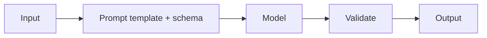

- **Prompt lives in:** one versioned template.
- **Evaluate:** task metric, schema validity.

## 2. Prompt chain pipeline

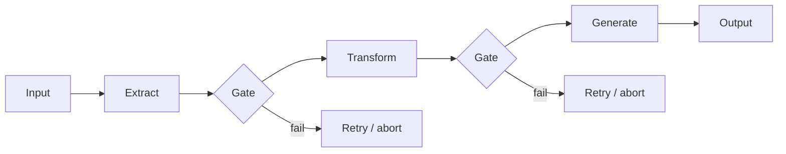

- **Prompts:** one per step, each narrow.
- **Evaluate:** each step on its own, plus end to end.

## 3. Router + specialists

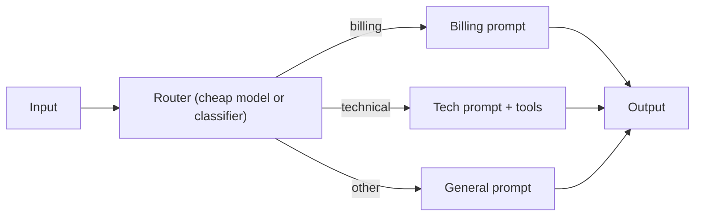

- **Prompts:** a router prompt with clear category definitions, and one specialist prompt per route.
- **Evaluate:** routing accuracy (a confusion matrix), plus quality for each route.

## 4. Parallelization (sectioning and voting)

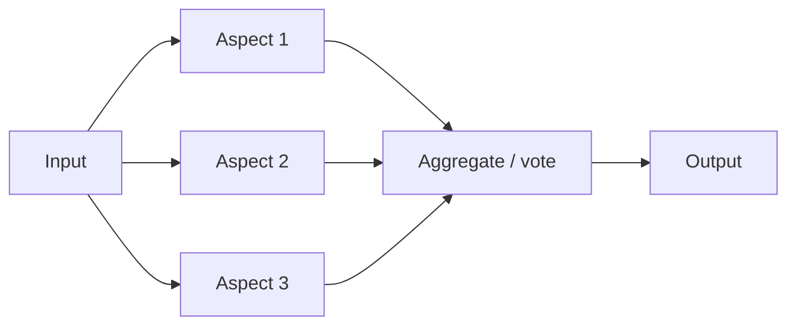

- **Sectioning:** each branch checks a different aspect, e.g. one guardrail and one answer.
- **Voting:** the same task is run N times, and the results are combined by majority or by a judge.

## 5. RAG pipeline

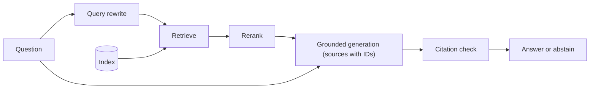

- **Prompts:** query rewrite, then grounded answer (with citation and abstain rules).
- **Evaluate:** retrieval recall@k, faithfulness, abstention on unanswerable questions.

## 6. ReAct agent loop

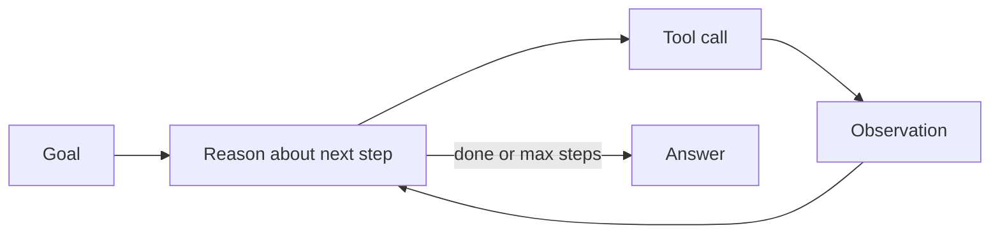

- **Prompts:** an agent system prompt (goal, autonomy boundaries, stop conditions) and tool descriptions.
- **Evaluate:** task success, steps per success, trajectory error analysis.

## 7. Orchestrator-workers

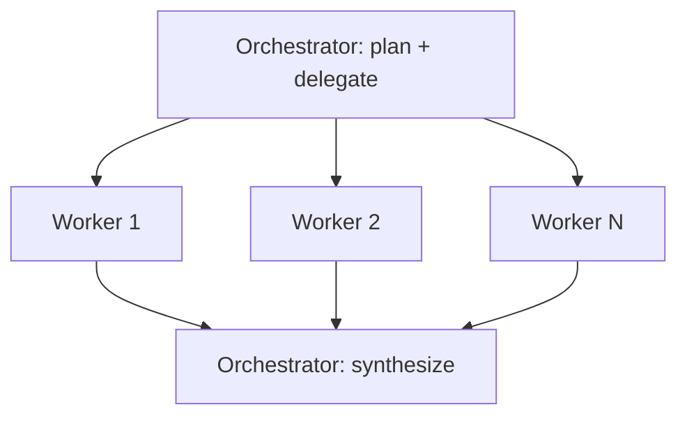

- **Prompts:** orchestrator planning, worker briefs (objective, format, boundaries), and synthesis.
- **Evaluate:** quality against a rubric, cost multiplier vs. a single agent.

## 8. Evaluator-optimizer loop

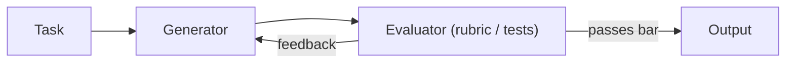

- **Prompts:** a generator, and an evaluator with an explicit rubric. Use tests or tools as the evaluator wherever possible.
- **Evaluate:** score per iteration, how quickly it converges, cost.

## 9. Guardrail sandwich

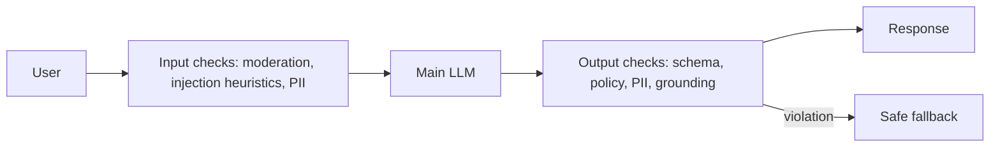

## 10. Dual-LLM / quarantine

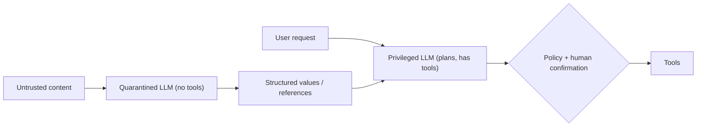

The privileged model never reads raw untrusted text. It only handles structured values or symbolic references. See CaMeL and the design-patterns paper in [Papers](../resources/papers.md#security-module-20).

## 11. Eval harness in CI

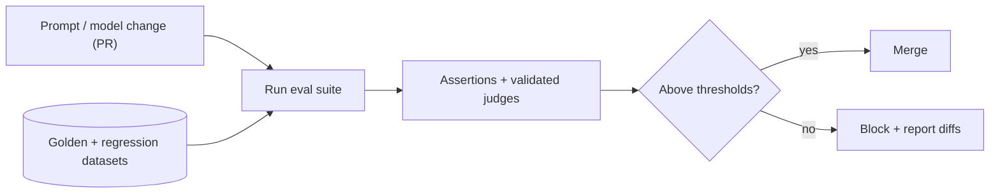
