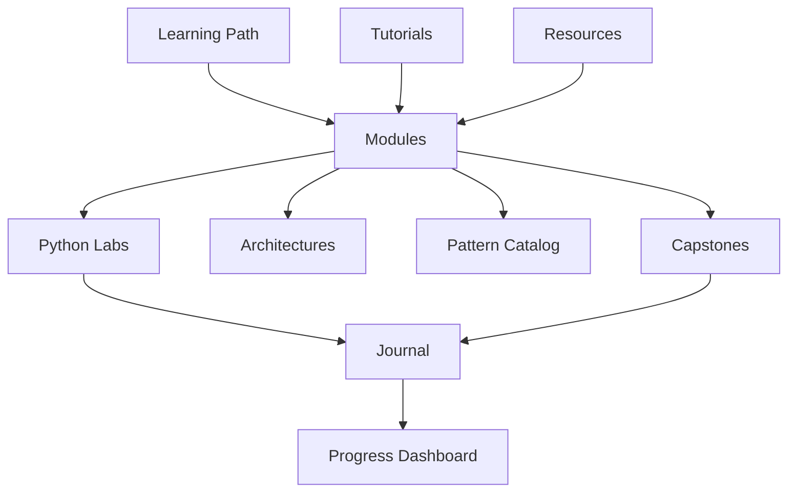

# Prompt Engineering Mastery

A private learning hub for getting to world-class prompt engineering, and the context engineering, agent design, and evaluation skills that now go with it.

!!! info "What this hub is (and isn't)"
    This repo is for **learning**: the learning path, design docs for each topic, curated study material, course notes, and small labs.
    Real projects live elsewhere. The capstones here are practice projects only.

## How to use this hub

1. Start with the [Roadmap](learning-path/roadmap.md) to see the six levels (L0 to L5) and what "mastery" means at each one.
2. Follow the [12-week plan](learning-path/weekly-plan.md), which interleaves modules, tutorials, and labs.
3. For each module:
    - Read the design doc in [Modules](modules/index.md).
    - Do the lab in `labs/`.
    - Watch the linked tutorial sections.
    - Tick the mastery checklist.
4. Log what you tried and learned in the [Journal](journal/index.md), and update the [Progress dashboard](learning-path/progress.md).
5. Re-check the [What's new tracker](reference/whats-new.md) monthly. Prompting advice ages quickly as models change.

## Map of the hub

| Section | What's inside |
| --- | --- |
| [Learning Path](learning-path/roadmap.md) | Levels, milestones, weekly plan, progress dashboard |
| [Modules](modules/index.md) | 25 design docs, one per topic, all using the same template |
| [Architectures](architectures/index.md) | System designs for LLM apps and agents, as diagrams |
| [Patterns](patterns/catalog.md) | Quick-lookup cards for prompting techniques |
| [Tutorials](tutorials/index.md) | Udemy, Coursera, DeepLearning.AI, YouTube, and free courses, with a tracker and notes |
| [Capstones](capstones/index.md) | Practice projects that combine several modules |
| [Resources](resources/index.md) | Official guides, papers, tools, people to follow |
| [Reference](reference/glossary.md) | Glossary, cheat sheet, and the "what's new" changelog |

## Guiding principles

- **Evals over vibes.** A prompt change isn't an improvement until it's measured against a dataset.
- **Context over clever wording.** On modern models, *what* goes into the context matters more than phrasing tricks.
- **Model-aware, not model-locked.** Learn the general principles, then the specifics of each provider.
- **Write it down.** Every experiment gets a journal entry, and every reusable prompt gets a prompt card.
