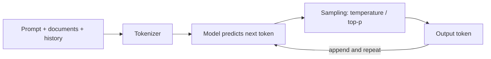

# 01 · How LLMs Work — Mastery

!!! abstract "At a glance"
    **Tier:** A (foundations) · **Module:** [01 · How LLMs work](../../modules/01-how-llms-work/index.md) · **Back to:** [Workbook](index.md) · [Architect 20%](../architect-20.md)  
    **Say it in one line:** *An LLM predicts the next token from everything in its context window. Every architecture decision (cost, latency, routing, RAG) follows from that.*  
    **Last reviewed:** 2026-10-07

## Explain it like I'm new

Think of your phone's keyboard autocomplete. Now make it read the whole internet and many books, and make it far better at guessing. That is an LLM. It does **not** look facts up in a database. It **predicts the next small chunk of text (a token)**, adds it, and predicts again, one token at a time.

Three things control what you get back:

1. **What it learned in training.** This is fixed until the next model version. It has a **knowledge cutoff** date.
2. **What you put in the context window.** This is your prompt, documents and chat history: everything it can "see" right now.
3. **How it picks the next token (sampling).** Settings such as **temperature** make it more predictable or more creative.

**Analogy.** A very well-read new joiner who never forgets grammar, but who only knows what you hand them on their desk today, plus what they read before their start date.

## Key ideas to master

- **Tokens** are the unit of cost, speed and limits. As a rule of thumb, 1 token ≈ 4 English characters ≈ ¾ of a word. Numbers, code and non-English text often use *more* tokens.
- **Context window** = input tokens + output tokens for one call. When it is full, something must be dropped.
- **Stateless.** The model remembers nothing between API calls. "Memory" is your application re-sending the information.
- **Sampling.** Temperature, top-p and max tokens are the main settings.
    - Low temperature gives more consistent output.
    - Even temperature 0 is **not guaranteed** to give identical output every time.
- **Cost and latency** grow with tokens.
    - Output tokens are usually priced higher than input tokens.
    - Long outputs are slow, because the model generates one token at a time.
- **Hallucination is a side-effect of prediction.** The model produces likely-sounding text, which is not always true text. Grounding (RAG) and checks reduce it.
- **Model routing.** Different models trade quality, speed, cost and **where the data is allowed to go** (cloud vs on-premises).

## In your resume project

- **Triage** of thousands of alerts runs on a **small, fast model**, because volume × tokens × price dominates the cost.
- **Narrative writing** for the investigation packet uses a **stronger model**, because quality matters more than cost on a much smaller volume.
- Data that cannot leave the bank goes to an **on-premises open model**. This is routing by *data policy*, not only by quality.
- Long trader chat logs are expensive in tokens. You **summarise or filter** them before the analysis step.

## Common mistakes

- Thinking the model "knows" today's trades. It only knows what you put into the context.
- Assuming temperature 0 makes the output auditable and repeatable. You still need to log the inputs and outputs.
- Comparing models only on quality and ignoring cost per alert and latency per case.

---

## Practice questions

### Simple

??? question "S1. What is a token?"
    **Answer:** A small chunk of text, often a word piece, that the model reads and writes. Prices, speed and context limits are all counted in tokens. As a rough rule, 1,000 tokens ≈ 750 English words.

??? question "S2. What is a context window?"
    **Answer:** The maximum number of tokens the model can handle in one call, counting **input plus output**. Think of it as the model's desk: anything not on the desk does not exist for this call.

??? question "S3. What does temperature control?"
    **Answer:** How random the next-token choice is.

    - **Low** (for example 0 to 0.3): picks the most likely tokens, so output is more consistent. Good for extraction and classification.
    - **High**: more varied output. Good for brainstorming.

??? question "S4. What is a knowledge cutoff?"
    **Answer:** The date after which the model has no training data. Anything newer, such as today's trades or a policy change from last week, must come from your **context** (RAG or tools).

??? question "S5. Does the model remember my previous API call?"
    **Answer:** No. The API is **stateless**. Chat "memory" works because the application re-sends earlier messages, or a summary of them, in every call.

### Medium

??? question "M1. Why do LLMs hallucinate?"
    **Answer:** They are trained to produce **likely** text, not **verified** text. When the context has no answer, the most likely-sounding continuation can be a confident invention.

    Ways to reduce it:

    - Put the evidence in the context (RAG).
    - Tell the model it is allowed to say "not found".
    - Ask for citations.
    - Validate the output with code or with a second check.

??? question "M2. Why are output tokens usually more expensive and slower than input tokens?"
    **Answer:** Input tokens are processed **in parallel** in one pass. Output tokens are produced **one at a time**, and each needs a fresh step through the model. So long answers cost more and take longer. Asking for concise, structured output saves both money and time.

??? question "M3. If temperature is 0, will I always get exactly the same answer?"
    **Answer:** Usually very similar, but **not guaranteed**. Hardware parallelism, batching on the provider's side, and model updates can all change results. For audit, **log the exact inputs, model version and outputs**. Do not rely on being able to reproduce them later.

??? question "M4. Give three reasons to route requests to different models."
    **Answer:**

    1. **Cost**: high-volume, simple steps go to cheap models.
    2. **Latency**: interactive steps need fast models.
    3. **Capability**: hard reasoning or writing needs strong models.

    A fourth, very important reason in banking is **data residency / policy**: sensitive data may only be processed by an on-premises model.

??? question "M5. Roughly how many tokens is a 30-page trader chat transcript, and why does it matter?"
    **Answer:** Assume about 500 words per page. 30 pages ≈ 15,000 words ≈ 20,000 tokens.

    That matters for two reasons:

    1. **Cost.** It is paid on every call that includes it.
    2. **Attention.** Key lines get buried in noise.

    So you filter (keyword or time window), chunk, or summarise before sending it to the analysis step.

### Hard

??? question "H1. Estimate the monthly LLM cost of triaging 200,000 alerts. State your assumptions."
    **Answer:** Show your method; the exact numbers matter less.

    **Assumptions:**

    - Each triage call: 2,000 input tokens + 200 output tokens.
    - Small model price: $1 per million input tokens and $5 per million output tokens. These are illustrative; always check current pricing.

    **Calculation:**

    - Input: 200,000 × 2,000 = 400M tokens → $400.
    - Output: 200,000 × 200 = 40M tokens → $200.
    - **Total ≈ $600 a month.**

    If you use a model 10× more expensive, it becomes about $6,000.

    **Architect point:** the cost difference is what justifies routing, *as long as* the cheap model's recall on true alerts stays above your threshold (proven by evals).

??? question "H2. Your context window is 200K tokens. Why not put the whole case file in every call?"
    **Answer:**

    1. **Cost and latency** grow with every token, on every call.
    2. **Quality can drop.** Models attend unevenly over long inputs ("lost in the middle"), and irrelevant text distracts them.
    3. **Entitlement and privacy.** You may expose data the step does not need (least privilege).
    4. **Audit is harder.** You cannot easily say which evidence drove the answer.

    Send the **smallest sufficient context** for each step.

??? question "H3. How do you make an LLM step auditable in a regulated environment if outputs are not perfectly reproducible?"
    **Answer:** Make the **record** the source of truth, not a re-run. For every call, log:

    - The prompt version (an ID, not free text).
    - The model name and version.
    - Parameters such as temperature.
    - The retrieved document IDs.
    - The tool calls and their results.
    - The full output.
    - Timestamps.
    - The human approver.

    Also make important outputs **structured** (a schema), so you can validate them and compare them over time.

### Tricky

??? question "T1. 'This model has a 1M-token context window, so we don't need RAG.' Agree?"
    **Answer:** No. A huge context window does not solve:

    - **Cost per call.**
    - **Latency.**
    - **Data freshness.** You still have to fetch today's data.
    - **Entitlements.** Who is allowed to see what?
    - **Attention quality** over very long inputs.

    Long context *complements* retrieval. It does not replace it. Use it when the task truly needs a whole document at once.

??? question "T2. 'The model said it checked the trade database.' Did it?"
    **Answer:** Only if your system **actually ran a tool** and returned the result. A model can *write* "I checked the database" with no tool call at all. Trust the **tool-call logs**, not the model's own description of what it did.

??? question "T3. 'A bigger model will fix our hallucination problem.' True?"
    **Answer:** Partly at best. Bigger models hallucinate less on general knowledge, but they still invent things when the **evidence is missing from the context**. The fix is mostly architectural:

    - Retrieve the right evidence.
    - Allow "I don't know".
    - Require citations.
    - Validate the output.

    Model size helps, but it is not the control.

??? question "T4. Is a token the same as a word?"
    **Answer:** No. Common words may be a single token. Rare words, numbers like `ISIN US0378331005`, code and many non-English languages split into **several** tokens. Budget for that when your data is full of identifiers.

### Scenario (resume-synced)

??? question "SC1. A director asks: 'Why do we use three different models instead of just the best one?' Answer in under a minute."
    **Answer (sample):**

    "Because each step has different needs. Triage is high volume and simple, so a small, fast model handles it at a fraction of the cost. We proved its recall on true alerts in evals before switching. Analysis and case narratives are low volume and high stakes, so they get the stronger model. Anything with data that cannot leave our environment goes to the on-prem model. One model for everything would either cost much more or break our data policy. Routing is decided by evidence from evals, not by preference."

??? question "SC2. An analyst says the triage agent 'forgot' the trader's history it saw yesterday. Explain why to a non-technical manager."
    **Answer:** "The model does not remember anything between conversations. Every call starts fresh. It only knows what our system hands it each time. If yesterday's findings matter, we must save them (for example in the case's episodic memory) and give them back to the model. That is a design choice we make on purpose, not a bug in the model."

## Can you teach it?

- [ ] I can explain tokens, the context window and temperature to a non-engineer in 2 minutes
- [ ] I can do a back-of-the-envelope cost estimate for a high-volume step
- [ ] I can justify model routing with cost, latency, capability **and** data policy
