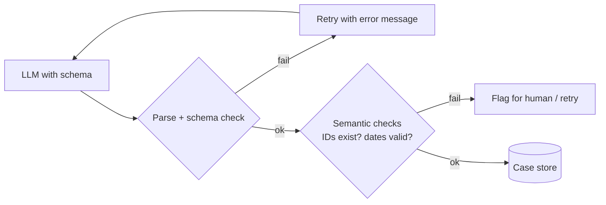

# 05 · Structured Outputs — Mastery

!!! abstract "At a glance"
    **Tier:** A (foundations) · **Module:** [05 · Structured outputs](../../modules/05-structured-outputs/index.md) · **Back to:** [Workbook](index.md) · [Architect 20%](../architect-20.md)  
    **Say it in one line:** *A schema turns an LLM from a chat partner into a software component. JSON that matches the schema is guaranteed structure. It is not guaranteed truth.*  
    **Last reviewed:** 2026-10-07

## Explain it like I'm new

If you ask a person to "write up the case", every person writes it differently. If you give them a **form** with boxes (case ID, pattern type, evidence list, risk score), every write-up has the same shape. Software can then read it, store it, compare it and check it.

**Structured output** means asking the model to fill a form, usually **JSON that follows a JSON Schema**. There are three levels of strength:

1. **Prompt-only.** "Reply in JSON like this..." Usually works, but sometimes breaks.
2. **JSON mode.** The output is valid JSON, but it may not match *your* fields.
3. **Schema-constrained (strict) structured outputs / tool schemas.** The provider forces the output to match your schema. This is the strongest option.

Even with level 3, the **values** can still be wrong: a wrong trade ID, or a made-up reason. So you still **validate the meaning** in code.

## Key ideas to master

- **Schema = contract** between the LLM step and the rest of the system: database, UI, next agent.
- **Validate in code** (for example with Pydantic) and **retry with the error message** if it fails. This is the validation loop.
- **Syntactic vs semantic validity.**
    - *Syntactic*: does it parse, and are the right fields present?
    - *Semantic*: do the cited IDs exist? Is the date inside the alert window?
- **Design schemas for the model.**
    - Use clear field names and descriptions.
    - Use enums instead of free text.
    - Keep nesting shallow.
    - Make fields optional when the data may be missing.
- **Put a reasoning field before the decision field** if you want the model to "think" first. Field order affects generation.
- **Version schemas.** Downstream consumers break when fields change.



## In your resume project

The **investigation packet** is a schema. A simplified version:

```json
{
  "case_id": "string",
  "pattern": "wash_trade | spoofing | layering | other | none",
  "summary": "string, <= 120 words, no PII",
  "evidence": [{"source_id": "string", "type": "trade|order|chat|email", "why_relevant": "string"}],
  "risk_score": "integer 1-5",
  "confidence": "low | medium | high",
  "needs_human_review": "boolean",
  "missing_data": ["string"]
}
```

Code then checks that every `source_id` was actually retrieved for this case, which is how you catch invented evidence.

## Common mistakes

- Trusting "valid JSON" as "correct output".
- Huge, deeply nested schemas with 60 fields. Quality drops. Split them into steps.
- No `missing_data` or `none` option, which **forces** the model to invent values.
- Changing a field name without versioning, which breaks the UI or the next agent.

---

## Practice questions

### Simple

??? question "S1. What is structured output?"
    **Answer:** Getting the model to reply in a fixed, machine-readable format, usually JSON that follows a schema, instead of free text. That way, code can use the result reliably.

??? question "S2. What is a JSON Schema?"
    **Answer:** A description of what valid JSON looks like: field names, types (string, integer), allowed values (enums), required fields and limits. It is the "form template".

??? question "S3. Why use an enum field like `pattern: wash_trade | spoofing | none`?"
    **Answer:** It limits answers to known values. Code can then branch on them, dashboards can count them, and the model cannot invent labels like "kinda suspicious".

??? question "S4. What is the difference between JSON mode and strict schema outputs?"
    **Answer:**

    - **JSON mode** guarantees *some* valid JSON.
    - **Strict schema** mode guarantees JSON that matches **your** schema: the right fields, types and enums.

    Use strict mode or tool schemas when you can.

### Medium

??? question "M1. Your output passes schema validation but cites a trade ID that does not exist. What layer failed, and how do you catch it?"
    **Answer:** **Semantic** validation failed. The structure is right, but the content is false. Catch it in code: check every `source_id` against the set of IDs actually retrieved for this case. If any is missing, retry with feedback or flag the case for a human. Track the rate as an eval metric ("citation validity").

??? question "M2. Why add a `missing_data` field or a `none` option?"
    **Answer:** Without a legal way to say "I don't know", a strict schema **forces** the model to fill fields, so it may invent values. A way out lowers hallucination and gives analysts useful information (for example, "chat logs not available for this period").

??? question "M3. Does field order in a schema matter?"
    **Answer:** Yes. Models generate fields in order. A `reasoning` or `evidence` field **before** the `decision` field lets the model gather support before committing. Decision first, then reasons, tends to produce after-the-fact justification.

??? question "M4. What is a validation-retry loop, and what is its risk?"
    **Answer:** Parse and validate the output. On failure, send the error back ("field risk_score must be 1–5") and retry. The risks:

    - **Infinite loops or cost blow-ups.** Cap the retries (for example 2), then fall back to a human or a safe default.
    - Retries hiding a systematic prompt problem. Log the retry rate as a health metric.

### Hard

??? question "H1. Design the validation layers for the investigation packet. Name at least four."
    **Answer:**

    1. **Parse / schema**: types, enums, required fields.
    2. **Referential integrity**: every evidence ID exists in the retrieved set for this case.
    3. **Business rules**: the risk score matches the pattern (for example, pattern `none` means risk ≤ 2), and dates are inside the alert window.
    4. **Policy filters**: no PII or MNPI patterns in `summary` (regex or a classifier).
    5. **Length and format limits**.
    6. **Consistency check** (optional): a second model or rule confirms the summary does not contradict the evidence.

??? question "H2. A 70-field schema gives poor quality. How do you redesign it?"
    **Answer:**

    - **Split by step.** An extraction schema (facts) feeds an assessment schema (pattern and risk), which feeds a narrative schema.
    - Fill deterministic fields (case ID, timestamps, account metadata) **in code**, not by the LLM.
    - Keep each LLM schema small and focused.
    - Merge the results in code.

    Smaller schemas are easier to evaluate and cheaper to retry.

??? question "H3. How do you evolve the packet schema without breaking downstream consumers?"
    **Answer:**

    - Use **semantic versioning**. Adding optional fields is a minor change. Renaming or removing fields is a major change.
    - Include `schema_version` in every output.
    - Support the old and new versions in parallel for a transition window.
    - Use contract tests in CI for every consumer.
    - Re-run the evals on the new schema.

    The same discipline as any API.

### Tricky

??? question "T1. 'We use strict structured outputs, so we don't need evals.' Respond."
    **Answer:** Strict mode guarantees **shape**, not **truth**. The model can still pick the wrong pattern, invent reasons, miss evidence or put PII in a summary. You need semantic validators **and** evals for accuracy and faithfulness.

??? question "T2. Should the LLM generate the `case_id` and `timestamp` fields?"
    **Answer:** No. Anything your system already knows should be **filled in by code**. Letting the model copy it adds a chance of typos and wastes tokens. The LLM fills only the fields that need judgement.

??? question "T3. Is it fine to ask for JSON and a friendly explanation in the same response?"
    **Answer:** It mixes two consumers (machine and human) and often breaks parsing. Put the human-readable text **inside** a schema field (for example `summary`), or make two calls. Keep the machine contract clean.

### Scenario (resume-synced)

??? question "SC1. The UI team says 5% of packets crash their page. Diagnose and fix."
    **Answer:**

    1. **Check the logs.** Is it a parse failure, a missing field, or an unexpected enum value?
    2. **Likely causes:**
        - Prompt-only JSON (not strict).
        - A recent schema change with no version.
        - The model emitting `"pattern": "Wash Trade"` instead of `wash_trade`.
    3. **Fix:**
        - Switch to strict schema outputs or tool schemas.
        - Validate before saving, with capped retries.
        - Put `schema_version` in every output.
        - Make the UI handle unknown or missing fields gracefully.
        - Add a CI contract test with real packet samples.

??? question "SC2. Explain to an auditor why the packet is JSON instead of a written report."
    **Answer:** "JSON lets us:

    - **Verify every claim automatically.** Each evidence item links to a real record ID.
    - **Apply PII/MNPI filters** to specific fields.
    - **Measure quality consistently** across thousands of cases.
    - **Keep an exact, comparable audit trail.**

    The analyst still sees a readable view, but it is generated from a structure we can check."

## Can you teach it?

- [ ] I can explain syntactic vs semantic validation with an example
- [ ] I can sketch the investigation-packet schema and its validation layers
- [ ] I can describe safe retry loops and schema versioning
