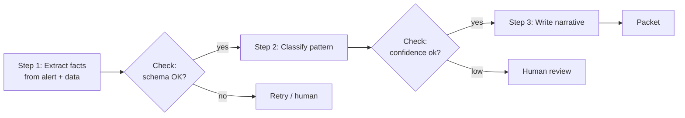

# 06 · Prompt Chaining — Mastery

!!! abstract "At a glance"
    **Tier:** B (core of your story) · **Module:** [06 · Prompt chaining](../../modules/06-prompt-chaining/index.md) · **Back to:** [Workbook](index.md) · [Architect 20%](../architect-20.md)  
    **Say it in one line:** *Break a big task into fixed, checkable steps that your code controls. Only reach for an agent when the steps can't be known in advance.*  
    **Last reviewed:** 2026-10-07

## Explain it like I'm new

Cooking a complex dish in one go is risky. Following a recipe step by step, tasting as you go, is safer. **Prompt chaining** works the same way: the output of one LLM call becomes the input of the next, with **your code** in between to check, transform or stop.

**Workflow vs agent.**

- In a **workflow** (chain), *you* decide the steps in code. It is predictable, testable and cheaper.
- In an **agent**, *the model* decides the next step in a loop. It is flexible, but harder to predict and test.

Architects should **start with workflows** and add agency only where it is needed.

## Key ideas to master

- **One step, one job.** Each prompt is simpler, so you can use a smaller model for easy steps.
- **Gates between steps.** These are code checks: schema validation, thresholds, business rules, human approval.
- **Common workflow shapes** (from Anthropic's *Building effective agents*):
    - **Prompt chaining**: sequential steps.
    - **Routing**: classify, then send to a specialised path.
    - **Parallelisation**: split independent sub-tasks (*sectioning*), or run the same task several times and vote (*voting*).
    - **Orchestrator-workers**: an LLM plans the sub-tasks dynamically.
    - **Evaluator-optimizer**: one LLM drafts, another critiques, and you loop.
- **Trade-offs.** More steps mean more latency and more calls, but each step is easier to test, debug and govern.
- **Errors compound.** If each step is 95% accurate, 5 steps in a row give about 77% end-to-end. Use gates and evals per step.

## In your resume project

Before building six agents, the **deterministic backbone** was a chain:

1. Fetch the alert and data (code + MCP).
2. LLM: extract the key facts into a schema.
3. Code: compute metrics (order-to-cancel ratio, time between trades).
4. LLM: classify the pattern with evidence.
5. Gate: human review if the risk is high or the confidence is low.
6. LLM: draft the narrative.
7. Validators.

Agents were added only for the **open-ended investigation** parts: deciding which extra data to pull, and following leads.

## Common mistakes

- Jumping to an autonomous agent for a process that is actually a fixed sequence.
- No checks between steps, so step 1's error silently poisons step 4.
- Making the LLM do maths or lookups that code does perfectly.
- Passing everything from every earlier step into each later step, which bloats the context.

---

## Practice questions

### Simple

??? question "S1. What is prompt chaining?"
    **Answer:** Splitting a task into a sequence of LLM calls, where each call's output feeds the next, often with code checks in between.

??? question "S2. What's a 'gate' in a chain?"
    **Answer:** A programmatic check between steps: schema valid? score above threshold? human approved? It stops errors from flowing downstream.

??? question "S3. What's the main difference between a workflow and an agent?"
    **Answer:**

    - **Workflow**: predefined steps, with control flow in code.
    - **Agent**: the LLM decides its own next steps and tool use in a loop.

### Medium

??? question "M1. Why does chaining often improve quality?"
    **Answer:**

    - Each step has a narrow focus with only the relevant context.
    - You can tune or test each step separately.
    - You can use the best model per step.
    - Mistakes are caught early at the gates.

    It is the "divide and conquer" principle.

??? question "M2. Explain the routing pattern with an example."
    **Answer:** A first, cheap LLM call (or classifier) decides the **category**. Each category then has its own specialised prompt, tools and model.

    Example: alert type spoofing → spoofing analysis path; wash trade → graph-ownership path; unclear → general triage.

??? question "M3. What's the difference between sectioning and voting in parallelisation?"
    **Answer:**

    - **Sectioning**: split the work into *different* independent parts that run at the same time (trades analysis, chat analysis, news check).
    - **Voting**: run the *same* task several times, or with different prompts or models, and combine the results to improve reliability on high-stakes decisions.

??? question "M4. Which parts of a chain should be code, not LLM?"
    **Answer:**

    - Data fetching.
    - Calculations (ratios, time differences).
    - Lookups.
    - Validation.
    - Permission checks.
    - Formatting.
    - Anything deterministic.

    The LLM handles judgement, extraction from messy text and writing.

### Hard

??? question "H1. A 6-step chain has 94% end-to-end accuracy, but step 3 alone is 97%. How do you find the weak link?"
    **Answer:**

    1. **Trace every step** (inputs and outputs) on the eval set.
    2. Add **per-step evals** with their own labelled expectations.
    3. Find where errors **first appear**. Remember that a step can be fine on its own but get bad inputs from the step before.
    4. Look at the **interfaces**: is a step losing information the next one needs?

    Fix the earliest failing step first.

??? question "H2. When does the evaluator-optimizer pattern pay off, and what is its risk?"
    **Answer:**

    - **Pays off** when there are clear quality criteria and drafts improve with feedback. Example: the case narrative is checked against "every claim cites evidence, no legal conclusions, under 200 words".
    - **Risks:**
        - Cost and latency from extra loops. Cap the iterations.
        - The evaluator sharing the generator's blind spots. Use explicit rubrics, code checks or a different model.
        - Endless polishing. Stop when the rubric passes.

??? question "H3. Convince a team that wants 'one autonomous agent' to start with a chain instead."
    **Answer:** "Our process is mostly known: fetch, extract, compute, classify, write. A chain gives us:

    - **Predictable cost and latency.**
    - **Per-step tests**, so our 1,400 CI cases can pinpoint failures.
    - **Clear audit points** for model risk.
    - **Easy HITL gates.**

    We'll add agent loops only where the path truly varies, like deciding which extra evidence to pull. That gives agency where it adds value, without making the whole system unpredictable."

### Tricky

??? question "T1. 'More steps always means better quality.' True?"
    **Answer:** No. Every step adds latency and cost, and each handover can drop information. Errors also compound across steps. Split only where it reduces difficulty or adds a useful checkpoint. Merge steps that always pass together.

??? question "T2. Is LangGraph only for agents?"
    **Answer:** No. Graph frameworks model **both** fixed workflows (deterministic edges) and agent loops (conditional edges the LLM decides). Many "agentic" systems are mostly workflows with a few agentic nodes. That is a good thing.

??? question "T3. 'Each step passed its own eval, so the whole chain is fine.' True?"
    **Answer:** Not necessarily. Steps can pass alone but fail **together**:

    - Step 2's output format may differ slightly from what step 3 expects.
    - Small errors compound (0.95⁵ ≈ 0.77).
    - Information can get lost at the handovers.

    Always run **end-to-end evals** as well as per-step ones.

### Scenario (resume-synced)

??? question "SC1. Map your six-agent system: which parts are really workflow, and which are agentic?"
    **Answer (template; adjust to what you built):**

    - **Workflow:**
        - Alert intake.
        - Routing by alert type.
        - Data fetch for standard evidence.
        - Metric computation.
        - Validators.
        - HITL gate.
        - Packet assembly.
    - **Agentic:**
        - The supervisor deciding which specialist to call next on unusual cases.
        - The data and comms agents choosing follow-up queries.
        - The pattern agent exploring hypotheses.

    Saying this clearly in an interview shows judgement, not hype.

??? question "SC2. Narratives sometimes contradict the classification step. How do you fix the chain?"
    **Answer:**

    - Pass the classification step's **structured output** (pattern, evidence IDs) as the **only** evidence input to the narrative step, rather than raw data.
    - Add a gate: a consistency check (code or a small LLM) that the narrative's pattern equals the classified pattern and cites only the listed IDs.
    - Add a per-step eval for consistency.

## Can you teach it?

- [ ] I can explain workflow vs agent and when to use each
- [ ] I can name the five workflow patterns with surveillance examples
- [ ] I can explain compounding error and per-step gates
