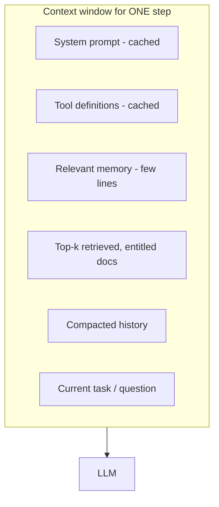

# 10 · Context Engineering — Mastery

!!! abstract "At a glance"
    **Tier:** B (core of your story) · **Module:** [10 · Context engineering](../../modules/10-context-engineering/index.md) · **Back to:** [Workbook](index.md) · [Architect 20%](../architect-20.md)  
    **Say it in one line:** *Context engineering is deciding exactly which tokens the model sees at each step: the smallest set of high-signal information that makes the right answer likely.*  
    **Last reviewed:** 2026-10-07

## Explain it like I'm new

Prompt engineering is **how you word the request**. Context engineering is **what you put on the model's desk**, and what you take off it.

The desk can hold:

- Instructions.
- Retrieved documents.
- Tool definitions.
- Tool results.
- Conversation history.
- Memory.
- Examples.

The desk is limited in size. Too much clutter means the model misses the important page. Too little means it guesses.

**Analogy.** Preparing a briefing pack for a senior executive before a meeting. You don't hand them the entire archive. You hand them the five pages that matter, in a sensible order, with the key point flagged.

In agents this matters even more. Every loop adds tool results, so the context **grows on every step** unless you manage it.

## Key ideas to master

- **Context is a budget.** Every token costs money and attention. Models get worse at using information as the context fills up, a decline sometimes called *context rot*.
- **The building blocks of context:**
    - System prompt.
    - Tool definitions.
    - Retrieved knowledge (RAG).
    - Tool results.
    - Message history.
    - Memory.
    - Examples.
- **Just-in-time retrieval.** Give the agent tools to fetch details *when needed*, instead of preloading everything.
- **Compaction.** Summarise old history or tool outputs when the context grows, keeping decisions, open questions and key IDs.
- **Tool-result clearing.** After a big tool result has been used, replace it with a short note ("retrieved 340 trades; 3 relevant: T-881, T-884, T-902").
- **Sub-agents with clean contexts.** Hand a sub-task to a sub-agent that returns only a short summary, so the main agent's context stays small.
- **Order and caching.** Stable content (system prompt, tool definitions) goes first so it can be cached. Changing content goes last.
- **Least-privilege context.** Only include data this step is **allowed** and **needs** to see. This is a security control, not just a cost one.

## In your resume project

A spoofing investigation can involve **50,000 order events** and **months of chats**. You never put all of that in context. Instead:

- The data agent **queries and aggregates** (order-to-cancel ratios, time windows) through MCP tools, and returns compact tables.
- The comms agent returns **only the matching excerpts** with message IDs.
- The supervisor keeps a **compacted case state** of findings, open questions and evidence IDs, not the raw tool dumps.
- Everything is filtered by the analyst's **entitlements** before it reaches any context.

## Common mistakes

- Dumping full tool results (thousands of rows) into the next prompt.
- Keeping the entire chat history forever in long agent runs.
- 40 tools in context when only 5 are needed for this step. Tool definitions are tokens too, and they confuse tool choice.
- Treating context as a cost problem only and forgetting **entitlements and privacy**.

---

## Practice questions

### Simple

??? question "S1. What is context engineering in one sentence?"
    **Answer:** Choosing and arranging everything the model sees in each call (instructions, data, tools, history, memory), so it has exactly what it needs and nothing that distracts or leaks.

??? question "S2. How is it different from prompt engineering?"
    **Answer:** **Prompt engineering** focuses on wording the instructions. **Context engineering** is broader: it manages the whole information state across many steps, including retrieval, tool results, memory and history. That is essential for agents.

??? question "S3. What is compaction?"
    **Answer:** Summarising older parts of the context (history, tool outputs) into a shorter note when the context gets large. You keep the important facts and decisions and drop the bulk.

??? question "S4. What is 'just-in-time' retrieval?"
    **Answer:** Instead of loading every document up front, you give the agent tools (search, fetch) so it pulls information **only when it needs it**. The context stays small and relevant.

### Medium

??? question "M1. Why can adding more context make answers worse?"
    **Answer:**

    - **Distraction.** Irrelevant text pulls attention away.
    - **Position effects.** Facts in the middle of long inputs are used less well ("lost in the middle", [Liu et al., 2023](https://arxiv.org/abs/2307.03172)).
    - **Conflicts.** Contradictory snippets confuse the model.
    - **Context rot.** Recall weakens as the window fills.

    More is not better. **Relevant** is better.

??? question "M2. A tool returns 5,000 trade rows. What do you send to the model?"
    **Answer:** Ideally, change the tool so it does the heavy work: **filter, aggregate and rank in code**, then return a short summary plus the top relevant rows with IDs. If the raw result is needed later, store it outside the context and give the model a reference ID it can fetch.

??? question "M3. How does prompt caching influence how you order the context?"
    **Answer:** Caching reuses an **identical prefix**. Put stable parts first (system prompt, tool definitions, fixed policy) and changing parts last (retrieved documents, the current question). Changing anything early in the prompt breaks the cache for everything after it.

??? question "M4. What should a good compaction summary keep?"
    **Answer:**

    - Decisions made.
    - Key findings with **evidence IDs**.
    - Open questions and next steps.
    - Constraints (for example "analyst lacks APAC entitlement").
    - Anything a human approved or rejected.

    Drop raw outputs and repetition.

### Hard

??? question "H1. Design a context budget for the case-writer step (assume a 200K window)."
    **Answer (example):**

    | Block | Budget |
    | --- | --- |
    | System prompt + schema | ~3K (cached) |
    | Policy snippets (retrieved, relevant only) | ~4K |
    | Compacted case state from supervisor | ~3K |
    | Evidence excerpts (trades, chats) with IDs | ~15K |
    | Space for output | ~2K |

    **Total ≈ 27K**, far below the limit, *on purpose*. The headroom keeps quality high and cost low. If evidence goes over budget, rank it and summarise it instead of truncating blindly.

??? question "H2. When would you use sub-agents primarily as a context-management technique?"
    **Answer:** When a sub-task needs to **read a lot but report a little**. Examples:

    - Scanning 3 months of chats for coordination language.
    - Reviewing 50,000 order events.

    The sub-agent burns its own context, then returns a 300-token summary with IDs. The main agent stays focused. The trade-off is extra cost and latency, plus the risk that the summary drops something, so require evidence IDs in the summary.

??? question "H3. How is context engineering also a security control?"
    **Answer:**

    1. **Least privilege.** Only data the user is entitled to, and that the step needs, enters the context.
    2. **Isolation of untrusted content.** It is tagged and kept away from tool-wielding steps where possible.
    3. **Smaller blast radius.** If the context leaks (through output or logs), less is exposed.
    4. **Redaction** of PII/MNPI happens before content enters the context, not after.

### Tricky

??? question "T1. 'Our model has 1M context, so we'll keep the full agent history forever.' Problem?"
    **Answer:** Yes:

    - Cost and latency grow on **every** step.
    - Quality degrades from distraction.
    - Old, wrong intermediate thoughts can mislead later steps.
    - More sensitive data is exposed per call.

    Compact the history and store the full trace **outside** the context for audit.

??? question "T2. Are tool definitions 'free' because they're not part of the conversation?"
    **Answer:** No. Tool names, descriptions and schemas are tokens sent on every call. Many tools also make **tool selection** worse. Load only the tools relevant to this step or agent.

??? question "T3. If retrieval returns the right document, is the context problem solved?"
    **Answer:** Not necessarily. The right document may sit among 20 wrong ones, be poorly chunked (the key line split in half), arrive in a bad order, or be too long. Retrieval quality **and** packing quality both matter.

### Scenario (resume-synced)

??? question "SC1. A long spoofing investigation slows down and gets worse after 30 agent steps. What's your fix?"
    **Answer:**

    1. **Measure** the tokens per step. History and tool dumps are probably the cause.
    2. **Clear tool results** after use, keeping a 1-line note plus IDs.
    3. **Compact** every N steps into a case-state summary (findings, open questions, evidence IDs).
    4. **Offload** heavy reading to sub-agents.
    5. Store full results in the case store, retrievable by ID.
    6. Add an eval that compares answers before and after compaction, to make sure nothing important is lost.

??? question "SC2. A reviewer asks: 'How do you guarantee an analyst never sees another region's data via the LLM?' Answer with context engineering."
    **Answer:** "Entitlements are applied **before** anything enters the context:

    - Retrieval filters run with the analyst's identity.
    - MCP tools enforce permissions server-side.
    - Memory is scoped to the case and to entitlements.

    The model can't leak what it never received. We don't rely on the prompt saying 'don't reveal'. We also test it: red-team evals try cross-region requests and expect refusals with no leaked content."

## Can you teach it?

- [ ] I can list the parts of context and explain why "less but relevant" wins
- [ ] I can explain compaction, tool-result clearing and sub-agents
- [ ] I can present context as both a cost control and a security control
