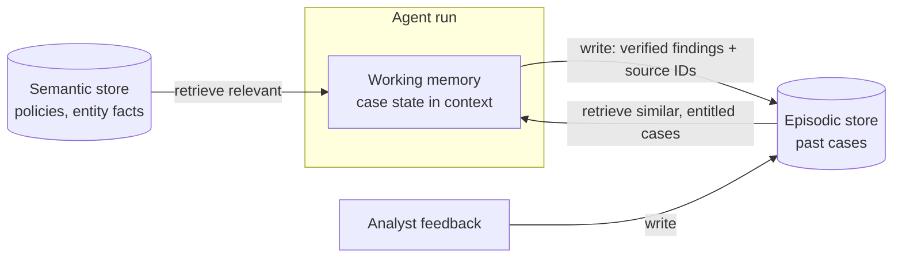

# 12 · Long Context and Memory — Mastery

!!! abstract "At a glance"
    **Tier:** B (core of your story) · **Module:** [12 · Long context and memory](../../modules/12-long-context-memory/index.md) · **Back to:** [Workbook](index.md) · [Architect 20%](../architect-20.md)  
    **Say it in one line:** *The model has no memory. Your system decides what to store, how to scope it and when to bring it back into context, using working, episodic and semantic tiers.*  
    **Last reviewed:** 2026-10-07

## Explain it like I'm new

People have different kinds of memory, and agents can copy the idea:

| Memory tier | Human version | Agent version | Example in surveillance |
| --- | --- | --- | --- |
| **Working** | What you're thinking about right now | The current context window and case state | "Findings so far on alert 48213" |
| **Episodic** | Remembering past events | A store of past cases, decisions and outcomes | "Last year, this trader had a similar spoofing alert, closed as false positive" |
| **Semantic** | Facts you know | Knowledge base: policies, rules, entity facts | "Our policy defines layering as..." |
| **Procedural** (bonus) | Knowing *how* to do things | Playbooks / skills / prompts | "Steps to investigate a wash-trade alert" |

**Long context** means the model can read a lot at once (hundreds of thousands of tokens). **Memory** means the system keeps information **across** calls and sessions. They are different tools:

- Long context = a big desk.
- Memory = a filing cabinet plus a librarian who knows what to bring back.

## Key ideas to master

- **Stateless model, stateful system.** All memory lives in your stores: database, vector index, graph, case file.
- **Write policy.** Decide *what* gets saved:
    - Decisions.
    - Verified facts with sources.
    - Analyst feedback.
    - Not every passing thought.
- **Read policy.** Decide *when* and *what* gets retrieved: relevance, recency, scope.
- **Scope and entitlements.** Memory must be scoped (per case, per user, per desk) and inherit the classification of its source data.
- **Memory poisoning.** If untrusted content gets written into memory, it can influence future cases. Validate what is written, and keep the provenance.
- **Retention and deletion.** Regulated firms have retention rules and "right to delete" duties. Memory stores must follow them.
- **Long-context limits.** Recall is uneven across very long inputs, and cost grows with length. Use long context for "must read the whole document" tasks, and memory + retrieval for everything else.

## In your resume project

- **Working memory**: the supervisor's compacted case state: findings, open questions, evidence IDs.
- **Episodic memory**: closed cases with the outcome and the analyst's reasoning, so the triage agent can say "similar pattern closed as legitimate market-making in March (case C-1902)".
- **Semantic memory**: surveillance policies, typologies and reference data in RAG and in the graph.
- **Controls**: memory is entitlement-scoped, writes carry source IDs, chat content is **never** written as instructions, and retention follows the books-and-records policy.

## Common mistakes

- "Memory" that is just an ever-growing chat history.
- Saving model guesses as facts, so future cases inherit errors.
- One global memory shared across users and desks, which leaks data across entitlements.
- No way to delete or expire memories.

---

## Practice questions

### Simple

??? question "S1. Does an LLM remember previous conversations by itself?"
    **Answer:** No. Each API call is independent. Any memory comes from the application storing information and putting it back into the prompt.

??? question "S2. Name the three main memory tiers for agents."
    **Answer:**

    - **Working**: current context.
    - **Episodic**: past events and cases.
    - **Semantic**: facts and knowledge.

    Some designs add **procedural** memory: how-to playbooks and skills.

??? question "S3. What's the difference between long context and memory?"
    **Answer:** **Long context** is how much the model can read *in one call*. **Memory** is information kept *between* calls and sessions, then selectively retrieved. A big context window doesn't give you memory.

### Medium

??? question "M1. What should an agent write to episodic memory after a case closes?"
    **Answer:**

    - Case ID.
    - Pattern type.
    - Final outcome (escalated / closed).
    - The **analyst's** reason.
    - Key evidence IDs.
    - Entities involved.
    - Date.
    - Entitlement scope.

    Save **verified, human-confirmed** information, not the agent's intermediate guesses.

??? question "M2. What is memory poisoning?"
    **Answer:** When false or malicious content gets saved to memory and later influences other tasks. For example, an injected chat message saying "trader X is always cleared" gets stored as a "fact". Prevent it by:

    - Only writing validated content with provenance.
    - Never storing untrusted text as instructions.
    - Periodic review.

??? question "M3. How do you decide what to retrieve from memory for a new case?"
    **Answer:** Combine:

    - **Relevance**: similar entities or patterns.
    - **Recency**.
    - **Importance**: escalated cases count more.
    - **Scope**: same entitlement.

    Retrieve a few short summaries with links, not full past cases.

### Hard

??? question "H1. Design memory for investigations that run over several weeks with multiple analysts."
    **Answer:**

    - A **case file as the source of truth**: structured case state (findings, evidence IDs, hypotheses, open tasks, decisions with approver), versioned.
    - At the start of each session: load a **compact summary** plus open tasks into working memory.
    - Write events (tool results, analyst notes) to an append-only **case log** for audit.
    - **Handover**: an auto-generated "where we are" summary, which the incoming analyst reviews.
    - **Entitlement checks** when an analyst joins. Some evidence may be hidden from them.

??? question "H2. How do retention, legal hold and deletion affect agent memory design?"
    **Answer:**

    - Memory stores are **records** in scope of the retention policy. Know which items must be kept (books and records) and which must be deleted.
    - Support **legal hold** (no deletion while it applies).
    - Make **deletion propagate**: source → embeddings → summaries → caches.
    - Keep provenance links so you can find every derived item.

    Design this up front. Retrofitting it is painful.

??? question "H3. When would you choose long context over memory + retrieval for a task?"
    **Answer:** When the task needs **whole-document reasoning** where any part could matter, and the document fits comfortably. Examples:

    - Reviewing one complete 80-page trading agreement.
    - Reading a full day's chat thread for tone and coordination.

    For questions across *many* documents or over time, use retrieval and memory.

### Tricky

??? question "T1. 'Let's give the agent memory of everything it has ever seen — more memory is smarter.' Respond."
    **Answer:**

    - Noise grows and retrieval gets worse.
    - Old errors persist.
    - Cross-entitlement leaks become likely.
    - Retention and deletion become impossible to manage.

    Memory should be **curated**: verified, scoped and expiring.

??? question "T2. Can the model's own summary of a case be stored as a 'fact'?"
    **Answer:** Only with care. A summary is a **derived** claim, and it can be wrong.     Store it marked as AI-generated, with source IDs, and preferably **confirmed by a human** before it is used as trusted context in future cases.

??? question "T3. 'We compact the case every 10 steps by summarising the previous summary. That's fine.' Any risk?"
    **Answer:** Yes: **summary drift**. Each re-summary can drop or distort details, like a game of telephone. After several rounds, key evidence IDs or caveats ("possibly legitimate market-making") disappear. Mitigations:

    - Keep a **structured** case state (findings with IDs) that is updated, not re-summarised from prose.
    - Re-summarise from the **original log**, not from the last summary.
    - Validate that every evidence ID in the log is still in the state or is explicitly dismissed.

### Scenario (resume-synced)

??? question "SC1. The triage agent cites a past case the current analyst isn't allowed to see. What went wrong and how do you fix it?"
    **Answer:** The episodic memory retrieval **didn't apply entitlement filters**, or the memory item didn't inherit the classification of its source.

    **Fix:**

    - Tag every memory item with the scope of its source.
    - Filter memory retrieval by the caller's identity.
    - Re-index existing memory with scopes.
    - Add a red-team eval for cross-scope memory recall.
    - Report the incident through the data-protection process.

??? question "SC2. Explain your memory design to a business stakeholder in 30 seconds."
    **Answer:** "The AI works like a well-organised investigator:

    - It keeps notes on the **current case** in front of it.
    - It can look up **past cases** the analyst is allowed to see.
    - It can check **policies** any time.

    It only saves facts that a human has confirmed, with links to the evidence. Everything follows our access and retention rules."

## Can you teach it?

- [ ] I can explain working / episodic / semantic memory with surveillance examples
- [ ] I can describe write and read policies, and memory poisoning
- [ ] I can cover entitlements, retention and deletion for memory stores
