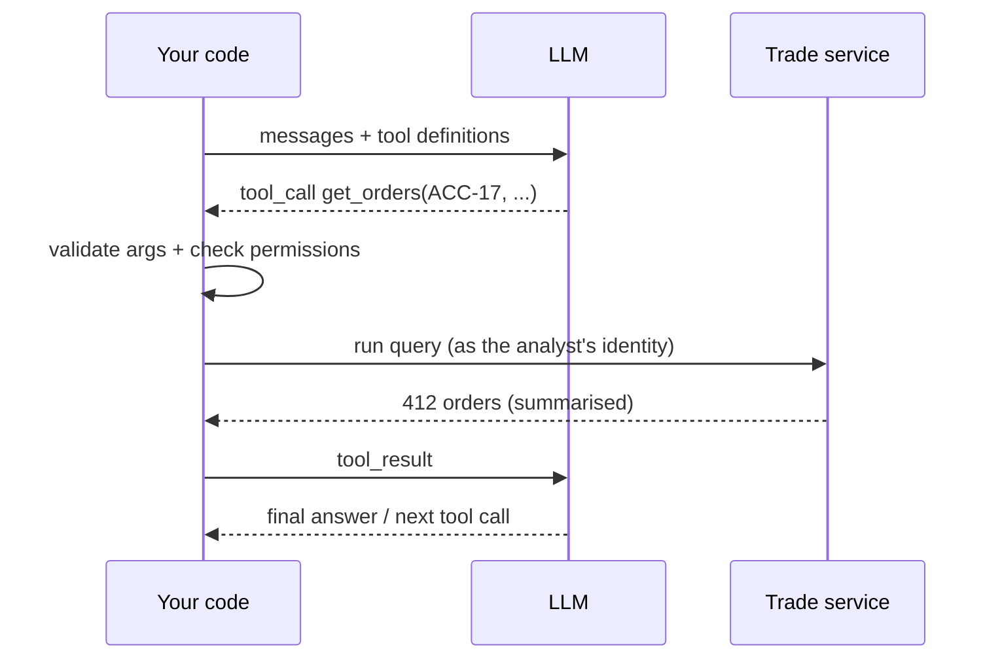

# 14 · Tool Calling — Mastery

!!! abstract "At a glance"
    **Tier:** B (core of your story) · **Module:** [14 · Tool calling](../../modules/14-tool-calling/index.md) · **Back to:** [Workbook](index.md) · [Architect 20%](../architect-20.md)  
    **Say it in one line:** *The model never runs anything. It asks for a tool call, your code validates and executes it, and the result returns as data. Tool names, descriptions and schemas are prompts, so design them like an API for a new colleague.*  
    **Last reviewed:** 2026-10-07

## Explain it like I'm new

An LLM on its own can only produce text. **Tool calling** (also called *function calling*) lets it say:

> "Please run `get_orders(account_id='ACC-17', start='2026-09-01', end='2026-09-02')`."

Then:

1. **You** describe the available tools to the model: name, what each does, and its parameters as a JSON Schema.
2. The model replies with a **tool call request** (the tool name plus arguments) instead of, or before, a normal answer.
3. **Your code** checks the request (is it allowed? are the arguments valid?) and **runs the real function**.
4. You send the **tool result** back to the model, and it continues: either calling more tools or answering.

**Analogy.** The model is a manager who can only write requests on sticky notes. Your code is the assistant who decides whether to act on each note, does the work, and brings back the result.



## Key ideas to master

- **Tool definitions are prompt text.**
    - Clear names (`get_order_history`, not `q2`).
    - A description saying **when to use the tool and when not to**.
    - Typed parameters with descriptions, formats and examples.
- **Few, well-separated tools beat many overlapping ones.** If a human can't tell which tool to use, neither can the model.
- **Validate everything.** Model arguments are untrusted input: check types, ranges and allow-lists.
- **Authorisation in the tool layer.** Tools run with the **end user's** permissions, not a powerful service account.
- **Read vs write tools.** Read-only tools can usually run automatically. **Write / irreversible** tools (file a case, notify, freeze an account) need confirmation or HITL.
- **Return useful, compact results.** Summaries plus IDs, and **actionable errors** ("date range max 31 days; you sent 90").
- **Idempotency and retries.** Tool calls can repeat. Write tools need idempotency keys.
- **Parallel tool calls.** Models can request several independent calls at once, which reduces latency.

## In your resume project

A good and a bad tool definition:

=== "Bad"

    ```json
    {"name": "query", "description": "Gets data",
     "parameters": {"type": "object", "properties": {"q": {"type": "string"}}}}
    ```

=== "Good"

    ```json
    {
      "name": "get_order_events",
      "description": "Fetch order lifecycle events (new, amend, cancel, fill) for ONE account in a time window. Use for spoofing/layering analysis. Do NOT use for executed trades only - use get_trades for that. Max window 31 days. Returns summary stats + up to 200 events with event_id.",
      "parameters": {
        "type": "object",
        "properties": {
          "account_id": {"type": "string", "description": "Internal account ID, e.g. ACC-17"},
          "start": {"type": "string", "format": "date-time"},
          "end": {"type": "string", "format": "date-time"},
          "event_types": {"type": "array", "items": {"enum": ["new", "amend", "cancel", "fill"]}}
        },
        "required": ["account_id", "start", "end"]
      }
    }
    ```

The tool runs **as the analyst** (entitlements applied), enforces the 31-day limit in code, and returns **aggregated stats first**.

## Common mistakes

- Vague tool descriptions, so the model picks the wrong tool or invents arguments.
- 30+ tools loaded at once, so selection accuracy drops.
- Tools running with admin privileges.
- Returning huge raw results that flood the context.
- Letting the model call write actions with no confirmation.

---

## Practice questions

### Simple

??? question "S1. Does the LLM execute the tool itself?"
    **Answer:** No. It only outputs a **request** (tool name plus arguments). Your application decides whether to run it, runs it, and returns the result.

??? question "S2. What three things define a tool for the model?"
    **Answer:**

    1. **Name.**
    2. **Description**: what it does and when to use it.
    3. **Input schema**: parameters, types and required fields, usually as JSON Schema.

??? question "S3. What is a tool result?"
    **Answer:** The output of running the tool, sent back to the model as a message, so it can continue reasoning or answer.

??? question "S4. Why separate read tools from write tools?"
    **Answer:** Reads are usually safe to automate. Writes change the world (file a case, send an email) and can be irreversible, so they need stronger checks: confirmation, HITL and audit.

### Medium

??? question "M1. The model keeps calling `get_trades` when it should call `get_order_events`. How do you fix it?"
    **Answer:**

    - Improve the **descriptions** with explicit "use when / don't use when" lines.
    - Rename the tools to make the difference obvious.
    - Add a short example to the description.
    - Check that the system prompt explains the investigation steps.
    - Check that no near-duplicate tools exist.
    - Add **tool-selection evals**: input → expected tool.

??? question "M2. Why are model-generated tool arguments untrusted?"
    **Answer:** The model can make mistakes (wrong formats, impossible ranges), and it can be **manipulated** by injected content into requesting harmful calls. Validate the arguments like any user input, and enforce permissions in the tool.

??? question "M3. What makes a good tool error message?"
    **Answer:** It is specific and actionable, so the model can correct itself. For example: `"error": "window_too_large", "detail": "max 31 days; requested 90. Split into 3 calls."` A generic error like `500 failed` usually causes loops or guesses.

??? question "M4. What are parallel tool calls, and when are they safe?"
    **Answer:** The model asks for several tool calls in one turn (for example trades for 3 accounts). Your code runs them at the same time. This is safe for **independent read** operations. Avoid it for write actions with ordering dependencies.

### Hard

??? question "H1. Design the authorisation model for tools used by agents on behalf of analysts."
    **Answer:**

    - The tool layer receives the **analyst's identity / token** from the orchestrator (never from the model's arguments).
    - Each tool enforces **entitlements server-side** (row- or column-level).
    - Scopes per agent: the comms agent can only call comms tools.
    - Write tools need an **approval token** from a HITL step.
    - Every call is logged with the user, agent, tool, arguments, result size and decision.
    - Add rate limits and anomaly alerts.

??? question "H2. How do you evaluate tool use, not just final answers?"
    **Answer:** Measure:

    - **Tool-selection accuracy**: was the right tool picked?
    - **Argument accuracy**: valid and correct parameters.
    - **Unnecessary calls**: efficiency.
    - **Error recovery rate**.
    - **Forbidden-call attempts**: safety.

    Use traces from LangSmith-style tooling, with expected tool trajectories for key scenarios.

??? question "H3. A tool can return 50,000 rows. Design the response contract."
    **Answer:**

    - Return **summary stats** first: counts, ratios, time distribution.
    - Then the **top N most relevant rows** with IDs (ranked by a rule), plus a `next_page_token` or a `result_ref` that the model can fetch later if needed.
    - Never put raw bulk data into the context.
    - Document this in the tool description, so the model knows how to dig deeper.

??? question "H4. The agent retried `escalate_case` after a timeout and the case was escalated twice. How do you prevent this?"
    **Answer:** Make write tools **idempotent**:

    - The orchestrator (not the model) attaches an **idempotency key**, for example `case_id + action + approval_id`.
    - The server ignores repeats with the same key and returns the original result.
    - Return clear statuses (`already_escalated`), so the model doesn't keep retrying.
    - Keep write actions behind a HITL approval token that can only be used once.

    Network timeouts don't mean the action failed. Design for "maybe it happened".

### Tricky

??? question "T1. 'The tool is internal, so we don't need input validation.' Respond."
    **Answer:** Wrong. Model arguments can be malformed or manipulated through prompt injection (an injected chat says "query all accounts for 2020–2026"). Internal tools still need validation, limits and authorisation. The LLM is a new and **unpredictable** caller.

??? question "T2. Should the tool description say 'This tool is safe'?"
    **Answer:** That text does nothing for safety. It only influences the model's choice. Safety comes from what the tool **enforces in code**. Descriptions should help the model choose correctly, not reassure humans.

??? question "T3. Can you give the model a 'run_sql' tool to keep things simple?"
    **Answer:** Risky. A general-purpose tool means a huge attack surface (data exfiltration, expensive queries), weak entitlement enforcement and hard auditing. Prefer **narrow, purpose-built tools**. If you must offer SQL, make it read-only, against curated views, with row-level security, query limits and allow-listed tables.

### Scenario (resume-synced)

??? question "SC1. The data agent sometimes requests a 2-year window and times out the trade service. Fix it end-to-end."
    **Answer:**

    1. The **schema and description** state the max window (31 days).
    2. **Validate in code** and return an actionable error suggesting how to split.
    3. Add a server-side **query budget** per case.
    4. Prompt guidance: "start with the alert window ± 1 day; expand only if needed".
    5. Add evals for the window-size choice.
    6. Monitor the timeout rate.

??? question "SC2. An interviewer asks: 'How did you stop agents from taking actions they shouldn't?'"
    **Answer (sample):** "Three layers:

    1. **Agents get narrow tools.** Mostly read-only, scoped per agent role.
    2. **Tools enforce the analyst's entitlements and validate every argument**, so a confused or manipulated model can't widen access.
    3. **Any write action** (filing or escalating a case) requires a human approval token from the HITL step, and every call is logged.

    The prompt guides behaviour. The tool layer enforces it."

## Can you teach it?

- [ ] I can draw the tool-calling loop and say where validation and authorisation happen
- [ ] I can write a good tool definition with use / don't-use guidance
- [ ] I can explain read vs write tools, and why write tools need HITL
