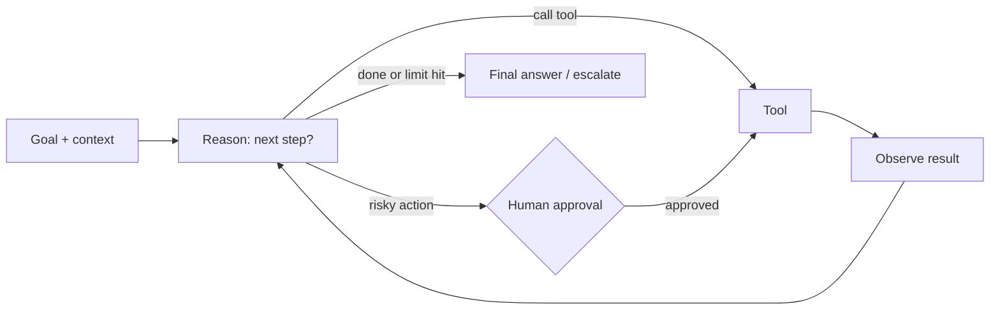

# 15 · Agent Patterns — Mastery

!!! abstract "At a glance"
    **Tier:** B (core of your story) · **Module:** [15 · Agent patterns](../../modules/15-agent-patterns/index.md) · **Back to:** [Workbook](index.md) · [Architect 20%](../architect-20.md)  
    **Say it in one line:** *An agent is an LLM using tools in a loop until a goal is met. Choose the simplest pattern that works, and put stopping rules and human approval at the risky points.*  
    **Last reviewed:** 2026-10-07

## Explain it like I'm new

An agent is like a junior investigator with a task list:

1. Think about what to do next.
2. Use a tool (look up trades, read chats).
3. Look at the result.
4. Repeat until they can answer, or until they must ask a manager.

This "think → act → observe" loop is called **ReAct** (Reason + Act). Agents are useful when **you can't predict the steps in advance**, for example when each investigation follows different leads.

But agents are:

- **Slower.**
- **More expensive.**
- **Harder to test** than fixed workflows.

That is why good architects use agents **only where needed**, with:

- **Limits** (max steps, max cost).
- **Checkpoints** (human approval).
- **Clear tools.**

## Key ideas to master

| Pattern | How it works | Good for | Watch out |
| --- | --- | --- | --- |
| **ReAct (single agent loop)** | Reason, call tool, observe, repeat | Open-ended investigation | Loops, drift, cost |
| **Plan-and-execute** | Make a plan first, then run the steps (re-plan if needed) | Longer tasks with a visible plan | Plans go stale |
| **Orchestrator-workers** | Orchestrator LLM splits work dynamically and hands it to workers | Unknown number of sub-tasks | Coordination overhead |
| **Evaluator-optimizer / reflection** | One drafts, another critiques against a rubric | Narratives, quality-critical outputs | Extra cost, shared blind spots |
| **Human-in-the-loop (HITL)** | Agent pauses for approval / input | High-risk actions, regulated decisions | Approval fatigue |

Also know:

- **Stopping conditions**: goal met, max iterations, max tokens or cost, no progress, or a need for a human.
- **Checkpointing / durable state**: save the state so a run can pause for a human for hours, then resume. LangGraph supports this.
- **Autonomy levels**: suggest only → act with approval → act and notify → fully autonomous. Regulated surveillance mostly lives at **"act with approval"** for anything consequential.

## In your resume project

- The **supervisor** follows an orchestrator-workers pattern: it decides which specialist (data, comms, pattern) to call next.
- Specialists run **small ReAct loops** with scoped tools and **step limits**.
- The case-writer uses **evaluator-optimizer**: draft → rubric check (citations, no legal conclusions, length) → revise, with at most 2 loops.
- **HITL gates**:
    - Before filing or escalating a case.
    - When confidence is low.
    - When the agent wants data outside the standard scope.

## Common mistakes

- Agents with no step or cost limits, which leads to runaway loops.
- Using an agent for a fixed process. A chain would be cheaper and more reliable.
- A HITL step that just shows "Approve?" without evidence, which leads to rubber-stamping.
- No trace of the agent's steps, which makes audit impossible.

---

## Practice questions

### Simple

??? question "S1. What is an AI agent?"
    **Answer:** An LLM that works in a loop: it decides what to do, uses tools, looks at the results and continues until it reaches a goal or a stopping condition.

??? question "S2. What does ReAct stand for?"
    **Answer:** **Reason + Act.** The model alternates between reasoning about the next step and taking an action (a tool call), then observes the result.

??? question "S3. What is HITL?"
    **Answer:** **Human-in-the-loop.** A person reviews, approves, edits or rejects at defined points before the agent continues or acts.

??? question "S4. Name two stopping conditions for an agent loop."
    **Answer:** Any two of:

    - The goal is achieved (a valid final answer).
    - The max number of steps is reached.
    - The cost or token budget is exceeded.
    - No progress for N steps.
    - Human input is required.

### Medium

??? question "M1. When should you use an agent instead of a workflow?"
    **Answer:** When the **steps can't be predefined**: the path depends on what is found, the number of sub-tasks varies, or there are many possible tools and orders. If the steps are known, a workflow is cheaper, faster and easier to test.

??? question "M2. Explain orchestrator-workers vs plain parallelisation."
    **Answer:**

    - **Parallelisation**: *you* define the sub-tasks in code ahead of time.
    - **Orchestrator-workers**: an *LLM* decides at runtime which sub-tasks are needed, hands them to workers and combines the results.

    Use the second when the sub-tasks depend on the input.

??? question "M3. How do you make HITL effective, not a rubber stamp?"
    **Answer:**

    - Show the **evidence and reasoning** (cited IDs, key metrics), not only the conclusion.
    - Highlight uncertainty and what is missing.
    - Make edit and reject easy.
    - Capture the reviewer's reason (feedback for evals).
    - Ask for approval only where the risk justifies it, to avoid fatigue.

??? question "M4. What is checkpointing and why does it matter for HITL?"
    **Answer:** Saving the agent's state (messages, case state, step) to durable storage. The run can **pause** for a human (minutes or days), survive restarts and **resume** exactly where it stopped. It also gives an audit trail.

### Hard

??? question "H1. Design guardrails for an investigation agent's loop."
    **Answer:**

    - **Limits**: max 15 tool calls, max cost per case, max wall-clock time.
    - **Progress detection**: stop if the same tool is called with the same arguments twice.
    - **Scoped tools** per agent.
    - **HITL**: before any write action, or when data outside scope is requested.
    - **Validated outputs** (schema).
    - **Escalation path**: if limits are hit, return a partial packet plus "needs human".
    - **Full tracing** of every step.

??? question "H2. Compare ReAct and plan-and-execute for a 3-week investigation."
    **Answer:**

    - **ReAct** adapts step by step, but it can lose the big picture over long horizons.
    - **Plan-and-execute** creates a visible plan (gather trades → map ownership → review comms → assess), which analysts can review and approve. Execution then follows it with re-planning when findings change.

    For long, regulated work, **plan-and-execute with a reviewable plan and checkpoints** is usually better. Use ReAct inside individual steps.

??? question "H3. What metrics tell you an agent is healthy in production?"
    **Answer:**

    - Task success rate (analyst accepted the packet).
    - Average steps and cost per case.
    - Rate of hitting the loop limit.
    - Tool error rate.
    - HITL rejection and edit rate.
    - Time to packet.
    - Escalation rate.
    - Safety events (forbidden tool attempts, injection detections).

    Watch for trends after every prompt or model change.

### Tricky

??? question "T1. 'Agents are always better than workflows because they're smarter.' Respond."
    **Answer:** No. Agents trade predictability, cost and testability for flexibility. For known processes, workflows are **more** reliable. The best systems are mostly workflow, with agentic parts only where the path varies.

??? question "T2. Does adding a reflection / self-critique step always improve accuracy?"
    **Answer:** Not always. A model critiquing itself can miss the same errors, or "fix" correct answers. It works best with an **explicit rubric**, external checks (code, citations) or a different model, and with capped iterations. Measure it with evals.

??? question "T3. Is full autonomy the end goal for a surveillance agent?"
    **Answer:** In regulated decisions, no. Accountability stays with humans. Aim for **high automation of evidence gathering and drafting**, with human approval of consequential decisions. That is both safer and what regulators expect.

### Scenario (resume-synced)

??? question "SC1. Interviewer: 'Walk me through the agent pattern you used and why.'"
    **Answer (sample):** "We used a supervisor in an orchestrator-workers pattern, built on LangGraph. The supervisor looks at the alert and the current case state and decides which specialist to call: data, comms or pattern. Each specialist runs a short ReAct loop with scoped, read-only MCP tools and step limits. The case-writer drafts the packet and goes through an evaluator check (citations, no legal conclusions). Then the graph pauses at a HITL checkpoint, where the analyst approves, edits or rejects. Rejections loop back with the analyst's note. We chose this because investigations vary too much for a fixed chain, but we wanted every consequential action to stay under human control."

??? question "SC2. An agent occasionally loops for 40 steps calling the comms tool. Diagnose."
    **Answer:** Likely causes:

    - Tool errors that aren't actionable, so the agent retries blindly.
    - Results too big or truncated, so it keeps re-querying.
    - No clear "done" criteria in the prompt.
    - No duplicate-call detection.

    Fix:

    - Actionable errors.
    - Compact results with IDs.
    - Explicit completion criteria.
    - A step limit plus duplicate detection.
    - An eval case that reproduces the loop.

## Can you teach it?

- [ ] I can explain ReAct, plan-and-execute, orchestrator-workers and evaluator-optimizer
- [ ] I can design loop limits, checkpoints and HITL that avoid rubber-stamping
- [ ] I can tell my surveillance agent story in 90 seconds
