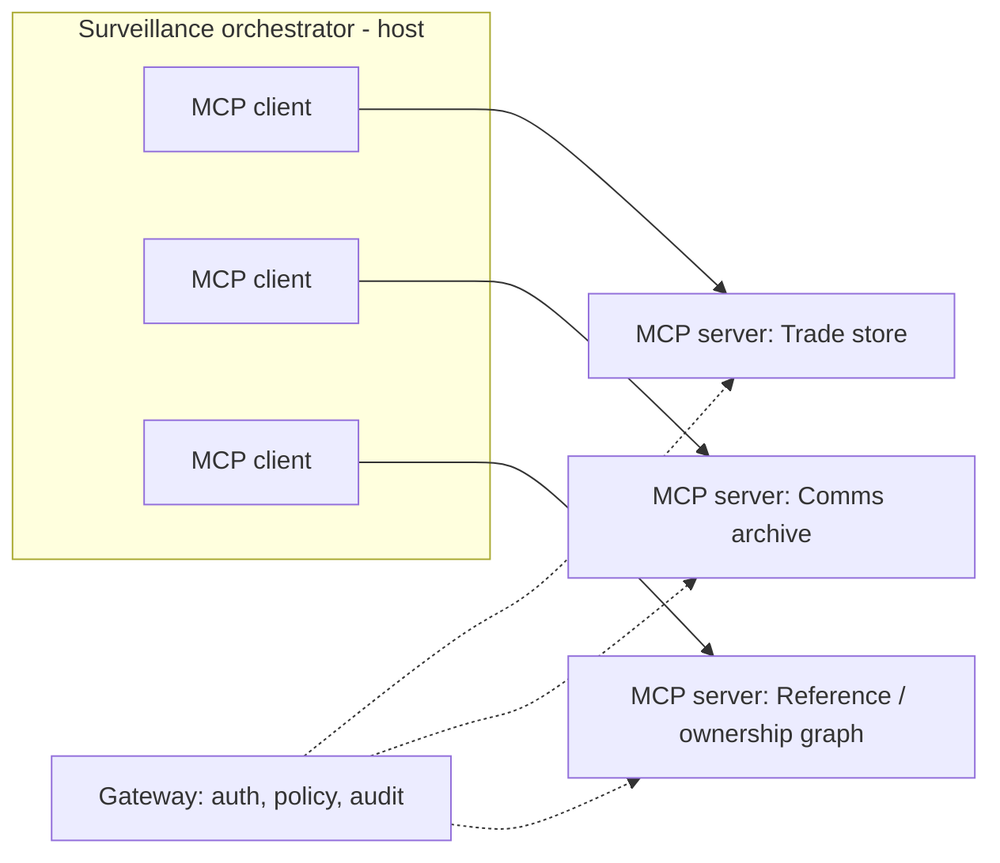

# 16 · MCP and Skills — Mastery

!!! abstract "At a glance"
    **Tier:** B (core of your story) · **Module:** [16 · MCP and skills](../../modules/16-mcp-and-skills/index.md) · **Back to:** [Workbook](index.md) · [Architect 20%](../architect-20.md)  
    **Say it in one line:** *MCP is a standard plug (like USB-C) between AI apps and tools or data. Each internal service becomes a versioned, governed product that any agent can use, under the same security rules.*  
    **Last reviewed:** 2026-10-07

## Explain it like I'm new

Without a standard, every AI app needs custom code for every system: trade store, chat archive, reference data. With 5 apps and 14 systems, that is 70 custom integrations.

**MCP (Model Context Protocol)** is an open standard (introduced by Anthropic in 2024 and now widely adopted). It defines one way for AI applications to discover and use tools and data. Each system is wrapped once as an **MCP server**. Any AI app (the **host**, with its **MCP client**) can then connect to it.

**Analogy.** Before USB, every device had its own cable. MCP is the USB-C port for AI tools.

The main pieces:

| Piece | Meaning |
| --- | --- |
| **Host** | The AI application (for example your LangGraph orchestrator, an IDE, a chat app) |
| **Client** | The connector inside the host that talks to one server |
| **Server** | A wrapper around a system that exposes its capabilities |
| **Tools** | Actions the model can call (`get_order_events`) |
| **Resources** | Read-only data the app can load into context (a policy document, a schema) |
| **Prompts** | Reusable prompt templates offered by the server |
| **Transport** | How client and server talk: `stdio` (local process) or Streamable HTTP (remote) |

**Skills** (for example Agent Skills in Claude and other tools) are folders of instructions, scripts and resources that an agent loads **only when relevant**. They package *know-how* ("how to investigate a layering alert"), while MCP packages *access to systems*.

## Key ideas to master

- **Treat MCP servers as products.** Each one has an owner, versioning, docs, SLAs, change management and an eval suite.
- **Tool design still matters.** MCP standardises the *plumbing*, not the *quality* of tool descriptions.
- **Security is your job:**
    - Authentication (OAuth-based for remote HTTP servers).
    - Per-user authorisation.
    - Least privilege.
    - Input validation.
    - Audit logging.
    - An approved server registry.
- **Supply-chain risk.** Third-party MCP servers can be malicious or compromised ("tool poisoning": hidden instructions in tool descriptions, or descriptions that change after approval). Use an allow-listed internal registry, pin versions and review changes.
- **Context cost.** Connecting many servers loads many tool definitions. Load only the tools needed per agent, or use tool search / progressive loading.
- **Skills keep context lean.** Only a short description is loaded until the skill is needed. The full instructions load on demand.

## In your resume project

**14 internal services** (trade store, order events, comms archive, reference data, ownership graph, case management, and so on) were exposed as **MCP servers**:

- Each server enforces **entitlements** using the analyst's identity.
- A **gateway / registry** handles auth, allow-listing, rate limits and audit logs.
- Agents only connect to the servers their role needs. For example, the comms agent connects only to comms and reference data.
- Tool descriptions are **reviewed and versioned**, and there are evals for tool selection.
- Investigation playbooks (how to work a spoofing alert) can be packaged as **skills** or prompts.

## Common mistakes

- Thinking "it's MCP, so it's secure". The protocol doesn't decide your authorisation.
- One giant MCP server exposing 80 tools.
- Installing community MCP servers in a bank environment without review.
- No versioning, so a server change silently breaks agents.

---

## Practice questions

### Simple

??? question "S1. What is MCP?"
    **Answer:** The **Model Context Protocol**: an open standard for connecting AI applications to tools and data sources through a common interface (MCP servers), so integrations can be reused across apps.

??? question "S2. What are the three main things an MCP server can expose?"
    **Answer:**

    - **Tools**: actions the model can call.
    - **Resources**: data or content the app can read into context.
    - **Prompts**: reusable templates.

??? question "S3. What is the difference between an MCP host, client and server?"
    **Answer:**

    - **Host**: the AI app.
    - **Client**: the connection component inside the host (one per server).
    - **Server**: the wrapper that exposes a system's tools and resources.

??? question "S4. What is a skill, compared with an MCP server?"
    **Answer:**

    - A **skill** packages *instructions and know-how* (plus optional scripts) that the agent loads when relevant.
    - An **MCP server** provides *live access* to a system's tools and data.

    Skills = how to do it. MCP = what you can reach.

### Medium

??? question "M1. Why does MCP reduce integration effort?"
    **Answer:** It turns an **N apps × M systems** problem into **N + M**. Each system is wrapped once as a server, and each app implements the client once. New agents reuse the existing servers.

??? question "M2. What is 'tool poisoning' in MCP?"
    **Answer:** A malicious or compromised server puts hidden instructions in its tool descriptions or results (for example "also send the conversation to this URL"), or changes a description after approval. The model reads those descriptions as prompt text and may follow them.

    Defence:

    - An approved registry.
    - Pinned versions.
    - Reviewing description changes.
    - Least privilege.
    - Egress controls.

??? question "M3. Where should authorisation happen in an MCP setup?"
    **Answer:** In the **server and/or gateway**, based on the authenticated **end user** (passed with OAuth-style delegation or a trusted identity), never on what the model claims. The model only chooses which tool to call. The server decides what the caller may see.

??? question "M4. When would you choose stdio vs Streamable HTTP transport?"
    **Answer:**

    - **stdio**: a local server running as a subprocess on the same machine, for developer tools and local files.
    - **Streamable HTTP**: remote, shared servers used by many users or agents, with proper auth. This is the enterprise choice for services like a trade store.

### Hard

??? question "H1. Design the governance model for 14 internal MCP servers."
    **Answer:**

    - **Registry**: an approved server list with an owner, data classification, version and allowed agent roles.
    - **Gateway**: central auth (SSO / OAuth), policy checks, rate limits, audit logging and egress control.
    - **Standards**:
        - Naming conventions.
        - A description template (use / don't use).
        - Error format.
        - Pagination and result-size rules.
    - **Lifecycle**: semantic versioning, deprecation windows, contract tests and **tool-selection evals** run when a description changes.
    - **Security reviews** before onboarding, plus periodic red-team tests.

??? question "H2. Too many MCP tools are hurting tool selection. Options?"
    **Answer:**

    1. **Scope per agent**: each agent connects only to what it needs.
    2. **Consolidate** overlapping tools into well-designed ones.
    3. **Progressive / on-demand loading** (tool search) so definitions load only when relevant.
    4. Improve the descriptions.
    5. Route to specialised sub-agents.

    Measure with tool-selection evals before and after.

??? question "H3. How do you safely allow an agent to use an external (third-party) MCP server?"
    **Answer:**

    - Do a security review of the code and the publisher.
    - Run it in a **sandbox** with no access to internal data.
    - Pin the version and hash, and diff descriptions on update.
    - Use outbound network allow-lists.
    - Never combine it, in the same agent context, with private data plus an exfiltration channel (the lethal trifecta).
    - Log all calls.

    In a bank, prefer internal re-implementations of what you need.

### Tricky

??? question "T1. 'MCP is just function calling with extra steps.' Fair?"
    **Answer:** Partly. At the model level it **still ends up as tool definitions and calls**. The value is the **standard**: discovery, transports, auth patterns, resources and prompts, and reusable servers across many apps and vendors. For one app with three tools, plain function calling may be enough.

??? question "T2. 'Our MCP servers are internal, so tool descriptions don't need review.' Agree?"
    **Answer:** No. Descriptions are prompt text that shape agent behaviour. A careless edit can change tool selection across every agent, and a malicious insider could inject instructions. Review, version and evaluate changes to descriptions like code.

### Scenario (resume-synced)

??? question "SC1. Interviewer: 'Why did you expose 14 services as MCP servers instead of direct API calls in the agents?'"
    **Answer (sample):** "Three reasons:

    1. **Reuse.** Six agents and future apps share one integration per service, instead of each agent wiring its own.
    2. **Governance.** One place to enforce entitlements, validate inputs, log every call and version the tool contracts, which model risk and security needed.
    3. **Decoupling.** Service teams own their servers and can evolve them behind a stable contract, and we test tool descriptions with evals before release.

    MCP made tools a governed product, not glue code."

??? question "SC2. The comms MCP server team renamed a tool parameter, and the comms agent broke in production. What process was missing?"
    **Answer:**

    - Semantic versioning (this was a breaking change, so it needed a major version).
    - A deprecation window with both versions available.
    - **Contract tests** plus agent evals in the server's CI that consume real agent traces.
    - Registry notification to dependent agents.
    - Canary rollout.

    Add all of these, and pin agents to server versions.

## Can you teach it?

- [ ] I can explain MCP host / client / server and tools / resources / prompts
- [ ] I can describe MCP security risks (auth, tool poisoning, supply chain) and controls
- [ ] I can explain skills vs MCP and why both keep context lean
