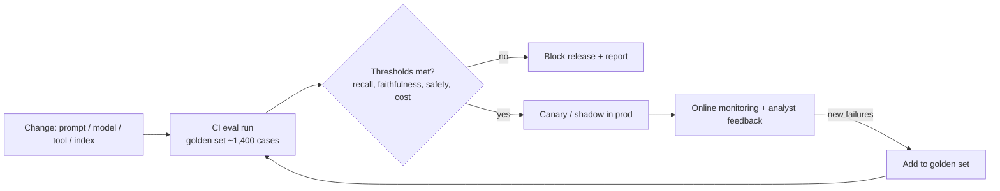

# 18 · Evaluation — Mastery

!!! abstract "At a glance"
    **Tier:** C (ship and defend) · **Module:** [18 · Evaluation](../../modules/18-evaluation/index.md) · **Back to:** [Workbook](index.md) · [Architect 20%](../architect-20.md)  
    **Say it in one line:** *Evals are the unit tests and release gates for LLM systems: a labelled golden set, clear metrics, automated scoring in CI and production monitoring. No eval, no release.*  
    **Last reviewed:** 2026-10-07

## Explain it like I'm new

When you change normal code, unit tests tell you whether something broke. LLM outputs vary and are "fuzzy", so you need **evals**: a set of test cases with **expected outcomes**, plus a way to **score** the answers automatically.

The three parts:

1. **Dataset (golden set).** Real or realistic inputs, with the correct answer or acceptance criteria. For example: "alert 48213 → should be high priority, wash trade, evidence must include T-881 and T-884."
2. **Graders (scorers):**
    - **Code checks**: exact match, schema valid, IDs exist.
    - **LLM-as-judge**: a model grades against a rubric.
    - **Human review**: experts grade a sample.
3. **Process.** Run the evals on every change (prompt, model, tool, retrieval) in **CI**, and block the release if the scores drop below thresholds.

**Offline evals** run before release on fixed data. **Online evals / monitoring** run on live traffic (sampled grading, analyst feedback, drift).

## Key ideas to master

- **Metrics should match the business risk.**
    - **Recall** on true alerts: missing real misconduct is the worst outcome.
    - **Precision**: wasting analyst time.
    - **Faithfulness**: claims supported by evidence.
    - **Citation validity**.
    - **Format compliance**.
    - **Latency and cost**.
    - **Safety**: injection resistance, PII/MNPI leaks.
- **Golden set design.**
    - Cover the main patterns **and** edge cases.
    - Include adversarial cases and "insufficient evidence" cases.
    - Use labels from expert analysts.
    - Version the dataset.
    - Keep a **held-out** portion.
- **LLM-as-judge.** It scales well, but it has biases:
    - **Position**: preferring the first option.
    - **Verbosity**: preferring longer answers.
    - **Self-preference**: preferring its own model's style.

    Calibrate it against human labels, use specific rubrics, and prefer pass/fail checks over 1–10 scores.
- **Evaluate components separately.** Retrieval, tool selection, each agent, then end-to-end.
- **Non-determinism.** Run important cases several times and look at the variance. For agents, consider *pass^k* (passes all k tries) for reliability, not only *pass@k* (passes at least once).
- **Never leak eval data** into prompts or few-shot examples (this repo enforces that with a test).
- **Turn production failures into new eval cases.** The golden set grows over time.

## In your resume project

- **About 1,400 CI cases in LangSmith**, covering:
    - Triage decisions.
    - Pattern classification.
    - Tool selection.
    - Packet schema and citation validity.
    - Faithfulness of narratives.
    - Red-team injection cases.
    - Entitlement leak tests.
- **Release gates** (illustrative):
    - Recall on true alerts ≥ the current baseline.
    - Faithfulness ≥ 0.95.
    - Zero entitlement leaks.
    - Injection success rate ≤ the agreed threshold.
    - Cost per case within budget.
- **Online:**
    - Analyst accept / edit / reject rates.
    - Sampled LLM-judge scoring.
    - Drift alerts.

## Common mistakes

- "Vibe checks" (trying 5 examples by hand) instead of a dataset.
- Only measuring accuracy, and ignoring recall on rare-but-critical cases.
- Trusting an LLM judge without checking it against humans.
- A golden set that never changes. It goes stale, and teams overfit to it.

---

## Practice questions

### Simple

??? question "S1. What is an eval?"
    **Answer:** A repeatable test for an LLM system: input cases, expected outcomes or criteria, and a scoring method. It tells you whether quality went up or down after a change.

??? question "S2. What is a golden set?"
    **Answer:** A curated, labelled dataset of test cases, with correct answers or acceptance criteria approved by experts. It is used as the trusted benchmark for your system.

??? question "S3. What is LLM-as-judge?"
    **Answer:** Using an LLM to grade another model's output against a rubric (for example "does every claim cite evidence?"). It is useful when exact-match checks are impossible.

??? question "S4. Offline vs online evaluation?"
    **Answer:**

    - **Offline**: before release, on fixed test data.
    - **Online**: in production, on real traffic, through sampling, user feedback and monitoring.

    You need both.

### Medium

??? question "M1. For alert triage, why might recall matter more than precision?"
    **Answer:** A **missed** true alert (a false negative) means real market abuse goes undetected, which brings regulatory and reputational damage. A false positive costs analyst time. So you set a **minimum recall** and then optimise precision within it. The exact trade-off is a business and risk decision.

??? question "M2. What is faithfulness, and how do you measure it?"
    **Answer:** Whether every claim in the output is **supported by the provided sources**. Measure it by:

    - Splitting the answer into claims.
    - Checking each claim against the cited evidence (LLM judge, or an NLI model, which judges whether one text supports another).
    - Reporting the supported fraction.

    Plus code checks that the cited IDs exist.

??? question "M3. Name three biases of LLM judges and a fix for each."
    **Answer:**

    - **Position bias**: swap the order and average.
    - **Verbosity bias**: the rubric explicitly ignores length, or penalises padding.
    - **Self-preference**: use a different model family as judge, or calibrate on human labels.

    Also use specific yes/no criteria, not vague 1–10 scores.

??? question "M4. Why should eval items never be used as few-shot examples?"
    **Answer:** The model would see the answers to the test, which inflates the scores and hides real quality. That is data leakage. Keep separate example banks and enforce **disjoint IDs** with an automated test.

??? question "M5. What should trigger an eval run?"
    **Answer:** Any change to:

    - A prompt.
    - The model or model version.
    - Tool definitions.
    - The retrieval index or chunking.
    - The schema.
    - Orchestration logic.

    Also run them on a schedule, to catch provider-side drift.

### Hard

??? question "H1. Design a minimum eval pack for a governed surveillance agent."
    **Answer:**

    1. **Functional**: triage priority (recall / precision), pattern classification, a packet completeness rubric.
    2. **Grounding**: faithfulness, citation validity, an insufficient-evidence refusal rate on cases with no answer.
    3. **Tooling**: tool-selection and argument accuracy, loop and step counts.
    4. **Safety**: an injection suite (direct and indirect, through chats and emails), PII/MNPI leak checks, cross-entitlement probes (must be 0).
    5. **Operational**: p95 latency, cost per case.
    6. **Human calibration**: a monthly expert review of a sample, comparing judge and human agreement.

    Each metric has a **threshold** and an **owner**.

??? question "H2. Your new prompt improves average quality by 3% but fails 4 previously-passing critical cases. Ship?"
    **Answer:** Not automatically. **Critical cases are hard gates**, not part of the average. Look into the 4 regressions. If they are true failures on high-risk patterns, block the release, fix it and re-run. Use tagged slices (critical / high-risk / adversarial) with separate thresholds, so that averages can't hide them.

??? question "H3. How do you handle non-determinism in evals?"
    **Answer:**

    - Use low temperature where appropriate.
    - Run critical cases **several times** and report the pass rate and variance.
    - For agents, track pass^k (consistent success).
    - Set thresholds with confidence intervals in mind (1,400 cases ≠ infinite precision).
    - Don't chase differences smaller than the noise.

??? question "H4. How do you keep the golden set from going stale or being overfitted?"
    **Answer:**

    - **Add production failures** and new typologies regularly.
    - Keep a **held-out** set the team never tunes on.
    - Version the dataset and review the labels.
    - Rotate in fresh samples.
    - Check that eval gains also show up in **online metrics** (analyst acceptance).

### Tricky

??? question "T1. '100% pass rate on our evals — we're ready.' Respond."
    **Answer:** Be suspicious. Possible causes:

    - The evals are too easy or stale.
    - Leakage into prompts or examples.
    - Overfitting to the set.
    - Missing adversarial or edge cases.

    Check the coverage, the held-out results and the online metrics. A perfect score usually means the **test** is weak.

??? question "T2. 'We'll use the same model as both generator and judge — it understands the task best.' Problem?"
    **Answer:** **Self-preference bias**: it may rate its own style and errors favourably. Use a different model, or at least calibrate it against human labels and rely on objective code checks wherever possible.

??? question "T3. Is accuracy a good single metric for triage?"
    **Answer:** No. If 97% of alerts are false positives, a system that says "low risk" to everything gets 97% accuracy and catches **zero** misconduct. Use recall, precision and per-class metrics on imbalanced data.

### Scenario (resume-synced)

??? question "SC1. After a model upgrade, faithfulness drops from 0.96 to 0.91 in CI. Walk through your response."
    **Answer:**

    1. **Block** the release. The gate did its job.
    2. **Slice** the failures by pattern, step and document type.
    3. **Inspect the traces**. Is the new model adding outside knowledge? Ignoring the citation rules? Is retrieval different?
    4. **Adjust the prompts** for the new model (it may need clearer grounding rules), or keep the old model pinned.
    5. Re-run the full suite and the critical slices.
    6. Record the decision for model risk.

??? question "SC2. Model risk asks: 'How do you know the agent is still good six months after launch?'"
    **Answer:** "Four things:

    1. **Continuous monitoring**: analyst accept / edit / reject rates, sampled faithfulness grading, latency and cost.
    2. **Scheduled CI runs** of the full golden set, to catch provider drift.
    3. **New failure cases** go into the golden set every sprint.
    4. A **quarterly expert review** that compares the LLM judge with human labels.

    Any metric breaching its threshold raises an alert to the owner, and that can trigger rollback."

??? question "SC3. Explain your 1,400 CI cases to a fresher in simple words."
    **Answer:** "We have 1,400 practice cases where experts already know the right answer. Every time anyone changes a prompt, a model or a tool, a robot runs all 1,400 cases and scores them. If the scores drop on important things (missing a real wash trade, leaking data, citing fake evidence), the change isn't allowed to go live. It's like an automated exam the system must pass before every release."

## Can you teach it?

- [ ] I can design a golden set and pick metrics that match business risk
- [ ] I can explain LLM-judge biases and how to calibrate the judge
- [ ] I can describe CI gates, critical slices and online monitoring
