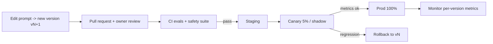

# 21 · PromptOps (lite) — Mastery

!!! abstract "At a glance"
    **Tier:** C (ship and defend) · **Module:** [21 · PromptOps](../../modules/21-promptops/index.md) · **Back to:** [Workbook](index.md) · [Architect 20%](../architect-20.md)  
    **Say it in one line:** *Treat prompts like code and configuration: version them, review them, test them with evals, roll them out safely, monitor them and be able to roll back, with an audit trail of who changed what.*  
    **Last reviewed:** 2026-10-07

## Explain it like I'm new

A prompt in production is **part of your software**. Changing one sentence can change thousands of decisions. **PromptOps** (LLMOps for prompts) is the discipline of managing prompts safely:

1. **Version.** Every prompt has an ID and a version, for example `triage.system.v7`. Never edit a version that is in use. Create `v8` instead. This repo follows that rule for `prompts/` YAML.
2. **Review.** Changes go through a pull request, reviewed by the owner (and by risk, for policy text).
3. **Test.** The eval suite runs automatically. If it fails, the change doesn't merge.
4. **Release safely.** Use a canary (a small % of traffic) or shadow mode, then full rollout.
5. **Monitor.** Watch quality, cost and latency in production.
6. **Roll back.** Switch back to the previous version quickly if something goes wrong.
7. **Trace.** Every output records which prompt version, model and configuration produced it.

As an architect, you **design** this process and the **design authority** rules. You don't run it day to day.

## Key ideas to master

- **Prompts as artefacts**, not hard-coded strings: stored in a repo or registry, with metadata (owner, model, eval set, status).
- **The release unit = prompt version + model version + parameters + tool definitions + retrieval config.** A change to any of them is a "release".
- **Environments**: dev → staging → prod, with the same eval gates.
- **Change classes**:
    - Wording tweak → standard review.
    - Policy or refusal change → risk sign-off.
    - Model change → full suite plus model-risk notification.
- **Observability**: traces (LangSmith-style), dashboards for metrics per prompt version.
- **Model deprecation**: providers retire models. Track the dates, test replacements early and log them in [What's new](../../reference/whats-new.md).

## In your resume project

- The prompt blocks (policy, task, schema) for each of the six agents are **versioned in a repo**, and each output's trace records the block versions.
- **LangSmith** traces plus the **1,400-case CI suite** gate every change.
- Policy blocks need a **compliance / model-risk sign-off**.
- Model upgrades (for example a new Sonnet-class version) run in **shadow mode** on live alerts before cutover.
- **Rollback** is a config switch to the previous version set.

## Common mistakes

- Editing a prompt directly in production config "just to fix one word".
- Not recording the prompt version in outputs, so you can't explain past decisions.
- Testing the prompt change but forgetting that the **model** auto-updated (using an unpinned alias).
- No owner for each prompt.

---

## Practice questions

### Simple

??? question "S1. What is PromptOps?"
    **Answer:** The practice of managing prompts like software: versioning, review, automated testing, controlled release, monitoring and rollback.

??? question "S2. Why version prompts?"
    **Answer:** So you can:

    - Know exactly which prompt produced which output (audit).
    - Compare versions.
    - Roll back safely.
    - Avoid accidental changes to prompts in use.

??? question "S3. What is a canary release?"
    **Answer:** Rolling out a change to a **small share of traffic** first (for example 5%) and comparing its metrics against the current version before expanding to everyone.

### Medium

??? question "M1. What counts as a 'release' for an LLM feature?"
    **Answer:** A change to **any** of:

    - The prompt text.
    - The model or model version.
    - Sampling parameters.
    - Tool definitions.
    - The schema.
    - The retrieval index or configuration.
    - Orchestration logic.

    All of them can change behaviour, so all of them go through evals.

??? question "M2. What is shadow mode, and when do you use it?"
    **Answer:** The new version processes **real traffic in parallel**, but its outputs aren't shown to users or acted on. You compare them with the current version. Use it for risky changes (model upgrades, major prompt rewrites) in regulated workflows.

??? question "M3. Why pin model versions instead of using a 'latest' alias?"
    **Answer:** With an alias, the provider can update the model **under you**, changing behaviour with no change on your side, and nothing passes through your eval gate. Pin specific versions. Upgrade deliberately, with evals.

### Hard

??? question "H1. Define a change-management policy for prompts in a regulated firm."
    **Answer:**

    - **Classes:**
        1. Cosmetic / wording: owner review plus the eval gate.
        2. Behavioural: the task logic changes. Owner plus tech-lead review, full eval, canary.
        3. Policy / safety: refusal, redaction or scope changes. Adds risk / compliance sign-off.
        4. Model change: full suite, shadow run, model-risk notification and documentation update.
    - **Everything:** versioned, traced, with a rollback plan and a recorded approver.

??? question "H2. A bad prompt release reached production. Design the incident response."
    **Answer:**

    1. **Detect**: alerts on per-version metrics, analyst complaints.
    2. **Contain**: roll back to the previous version set through config.
    3. **Assess the impact**: query the traces for outputs from the bad version, and decide whether affected cases need re-review.
    4. **Root cause**: why didn't the evals catch it? Add the failing cases to the golden set.
    5. **Report** through the model-risk / incident process.

??? question "H3. How do you manage provider model deprecations across six agents?"
    **Answer:**

    - Keep a **model inventory**: agent → model version → deprecation date.
    - Subscribe to provider changelogs and log changes in what's-new.
    - Test candidates **early** with the full suite.
    - Plan prompt adjustments (new models may follow instructions differently).
    - Schedule shadow runs.
    - Have a fallback model approved ahead of time.

### Tricky

??? question "T1. 'It's a one-word prompt fix, we can hotfix it in prod.' OK?"
    **Answer:** No. One word can change behaviour on thousands of cases ("may" vs "must"). Use a fast-track path if needed, but keep **version + eval + record** as the minimum. Speed comes from automation, not from skipping gates.

??? question "T2. 'Prompts are just text, so they don't need code review.' Agree?"
    **Answer:** No. In LLM systems, prompts **are behaviour**. They decide refusals, data handling and tool use. They deserve the same review rigour as code, and policy prompts need extra (risk) review.

??? question "T3. 'We only changed the retrieval index, not the prompt, so no eval run is needed.' Correct?"
    **Answer:** No. A new index changes **what the model sees**, which changes its answers as much as a prompt edit can. Re-chunking, new embeddings or new documents are all releases. Version the index and run the grounding evals (retrieval recall, faithfulness) before switching.

### Scenario (resume-synced)

??? question "SC1. Model risk asks: 'For case C-2231 from four months ago, can you show exactly why the agent said what it said?'"
    **Answer:** "Yes. The case trace records:

    - The prompt block versions (`policy v4`, `task v9`, `schema v3`).
    - The model version.
    - The parameters.
    - Each tool call with its arguments and results.
    - The retrieved document IDs.
    - The output packet.
    - The analyst's approval.

    We can pull the exact prompt text from the repository at those versions and show the evidence it cited. We can't promise an identical re-generation, but we have the complete record of what happened."

??? question "SC2. Explain PromptOps to a fresher on your team in 3 sentences."
    **Answer:** "Prompts are code: every change gets a new version and a pull request, never a direct edit. Robots run our test cases on every change, and if scores drop, it can't ship. We roll out to a small slice first, watch the dashboards, and can switch back to the old version in one step."

## Can you teach it?

- [ ] I can describe the prompt lifecycle: version → review → eval → canary → monitor → rollback
- [ ] I can define what counts as a release and why to pin models
- [ ] I can explain auditability for past decisions
