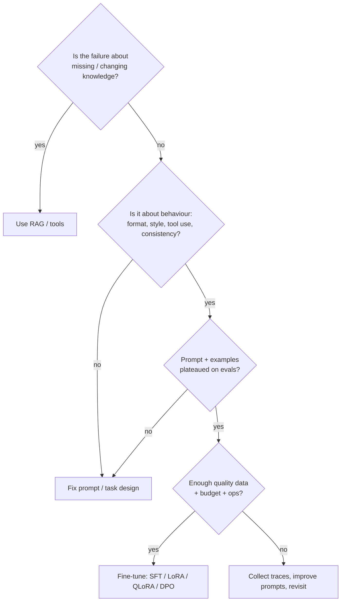

# 22 · Fine-tune vs Prompt vs RAG — Mastery

!!! abstract "At a glance"
    **Tier:** C (ship and defend) · **Module:** [22 · Fine-tune vs prompt vs RAG](../../modules/22-finetune-vs-prompt-vs-rag/index.md) · **Back to:** [Workbook](index.md) · [Architect 20%](../architect-20.md)  
    **Say it in one line:** *Prompt first. Use RAG for knowledge the model lacks. Fine-tune to change behaviour (format, style, tool use, cost) once evals prove that prompting and RAG have plateaued and you have good data.*  
    **Last reviewed:** 2026-10-07

## Explain it like I'm new

Three ways to make a model do your job better:

| Approach | Analogy | Changes | Best for |
| --- | --- | --- | --- |
| **Prompting** | Giving clear instructions to a new hire | Nothing in the model | Most tasks; fastest to iterate |
| **RAG** | Giving them the right files to read | What the model *sees* | Fresh, private, changing **knowledge**; citations |
| **Fine-tuning** | Sending them on a training course | The model's *weights* (its habits) | Consistent **behaviour**: format, tone, tool use, domain style; smaller/cheaper models |

The key rule:

- **RAG teaches facts.**
- **Fine-tuning teaches habits.**

Fine-tuning is a poor way to add facts that change often. You'd have to retrain every time, and you'd lose citations.

**Fine-tuning words to know:**

- **SFT (supervised fine-tuning)**: training on examples of input → ideal output.
- **LoRA**: trains small "adapter" layers instead of the whole model. Cheaper.
- **QLoRA**: LoRA on a compressed (quantised) model. Even cheaper; it fits on smaller GPUs.
- **DPO (Direct Preference Optimization)**: trains on pairs of a **preferred** and a **rejected** answer, so the model learns which kind of answer you prefer. It needs no separate reward model.

## Key ideas to master

- **The decision order:**
    1. Better prompt / context.
    2. RAG / tools.
    3. Fine-tune.

    Combine them as needed. Many production systems use **RAG plus a fine-tuned model**.
- **Fine-tune when:**
    - The behaviour is hard to describe but easy to show with many examples.
    - Prompts are long and costly.
    - You need a **small model** to match a big one on a narrow task.
    - Tool-call format or argument errors persist.
    - Latency or cost needs a smaller model.
- **Don't fine-tune when:**
    - The problem is missing knowledge (use RAG).
    - You lack quality data (hundreds to thousands of good examples).
    - The task changes weekly.
    - You haven't built evals yet.
- **Costs of fine-tuning:**
    - Data collection and labelling.
    - Training runs.
    - Hosting.
    - Re-tuning when the base model changes.
    - Model-risk validation.
    - Possible loss of general ability ("catastrophic forgetting").
- **Evidence-driven decisions.** Same eval set, compare: prompt-only vs RAG vs fine-tuned. Look at quality, cost, latency and maintenance.

## In your resume project

- **Knowledge** (policies, past cases, ownership) → **RAG and GraphRAG**, because it changes and needs citations.
- **Behaviour problem.** The on-prem open model (Llama-class) made **tool-call format and argument errors** that prompting didn't fix.
- **Fix:**
    - **QLoRA SFT** on curated, successful **tool-use traces** taken from production and evals.
    - Then **DPO** on preferred vs rejected trajectories (for example a correct, narrow query vs an overly broad one).
- **Evidence:** compare tool-call accuracy and cost per case on a held-out eval set, against prompt-only and against the larger cloud model.
- **Governance:** training data is checked for PII/MNPI handling and entitlements, the model is versioned and model-risk validation is documented.

## Common mistakes

- Fine-tuning to "teach the model our policies". Policies change; use RAG.
- Fine-tuning before building evals, so you can't prove it helped.
- Training on unreviewed traces, which teaches the model your bugs.
- Forgetting that a base-model upgrade means re-tuning and re-validation.

---

## Practice questions

### Simple

??? question "S1. What is the difference between RAG and fine-tuning?"
    **Answer:**

    - **RAG** gives the model relevant information **at query time** through the prompt. The model is unchanged.
    - **Fine-tuning** **changes the model's weights** by training on examples, so its default behaviour changes.

??? question "S2. What should you try first: prompting, RAG or fine-tuning?"
    **Answer:** **Prompting** (with good context). It is cheapest and fastest to iterate. Add RAG for missing knowledge. Fine-tune only when evals show the other approaches have plateaued.

??? question "S3. What is LoRA / QLoRA in simple words?"
    **Answer:**

    - **LoRA** trains small add-on layers instead of the whole model, which makes it cheaper and faster.
    - **QLoRA** does the same on a compressed (quantised) model, so it needs even less GPU memory.

??? question "S4. What is DPO?"
    **Answer:** **Direct Preference Optimization.** You train the model on pairs of answers to the same input, one preferred and one rejected, so it learns to produce the preferred kind. It needs no separate reward model.

### Medium

??? question "M1. Why is fine-tuning a poor way to add frequently changing facts?"
    **Answer:**

    - You'd need to **retrain** whenever the facts change.
    - The model can still mix up or hallucinate trained facts.
    - You **lose citations**, because you can't point to a source document.

    RAG updates instantly when the index changes, and it can cite sources.

??? question "M2. Give three good reasons to fine-tune."
    **Answer:**

    1. Consistent **format or style** that prompts can't reliably enforce.
    2. **Tool-use reliability** (correct calls and arguments) for a specific tool set.
    3. **Cost or latency**: make a small model match a large one on a narrow task.

    Also, to shorten very long prompts by "baking in" instructions.

??? question "M3. What data do you need for good fine-tuning?"
    **Answer:**

    - Enough **high-quality, reviewed** examples (often hundreds to thousands for narrow tasks).
    - Coverage of the real input variety, including edge cases.
    - Correct labels or preferences.
    - Data handled under the right privacy and entitlement rules.
    - A separate held-out eval set.

### Hard

??? question "H1. Build the business case: fine-tune the on-prem model vs keep using the bigger cloud model."
    **Answer:** Compare on the same eval set:

    - **Quality**: tool-call accuracy, task success.
    - **Cost per case**: inference cost plus amortised training and hosting.
    - **Latency**.
    - **Data policy**: the on-prem model keeps sensitive data in-house, which is often the deciding factor.
    - **Maintenance**: re-tuning on base upgrades, validation effort.

    Decide with numbers. For example: "the fine-tuned on-prem model reaches 96% of the cloud model's tool accuracy at 30% of the cost, and it meets the MNPI residency rule."

??? question "H2. Why combine SFT and DPO for tool-use traces?"
    **Answer:**

    - **SFT** teaches the model to imitate **good** trajectories: correct format and sensible sequences.
    - **DPO** then teaches **preferences between alternatives** (narrow vs broad query, correct vs wrong tool), which SFT alone can't express because it only shows positives.

    Together they improve both format and judgement.

??? question "H3. What governance does a fine-tuned model need in a bank?"
    **Answer:**

    - Model inventory entry.
    - Training-data lineage (sources, consent, PII/MNPI handling, entitlements).
    - Validation report (evals, bias and safety tests).
    - Versioning.
    - Approval by model risk.
    - Monitoring plan.
    - A re-validation trigger when the base model, data or use case changes.
    - A rollback model.

### Tricky

??? question "T1. 'We'll fine-tune on our surveillance policies so the model just knows them.' Respond."
    **Answer:** Bad idea:

    - Policies change.
    - Answers can't cite the source.
    - Trained-in facts can blur.

    Use **RAG** for policies with citations. Fine-tune only for behaviour, such as how to structure an assessment.

??? question "T2. 'Fine-tuning removes the need for good prompts.' True?"
    **Answer:** No. Fine-tuned models still need clear system prompts, context and schemas. Fine-tuning shifts **defaults**, and the prompt still gives the case-specific task and evidence.

??? question "T3. 'RAG vs fine-tuning — pick one.' Correct?"
    **Answer:** It's not either/or. Common production setup: **RAG for knowledge plus fine-tuning for behaviour plus good prompts**. Choose per failure type.

### Scenario (resume-synced)

??? question "SC1. Interviewer: 'Why did you fine-tune with QLoRA/DPO instead of just improving prompts?'"
    **Answer (sample):** "We tried prompt fixes first: clearer tool descriptions, examples and validation retries. The on-prem model still made tool-argument errors on a meaningful share of cases, and retries were adding latency and cost. The model had to stay on-prem because of data policy, so swapping to the big cloud model wasn't an option for that data. We had thousands of reviewed tool-use traces. So we used QLoRA SFT on good traces, then DPO on preferred-vs-rejected trajectories. On our held-out evals, tool-call accuracy rose and retries dropped, at a fraction of the cloud model's cost. Knowledge stayed in RAG. We fine-tuned only the behaviour."

??? question "SC2. In 5 minutes: when would you prompt, RAG, GraphRAG or fine-tune? (exit-criteria drill)"
    **Answer (outline):**

    - **Prompt**: the task is clear and the knowledge is in the context. Start here every time.
    - **RAG**: the answer needs private, fresh or large knowledge, plus citations (policies, past cases).
    - **GraphRAG**: the answer depends on **relationships across entities** (common ownership, communication networks).
    - **Fine-tune**: evals show **behavioural** gaps (format, tool use, consistency, small-model cost) after prompting and RAG, *and* you have quality data and governance capacity.
    - **Always**: decide with the same eval set and include cost, latency and data policy.

## Can you teach it?

- [ ] I can explain "RAG teaches facts, fine-tuning teaches habits"
- [ ] I can explain SFT, LoRA, QLoRA and DPO simply
- [ ] I can make an evidence-based business case with quality, cost, latency and data policy
