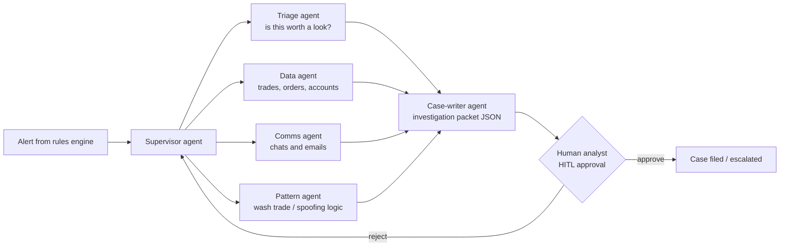

# Architect 20% — Mastery Workbook

!!! abstract "At a glance"
    **What this is:** a deep-dive workbook for every topic on the [Architect 20% checklist](../architect-20.md).
    Each page explains the topic in plain English, then drills it with **Simple → Medium → Hard → Tricky → Scenario** questions (answers hidden until you click).
    **Who it is for:** you, preparing for Principal / Enterprise / Agentic AI Architect interviews and design reviews. It is written so that a fresh graduate can also follow it.
    **Last reviewed:** 2026-10-07

## How to use this workbook

1. Read **"Explain it like I'm new"** on a topic page. If the analogy makes sense, move on.
2. Try each question **out loud** before you open the answer. Architects get judged on how they explain things, not only on what they know.
3. When you get one wrong, write the fix in your [Journal](../../journal/index.md).
4. Tick the box on the [Architect 20% checklist](../architect-20.md) only when you can answer every **Hard** and **Tricky** question without notes.
5. Finish with the [Exit drills](exit-drills.md). They mix all topics, the way a real design review does.

| Level | What it tests | Interview equivalent |
| --- | --- | --- |
| **Simple** | Definitions and vocabulary | Phone screen |
| **Medium** | Why it works, how to apply it | Technical round |
| **Hard** | Trade-offs, design choices, numbers | System-design round |
| **Tricky** | Common misconceptions and trap questions | "Gotcha" questions from a senior panel |
| **Scenario** | Your resume story under pressure | Architecture / model-risk review |

## Topic pages (in checklist order)

### Tier A — Foundations

| # | Topic | Practice page | Module |
| --- | --- | --- | --- |
| 01 | How LLMs work | [Questions](01-how-llms-work.md) | [Module 01](../../modules/01-how-llms-work/index.md) |
| 02 | Prompt anatomy | [Questions](02-prompt-anatomy.md) | [Module 02](../../modules/02-prompt-anatomy/index.md) |
| 04 | Clarity and structure | [Questions](04-clarity-and-structure.md) | [Module 04](../../modules/04-clarity-and-structure/index.md) |
| 05 | Structured outputs | [Questions](05-structured-outputs.md) | [Module 05](../../modules/05-structured-outputs/index.md) |
| 03 | Zero / few-shot (light) | [Questions](03-few-shot.md) | [Module 03](../../modules/03-few-shot/index.md) |

### Tier B — Core of your resume story

| # | Topic | Practice page | Module |
| --- | --- | --- | --- |
| 10 | Context engineering | [Questions](10-context-engineering.md) | [Module 10](../../modules/10-context-engineering/index.md) |
| 11 | RAG, grounding, GraphRAG | [Questions](11-rag-and-grounding.md) | [Module 11](../../modules/11-rag-and-grounding/index.md) |
| 12 | Long context and memory | [Questions](12-long-context-memory.md) | [Module 12](../../modules/12-long-context-memory/index.md) |
| 06 | Prompt chaining | [Questions](06-prompt-chaining.md) | [Module 06](../../modules/06-prompt-chaining/index.md) |
| 14 | Tool calling | [Questions](14-tool-calling.md) | [Module 14](../../modules/14-tool-calling/index.md) |
| 15 | Agent patterns | [Questions](15-agent-patterns.md) | [Module 15](../../modules/15-agent-patterns/index.md) |
| 16 | MCP and skills | [Questions](16-mcp-and-skills.md) | [Module 16](../../modules/16-mcp-and-skills/index.md) |
| 17 | Multi-agent | [Questions](17-multi-agent.md) | [Module 17](../../modules/17-multi-agent/index.md) |

### Tier C — Ship and defend

| # | Topic | Practice page | Module |
| --- | --- | --- | --- |
| 18 | Evaluation | [Questions](18-evaluation.md) | [Module 18](../../modules/18-evaluation/index.md) |
| 20 | Prompt security | [Questions](20-prompt-security.md) | [Module 20](../../modules/20-prompt-security/index.md) |
| 21 | PromptOps (lite) | [Questions](21-promptops.md) | [Module 21](../../modules/21-promptops/index.md) |
| 22 | Fine-tune vs prompt vs RAG | [Questions](22-finetune-vs-prompt-vs-rag.md) | [Module 22](../../modules/22-finetune-vs-prompt-vs-rag/index.md) |
| 09 | Reasoning models (lite) | [Questions](09-reasoning-models.md) | [Module 09](../../modules/09-reasoning-models/index.md) |

### Tier D — Cross-cutting architect concerns

These were added after review. They aren't "prompting" topics, but every architecture review of an LLM system asks about them. There is no separate hub module; each page links to the modules it builds on.

| # | Topic | Practice page | Builds on |
| --- | --- | --- | --- |
| X1 | Cost, latency and reliability | [Questions](x1-cost-latency-reliability.md) | [01](01-how-llms-work.md), [10](10-context-engineering.md), [21](21-promptops.md) |
| X2 | AI governance and model risk | [Questions](x2-governance-model-risk.md) | [18](18-evaluation.md), [20](20-prompt-security.md), [21](21-promptops.md) |

### Final

- [**Exit drills**](exit-drills.md): cross-topic design-review questions that map to the four exit criteria on the 20% page.

---

## The running scenario (used on every page)

The questions use one example system so that the ideas connect across pages. It is modelled on the agentic trade-surveillance work on your resume. Agent names and numbers below are **illustrative**, so adjust them to match what you actually built before you use them in an interview.

**The business problem (in plain words).** A bank must catch traders who break market rules. Two examples:

- **Wash trading**: buying and selling the same thing between accounts you control, to fake trading activity.
- **Spoofing**: placing big orders you never intend to fill, to push the price, then cancelling them.

Rule-based systems raise thousands of **alerts**. Most of them are false alarms. Human **compliance analysts** must review each alert and write up a case. That work is slow and expensive.

**The AI system.** A team of AI agents, orchestrated with LangGraph, helps analysts:

- **14 internal services** (trade store, order book, reference data, communications archive, and so on) are exposed to the agents as **MCP servers**.
- **Entitlement-aware RAG + GraphRAG** means each analyst only sees data they are allowed to see. A graph links accounts, traders and beneficial owners.
- **Memory tiers** help the agents work on long investigations:
    - **Working memory**: the current case.
    - **Episodic memory**: past cases.
    - **Semantic memory**: policies and rules.
- **Model routing** sends each step to a suitable model:
    - A small, fast model (Haiku-class) for triage.
    - A stronger model (Sonnet-class) for analysis and writing.
    - An on-premises open model (Llama-class) where data cannot leave the bank.
- **Controls** include prompt-injection defences, **PII** (personal data) and **MNPI** (material non-public information) redaction, and human approval before anything is filed.
- **Evals** run in LangSmith, with about 1,400 test cases in CI that gate every change.
- **Fine-tuning** used QLoRA / DPO on tool-use traces, where prompting alone was not enough.

## Mini-glossary for freshers

| Term | Plain meaning |
| --- | --- |
| **LLM** | Large language model: software that predicts the next piece of text |
| **Token** | A chunk of text (about ¾ of an English word) that the model reads and writes |
| **Context window** | Everything the model can "see" in one call: instructions, documents, history |
| **Prompt** | The text and instructions you send to the model |
| **System prompt** | The top-level, developer-owned instructions (rules of the job) |
| **RAG** | Retrieval-Augmented Generation: look up relevant documents first, then let the model answer using them |
| **Agent** | An LLM in a loop that can decide which tool to use next until a goal is met |
| **Tool** | A function the model can ask your code to run (for example `get_trades(account_id)`) |
| **MCP** | Model Context Protocol: a standard way to plug tools and data into AI apps |
| **Eval** | A repeatable test that scores model output |
| **HITL** | Human-in-the-loop: a person approves or edits before an action happens |
| **Hallucination** | The model states something confidently that is not true or not supported |
| **Prompt injection** | Untrusted text that tries to give the model new instructions |
| **Fine-tuning** | Further training a model on your examples to change its behaviour |
| **Entitlement** | A rule about who is allowed to see which data |
| **Embedding** | A list of numbers that represents the meaning of a text, so you can search by meaning |
| **Chunk** | A small piece of a long document, stored separately so search can return just that piece |
| **Schema** | A precise description of the shape of data (fields, types, allowed values), usually JSON Schema |
| **Golden set** | A trusted set of test cases with expert-approved correct answers |
| **Faithfulness** | How far every claim in an answer is supported by the provided sources |
| **Workflow** | Fixed steps decided by your code (as opposed to an agent, where the model decides) |

### Engineering and architecture terms used in the answers

| Term | Plain meaning |
| --- | --- |
| **Precision / recall** | Precision: of the cases flagged, how many were truly bad. Recall: of the truly bad cases, how many were flagged |
| **F1** | A single score that balances precision and recall |
| **p50 / p95 latency** | The median response time / the time that 95% of requests beat (the "slow tail") |
| **SLA** | Service-level agreement: a promised target, such as "packet within 5 minutes" |
| **Canary / shadow release** | Canary: give a change to a small % of traffic first. Shadow: run it in parallel without using its output |
| **Drift** | Quality or behaviour slowly changing over time (new data, model updates) |
| **Egress** | Data leaving your system (network calls, emails, links) |
| **Blast radius** | How much damage one failure or attack can cause |
| **Least privilege** | Give each component only the access it truly needs |
| **Idempotent** | Doing the same action twice has the same effect as doing it once |
| **ACL** | Access-control list: who may read or change a resource |
| **SSO / OAuth** | Single sign-on / a standard way to let an app act on a user's behalf with limited permissions |
| **BM25** | A classic keyword-search scoring method |
| **Recall@k / MRR** | Search metrics: was the right document in the top k? How high was it ranked on average? |
| **Cross-encoder (reranker)** | A model that reads the question and a document *together* to score relevance more accurately than an embedding comparison does |
| **NLI** | Natural-language inference: a model that judges whether one text supports, contradicts or is neutral to another |
| **Ablation** | Removing one part at a time to see whether it actually matters |
| **Quantisation** | Storing model weights with fewer bits so the model is smaller and cheaper to run |
| **Model risk** | The risk of harm from decisions based on a wrong or misused model (see [X2](x2-governance-model-risk.md)) |

## How to answer scenario questions (a simple framework)

Interviewers and review boards want structured answers. Use **C-D-T-E-C**:

1. **Context.** What was the problem or constraint? ("Analysts got 200 alerts a day, 95% false positives.")
2. **Decision.** What did you choose? ("A small model for triage, with a strong model only for complex cases.")
3. **Trade-off.** What did you give up, and why was that acceptable? ("Slightly lower precision, but recall stayed above baseline.")
4. **Evidence.** How did you prove it? ("CI evals on 1,400 cases, with cost per case tracked.")
5. **Control.** How do you keep it safe over time? ("Release gates, HITL, monitoring, rollback.")

Every sample answer in this workbook roughly follows this shape. Practise saying yours in **60–90 seconds**.
