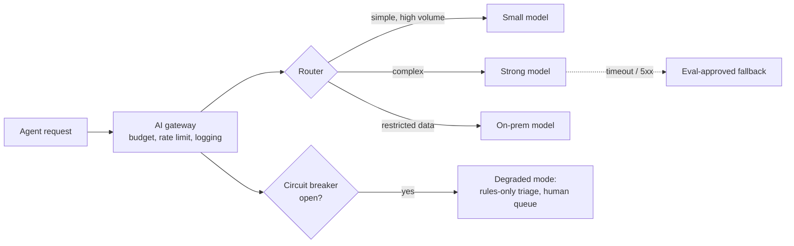

# X1 · Cost, Latency and Reliability — Mastery

!!! abstract "At a glance"
    **Tier:** D (cross-cutting architect concern; no separate hub module, builds on [01](01-how-llms-work.md), [10](10-context-engineering.md), [21](21-promptops.md)) · **Back to:** [Workbook](index.md) · [Architect 20%](../architect-20.md)  
    **Say it in one line:** *An LLM is a slow, metered, sometimes-unavailable dependency. Design for it like any critical external service: budgets, caching, routing, timeouts, retries, fallbacks and per-version metrics.*  
    **Last reviewed:** 2026-10-07

## Explain it like I'm new

When you call an LLM API, you're calling a **remote service** that:

- **Charges per token.** Every word in and out costs money.
- **Is slow** compared with normal APIs. It takes seconds, not milliseconds.
- **Has rate limits.** You may only send so many requests or tokens per minute.
- **Can fail or slow down.** Outages, overloaded servers, timeouts.
- **Changes over time.** Models get updated or retired.

Prompt-engineering demos ignore all of this. **Architects can't.** In production, a design that is 10% more accurate but 5× slower or 10× more expensive may be the wrong design.

**Analogy.** A brilliant consultant who bills by the word, sometimes doesn't pick up the phone, and takes a while to answer. You'd plan carefully what to ask them, have a backup consultant, and not ask the same question twice.

## Key ideas to master

**Cost levers** (roughly from biggest to smallest impact):

1. **Model routing.** Small models for simple, high-volume steps. See [01](01-how-llms-work.md).
2. **Fewer tokens.** Tighter context, compact tool results, shorter outputs. See [10](10-context-engineering.md).
3. **Prompt caching.** A stable prefix gets reused at a discount. Order matters.
4. **Batch APIs.** For non-urgent work (for example overnight back-testing or eval runs), providers offer asynchronous batch processing at a discount, often around 50%, with results within hours.
5. **Skip the LLM when code can do it.** Rules, lookups, calculations.
6. **Early exit.** Stop the pipeline as soon as the answer is clear (for example, triage says low risk, so there is no fan-out).

**Latency terms:**

- **TTFT (time to first token)**: how quickly the first words appear.
- **Total latency**: until the output is complete.
- **p50 / p95 / p99**: the median, and the "slow tail". p95 = 95% of requests are faster than this. Users and SLAs feel the tail, not the average.
- **Levers:**
    - Smaller models.
    - Shorter outputs.
    - **Streaming**, which shows tokens as they are generated and improves *perceived* speed.
    - **Parallel calls** (fan-out of independent steps).
    - Caching.
    - Less reasoning effort.

**Reliability patterns:**

- **Timeouts** on every call. Never wait forever.
- **Retries with exponential backoff and jitter** for temporary errors (rate limit `429`, server `5xx`). Cap the attempts.
- **Fallback models**: if the primary model fails, use an **eval-approved** backup. Never an untested one.
- **Circuit breaker**: if a provider keeps failing, stop calling it for a while and use the fallback or a degraded mode.
- **Graceful degradation**: for example, "AI summary unavailable; showing the raw alert", so that analysts are never blocked.
- **Idempotency** for write actions (see [14](14-tool-calling.md)).
- **AI gateway**: one central layer for keys, routing, rate limits, budgets, logging and fallbacks across all agents.

**Caching answers (semantic caching)** reuses an answer for a *similar* question. It saves cost, but it is **risky** in regulated settings:

- It can return an answer to a slightly different question.
- It can leak across entitlements.

If you use it, include the user's entitlement scope in the cache key, and only cache low-risk, non-personal content.

## In your resume project

- **Cost per case** is a tracked release metric, alongside quality.
- Triage on a small model (the biggest saving). Fan-out only for alerts above the risk threshold (early exit).
- System prompts and tool definitions are kept **stable and first** for prompt caching.
- **Nightly eval runs and back-testing** use batch processing.
- **Gateway**: per-agent token budgets, rate limits, provider fallbacks pre-approved by evals, and a circuit breaker.
- **Degraded mode**: if LLMs are down, alerts still flow to analysts using the rules engine. Surveillance never stops, because that is a regulatory obligation.

## Common mistakes

- Measuring average latency only, while the p95 tail breaks the SLA.
- Retrying instantly in a tight loop, which makes rate limiting worse.
- A "fallback model" that was never evaluated and behaves differently.
- No per-agent budget, so one runaway case burns the monthly spend.
- Semantic caching without the entitlement scope in the cache key.

---

## Practice questions

### Simple

??? question "S1. What are the three main 'non-functional' concerns when using LLMs in production?"
    **Answer:**

    - **Cost**: you pay per token.
    - **Latency**: responses take seconds.
    - **Reliability**: outages, rate limits, timeouts, model changes.

    Security is the fourth (see [20](20-prompt-security.md)).

??? question "S2. What does p95 latency mean?"
    **Answer:** 95% of requests complete faster than this time, and 5% are slower. It shows the "slow tail" that users actually notice, which an average hides.

??? question "S3. What is streaming, and what does it improve?"
    **Answer:** Sending output tokens to the user **as they are generated**, instead of waiting for the full answer. It improves **perceived** speed (time to first token), but not the total generation time.

??? question "S4. What is a rate limit?"
    **Answer:** A cap from the provider on how many requests or tokens you can send per minute. Exceeding it returns an error (often HTTP `429`), and you must slow down and retry later.

??? question "S5. What is a fallback model?"
    **Answer:** A backup model used when the primary one is unavailable or too slow. It must be **tested with your evals in advance**, because different models behave differently.

### Medium

??? question "M1. Name four ways to cut LLM cost without changing the model."
    **Answer:** Any four of:

    - Shorter context: retrieve less, compact history.
    - Compact tool results.
    - Shorter outputs, enforced with a schema.
    - Prompt caching with a stable prefix.
    - Batch APIs for non-urgent jobs.
    - Early exit.
    - Replacing LLM steps with code where possible.

??? question "M2. How should you retry a failed LLM call?"
    **Answer:**

    - Only retry **temporary** errors (429, 5xx, timeouts), not invalid requests.
    - Use **exponential backoff** (wait 1s, 2s, 4s...) plus **jitter** (random variation), so that many clients don't retry at the same moment.
    - **Cap** the attempts.
    - Then fall back or degrade gracefully.

??? question "M3. What is a circuit breaker?"
    **Answer:** A switch that **stops calling a failing service** for a period after repeated errors. Requests go straight to a fallback or degraded mode, which protects the system and gives the provider time to recover. After a cool-down, it lets a few test requests through.

??? question "M4. When is a batch API a good fit?"
    **Answer:** For work where nobody is waiting: nightly eval runs, back-testing a new prompt over past alerts, bulk re-classification. You accept a delay of hours in exchange for a lower price and higher throughput.

??? question "M5. What does an AI gateway do?"
    **Answer:** It is a central proxy between your apps and the LLM providers. It handles:

    - API keys.
    - Routing.
    - Rate limits.
    - Per-team budgets.
    - Logging and tracing.
    - Fallbacks.
    - Policy checks.

    There is one control point, instead of every agent doing it differently.

### Hard

??? question "H1. Your p95 time-to-packet is 9 minutes, and the SLA is 5. Where do you look and what do you change?"
    **Answer:**

    1. **Trace the critical path.** Which step or agent dominates? Long tool calls, sequential steps that could run in parallel, long outputs, high reasoning effort, retries?
    2. **Fixes:**
        - Run independent specialists **in parallel**.
        - Reduce output length.
        - Lower the reasoning effort except on complex cases.
        - Speed up the slow tools (pre-aggregate the data).
        - Cache the stable prefixes.
        - Use a faster model for non-critical steps.
    3. **Re-check quality** with evals after each change.
    4. Watch the **tail**: a few huge cases may need their own path or an async SLA.

??? question "H2. Design the fallback strategy for the case-writer agent."
    **Answer:**

    - **Primary**: the strong cloud model (pinned version).
    - **Fallback 1**: an alternate model, **pre-approved** on the same eval suite (it may need its own prompt variant).
    - **Fallback 2** for restricted data: the on-prem model only, never a cloud fallback (data policy beats availability).
    - **Degraded mode**: if all models fail, produce a structured evidence list without a narrative, and route the case to the analyst queue.
    - **Log** which path served each case, and alert when fallback usage spikes.

??? question "H3. Model the monthly cost of the full system and find the biggest lever."
    **Answer:** Build a simple table: **per step → calls per case × tokens in/out × price × cases per month**. You'll usually find:

    - **Triage** dominates by volume.
    - **Comms review** dominates by tokens per call.
    - **Fan-out** multiplies everything.

    Biggest levers, in order:

    1. Route triage to a small model.
    2. Early exit before fan-out.
    3. Compact comms excerpts.
    4. Cache the prefixes.

    Validate each one against the quality metrics.

??? question "H4. Should you use semantic caching for analyst questions like 'what does policy X say about cross trades?'"
    **Answer:** Possibly, for **policy questions** (low risk, same for everyone in scope), with:

    - The entitlement scope **and** the policy index version in the cache key.
    - A short time-to-live.
    - Invalidation when the policy changes.

    **Never** for case-specific or personal-data questions, where the risk of wrong reuse or cross-user leakage outweighs the saving.

### Tricky

??? question "T1. 'Streaming makes our pipeline faster.' True?"
    **Answer:** Only for **perceived** latency when a human reads the output live. For machine-to-machine steps (agent to agent, JSON parsing), streaming doesn't reduce the total time, and it can complicate validation. Use it for user-facing text.

??? question "T2. 'If the primary model is down, just call any other available model.' OK?"
    **Answer:** No. Untested models can behave very differently: format, refusals, faithfulness. They may also break **data policy** (a cloud model for restricted data). Fallbacks must be eval-approved and policy-compliant, or you degrade gracefully instead.

??? question "T3. 'Prompt caching means we can make prompts as long as we like.' True?"
    **Answer:** No. Caching reduces the **cost and latency** of the cached prefix. It doesn't fix attention dilution, lost-in-the-middle effects or the cost of the *uncached* part. Caches also expire. Keep prompts lean anyway.

??? question "T4. Is average cost per case the right budget metric?"
    **Answer:** It's useful but incomplete. Also track the **tail** (p95 cost per case: runaway agent loops), **cost per correct decision**, and per-agent budgets. One looping case can cost as much as a thousand normal ones.

### Scenario (resume-synced)

??? question "SC1. The cloud provider has a 2-hour outage during market hours. What does your system do?"
    **Answer:**

    1. The circuit breaker opens after repeated errors.
    2. Non-restricted steps move to the **pre-approved fallback model**.
    3. Restricted-data steps stay **on-prem**.
    4. If capacity is insufficient, go into **degraded mode**: the rules engine keeps raising alerts, and analysts get evidence lists without AI narratives. Nothing is dropped.
    5. Operations are alerted, and the fallback usage is logged per case.
    6. After recovery, optionally re-run the AI narrative for the cases handled in degraded mode.

    Surveillance obligations never depend on one vendor.

??? question "SC2. Finance asks why the AI costs grew 4× in a month while alert volume grew only 20%. Investigate."
    **Answer:** Check the per-version and per-agent dashboards:

    - A new prompt or model version with longer outputs or higher reasoning effort?
    - The early exit broken, so every alert fans out?
    - An agent loop bug (p95 cost spike)?
    - The prompt cache broken by a change near the top of the prompt?
    - A fallback to a pricier model stuck on?

    Fix the cause. Add **cost-per-case gates** to CI and budget alerts in the gateway.

## Can you teach it?

- [ ] I can list the cost levers and estimate the biggest one for a pipeline
- [ ] I can explain p95, TTFT, streaming, batching and caching trade-offs
- [ ] I can design timeouts, retries, fallbacks, circuit breakers and degraded mode
