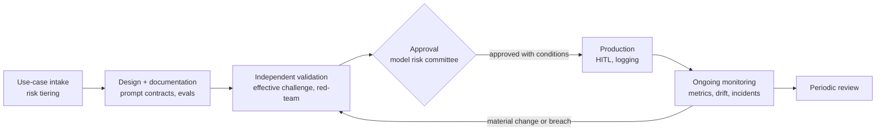

# X2 · AI Governance and Model Risk — Mastery

!!! abstract "At a glance"
    **Tier:** D (cross-cutting architect concern; no separate hub module, builds on [18](18-evaluation.md), [20](20-prompt-security.md), [21](21-promptops.md), [22](22-finetune-vs-prompt-vs-rag.md)) · **Back to:** [Workbook](index.md) · [Architect 20%](../architect-20.md)  
    **Say it in one line:** *In a bank, an LLM system is a model. It needs an inventory entry, documented purpose and limits, independent validation, ongoing monitoring, human oversight and a clear owner, before and after go-live.*  
    **Last reviewed:** 2026-10-07

!!! warning "Regulations change, and they differ by country"
    This page explains the **ideas** behind common frameworks so you can speak about them in reviews. It is not legal advice. Always check the current text with your firm's legal, compliance and model-risk teams, and note dates in [What's new](../../reference/whats-new.md).

## Explain it like I'm new

Banks have learned, sometimes painfully, that **models can be wrong in costly ways**. Credit-scoring models and pricing models are examples. So regulators expect a **model risk management** process:

1. **Know your models.** Keep an inventory.
2. **Build them carefully.** Document the purpose, data, design and limitations.
3. **Have someone independent check them.** This is validation, or "effective challenge".
4. **Keep watching them.** Ongoing monitoring.
5. **Have clear rules and owners.** Governance.

An LLM-based surveillance agent is a model too. It also brings new risks that classic models didn't have:

- Hallucination.
- Prompt injection.
- Vendor model changes.
- Non-determinism.
- Hard-to-explain outputs.

The architect's job is to **design the system so that it can pass this process**: traceable, testable, controllable.

**Analogy.** A new aircraft part isn't just "good engineering". It must be certified, documented, inspected regularly, and every flight logged. Governance is the certification and inspection regime for AI.

## Key frameworks to recognise (names and core ideas)

| Framework | What it is | Core idea to mention |
| --- | --- | --- |
| **SR 11-7** (US Federal Reserve / OCC, 2011) | Supervisory guidance on model risk management | Sound development; **independent validation with effective challenge** (conceptual soundness, ongoing monitoring, outcomes analysis); governance, policies and controls |
| **NIST AI RMF 1.0** (2023) + Generative AI Profile (2024) | Voluntary US framework for AI risk | Four functions: **Govern, Map, Measure, Manage** |
| **EU AI Act** (in force since 2024, obligations phased in over several years) | EU law that classifies AI by risk | Risk tiers: prohibited / **high-risk** / transparency obligations / minimal. High-risk systems need risk management, data governance, logging, documentation, **human oversight**, accuracy and robustness |
| **ISO/IEC 42001** (2023) | International standard for an AI management system | Organisation-level policies, roles, risk assessment and continual improvement, similar in spirit to ISO 27001 for security |
| **OWASP Top 10 for LLM Apps** | Security risk list | Prompt injection, data disclosure, excessive agency... (see [20](20-prompt-security.md)) |

## Key ideas to master

- **Model inventory.** Every LLM use case is registered with:
    - Its purpose.
    - The owner.
    - The models used (vendor and version).
    - The data classification.
    - The risk tier.
    - The validation status.
- **Documentation**, sometimes called a "model card" or "system card":
    - Intended use and **out-of-scope use**.
    - Design: prompts, RAG, tools, agents.
    - Data sources.
    - Known limitations.
    - Eval results.
    - Controls.
    - Monitoring plan.
- **Independent validation.** A team that didn't build it tests conceptual soundness, reviews the evals, runs its own challenge tests and red-teaming, and checks the limitations.
- **Third-party (vendor) model risk.** Foundation models are vendor models. You can't inspect their training, so you lean on:
    - **Your own evals.**
    - Version pinning.
    - Contractual controls (data use, retention, residency).
    - Monitoring for drift.
- **Human oversight.** Humans can understand, override and stop the system. HITL with real authority, not rubber-stamping.
- **Explainability for LLMs.** You can't fully explain the model's internals, so you explain the **decision record**:
    - The evidence cited.
    - The rules applied.
    - The tool calls.
    - The validators passed.
    - The human approval.
- **Change management.** Material changes (new model, new use, policy-prompt changes) trigger re-validation (see [21](21-promptops.md)).
- **Fairness and conduct.** For surveillance, check that the system doesn't unfairly target groups of employees (for example by language, region or desk), and document how this is tested.
- **Records and retention.** Prompts, outputs and decisions may be books and records. Retain them according to policy.

## In your resume project

- The surveillance agent system is registered in the **model inventory** as a high-impact use case, with each underlying LLM listed by version.
- The **documentation pack** includes:
    - The architecture diagram.
    - The prompt contracts.
    - Data lineage and entitlements.
    - The eval suite (~1,400 CI cases) and thresholds.
    - Red-team results.
    - Known limitations ("does not make final determinations").
    - The monitoring plan.
- **Validation** is done by an independent team with its own challenge set.
- **Human oversight**: analysts make every determination, and the AI drafts.
- **Re-validation triggers**: a new model version, the fine-tuned model update (QLoRA/DPO), a new alert type, or a change to policy prompts.

## Common mistakes

- Treating the LLM vendor's benchmarks as validation. You must validate **your** use case.
- Documentation written once at launch and never updated.
- "Human in the loop" where humans approve 99.9% within seconds. Regulators may not view that as meaningful oversight.
- Not registering "small" internal LLM tools that grow into decision-support systems.

---

## Practice questions

### Simple

??? question "S1. What is model risk?"
    **Answer:** The risk of loss or harm from decisions based on a model that is **wrong** or **misused**. That includes bad design, bad data, or using it outside what it was built for.

??? question "S2. What is a model inventory?"
    **Answer:** A central register of every model in use, recording its purpose, owner, version, data, risk level and validation status. You can't govern what you don't know exists.

??? question "S3. What does 'independent validation' mean?"
    **Answer:** A team **separate from the builders** reviews and tests the model: design soundness, data, evals, limitations. It challenges the assumptions before and after the model goes live.

??? question "S4. Name the four functions of the NIST AI RMF."
    **Answer:** **Govern, Map, Measure, Manage.**

??? question "S5. Is an LLM-based agent a 'model' for model risk purposes?"
    **Answer:** In most banks, yes. It is a quantitative or AI method whose outputs inform decisions. Firms typically bring LLM use cases into their model risk or AI governance framework, often with extra GenAI-specific controls.

### Medium

??? question "M1. What does SR 11-7 mean by 'effective challenge'?"
    **Answer:** A critical review by people who are **competent, independent and influential** enough to find flaws and get them fixed. Not a box-ticking sign-off.

??? question "M2. Why is a foundation model a 'third-party model risk'?"
    **Answer:** You didn't build it. You can't see its training data or internals, and the vendor can change or retire it. So you control the risk through:

    - Your own evals on your use case.
    - Version pinning.
    - Contract terms (data usage, retention, residency).
    - Monitoring.
    - Fallbacks.

??? question "M3. How do you 'explain' an LLM decision to a regulator?"
    **Answer:** Explain the **decision record**, not the neural network:

    - The inputs and evidence retrieved (with IDs).
    - The rules and policies applied.
    - The tool calls.
    - The structured output.
    - The validators passed.
    - Who approved, and when.

    Add the documented limitations and the eval evidence for how reliable the system is.

??? question "M4. What should a GenAI system card include?"
    **Answer:**

    - Purpose and out-of-scope uses.
    - Users.
    - The architecture (models, prompts, RAG, tools, agents).
    - Data sources and classification.
    - Eval results and thresholds.
    - Red-team results.
    - Known limitations.
    - Controls (HITL, filters).
    - The monitoring plan.
    - The owner.
    - Version history.

??? question "M5. What triggers re-validation?"
    **Answer:** Material changes:

    - A new model or model version.
    - A fine-tuned model update.
    - A new use case or user group.
    - Significant prompt or policy changes.
    - New data sources.
    - Monitoring breaches or incidents.
    - The scheduled periodic review.

### Hard

??? question "H1. Design the governance pack for launching the surveillance agents."
    **Answer:**

    1. **Inventory entry and risk tiering.**
    2. **System card and architecture**: agents, tools/MCP, RAG and GraphRAG, memory, model routing.
    3. **Prompt contracts** for each agent.
    4. **Data**: lineage, entitlements, PII/MNPI handling, retention.
    5. **Evaluation evidence**: golden set, thresholds, slices, red-team, fairness checks.
    6. **Controls**: HITL design, validators, guardrails, fallbacks.
    7. **Monitoring plan**: metrics, owners, alert thresholds, incident process.
    8. **Change management and re-validation triggers.**
    9. **Independent validation report and approval conditions.**

??? question "H2. How do you show human oversight is meaningful, not rubber-stamping?"
    **Answer:**

    - Track approval time, edit rate and rejection rate per analyst.
    - Seed **known test cases** (including deliberately flawed drafts) into the queue, and measure the catch rate.
    - Design the UI to show evidence and uncertainty, not just "Approve".
    - Train the analysts.
    - Review the patterns periodically.

    A near-100% instant approval rate is a red flag to investigate.

??? question "H3. How would you test a surveillance agent for fairness?"
    **Answer:**

    - Define the groups that matter: region, desk, the language of the communications, seniority.
    - Compare **alert escalation rates and error rates** (false positives and negatives) across the groups on labelled data.
    - Check for **language bias**: for example, are non-English chats flagged more often for the same behaviour?
    - Document the results and mitigations, and monitor them in production.
    - Involve compliance and HR on what is appropriate.

??? question "H4. Map NIST AI RMF's four functions to your project."
    **Answer:**

    - **Govern**: the AI policy, the inventory, roles (owner, validator, approver), the model risk committee.
    - **Map**: the context and risks of the use case: misuse, injection, data leakage, employee-monitoring sensitivity.
    - **Measure**: the eval suite, red-team, fairness tests, monitoring metrics.
    - **Manage**: controls (HITL, entitlements, guardrails), incident response, re-validation, decommissioning.

### Tricky

??? question "T1. 'The vendor publishes great benchmark scores, so validation is done.' Respond."
    **Answer:** No. Benchmarks measure **general** abilities on public data. Validation must show the model is fit for **your** use, with your data, prompts, tools and risks. That needs your own evals, challenge tests and monitoring.

??? question "T2. Could trader surveillance fall under the EU AI Act's 'high-risk' category?"
    **Answer:** **Possibly, so don't assume it doesn't.** The Act's high-risk list includes certain AI used in **employment**, such as systems that monitor and evaluate the behaviour of workers. Trader surveillance monitors employees, so legal must assess where the system is used and how.

    Good architect stance: design with high-risk-style controls anyway (risk management, logging, documentation, human oversight, accuracy testing), because the bank's own policies and other regulators expect similar standards.

??? question "T3. 'We keep a human in the loop, so model risk doesn't apply.' True?"
    **Answer:** No. HITL is a **control**, not an exemption. The model still shapes what humans see and how they decide (automation bias). It still needs inventory, validation, monitoring and evidence that the oversight is effective.

??? question "T4. 'Our fine-tuned model is ours, so it's not third-party risk anymore.' Correct?"
    **Answer:** Partly. You now own the **fine-tuning data, process and validation**, which is more responsibility, not less. The **base model** is still third party. Both layers need governance, and an update to the base model triggers re-tuning and re-validation.

### Scenario (resume-synced)

??? question "SC1. The model risk committee asks: 'What are the known limitations of your surveillance agents?' Give a strong answer."
    **Answer (sample):** "We document five main limitations:

    1. **Not a decision-maker.** It drafts evidence packets, and analysts decide.
    2. **Only as good as its evidence.** If communications or data are missing or out of the analyst's scope, it reports insufficient evidence rather than inferring.
    3. **Language coverage.** Accuracy is lower on some languages, which we monitor as a fairness slice.
    4. **Novel typologies.** Patterns not in our policies or golden set may be missed, and the rules engine remains the primary detector.
    5. **Vendor model changes.** We pin versions and re-validate on any change.

    Each limitation has a control and a metric."

??? question "SC2. Explain to a fresher why a bank can't just 'ship the AI' like a startup."
    **Answer:** "Because bank decisions affect markets, clients and employees, and regulators hold the bank responsible for them. So, like any model a bank uses, the AI must be registered, documented, tested by an independent team, watched continuously and controlled by humans. That's slower at first, but it's what lets us use AI on serious work at all."

## Can you teach it?

- [ ] I can explain model risk, inventory, validation and effective challenge simply
- [ ] I can name SR 11-7, NIST AI RMF, EU AI Act and ISO/IEC 42001 and their core ideas
- [ ] I can list the documentation and controls a governance pack needs for an LLM system
