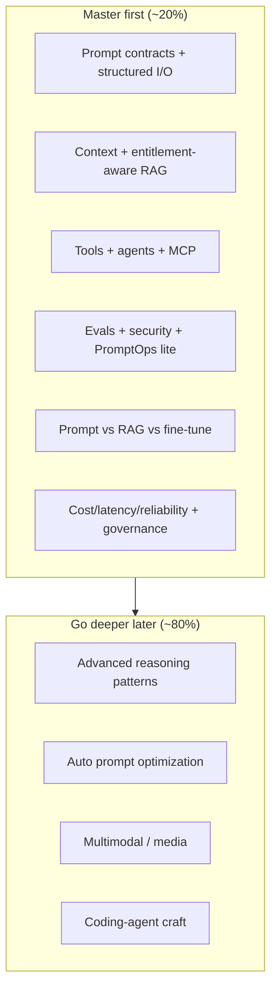

# Architect 20%: Prompt Engineering for Your Role

!!! abstract "At a glance"
    **Role target:** Principal / Enterprise / Agentic AI Architect (resume-aligned)  
    **Goal:** Master the ~20% of prompt engineering that shows up in architecture reviews, system design, and delivery — not become a full-time prompt craftsperson.  
    **Synced to:** Manasa Ranjan Behera — agentic trade-surveillance architecture (multi-agent, MCP, entitlement-aware RAG / GraphRAG, evals, governance).  
    **Last reviewed:** 2026-10-07

!!! tip "Practise every topic"
    The [**Architect 20% Workbook**](architect-20-mastery/index.md) explains each checklist topic in plain English and drills it with simple, medium, hard, tricky and resume-synced scenario questions. Every checklist item below links to its practice page, and the [Exit drills](architect-20-mastery/exit-drills.md) cover the exit criteria.

## How much do you need?

For your Architecture roles, prompt engineering is a **design and governance skill**, not a specialty job.

| You must be able to… | You do **not** need to… |
| --- | --- |
| Specify system/user/tool prompts, schemas, and refusal rules | Hand-tune every wording trick for creative writing |
| Choose single-call vs chain vs agent vs multi-agent | Memorize every CoT / ToT variant |
| Design context, memory, and entitlement-aware retrieval | Be the person writing every production prompt |
| Define eval gates, golden sets, and release criteria | Master DSPy / auto-prompt-opt tooling end-to-end |
| Defend prompt-injection, PII/MNPI, and HITL in reviews | Deep multimodal or generative-media prompting |
| Decide prompt vs RAG vs fine-tune with evidence | Rebuild model training stacks from scratch |

**Bar to hit:** you can walk into an architecture / model-risk review and defend *prompt contracts, context strategy, tool boundaries, evals, and controls* — the same storyline as your Morgan Stanley agentic surveillance work.

---

## Resume → mastery map

What your resume already claims, and what to lock in as the 20%:

| Resume signal | What to master (prompt / LLM layer) | Hub modules |
| --- | --- | --- |
| Six-agent LangGraph orchestration, HITL gates | Agent patterns, decomposition, approval boundaries in prompts | [06](../modules/06-prompt-chaining/index.md), [15](../modules/15-agent-patterns/index.md), [17](../modules/17-multi-agent/index.md) |
| 14 internal services as MCP servers | Tool descriptions, schemas, MCP/skills as the integration contract | [14](../modules/14-tool-calling/index.md), [16](../modules/16-mcp-and-skills/index.md) |
| Entitlement-aware RAG + GraphRAG | Grounding, cite-or-refuse, retrieval packing; when graph traversal beats vector-only | [10](../modules/10-context-engineering/index.md), [11](../modules/11-rag-and-grounding/index.md) |
| Agent memory (working / episodic / semantic) | What goes in context vs store; compaction; long-running cases | [10](../modules/10-context-engineering/index.md), [12](../modules/12-long-context-memory/index.md) |
| Model routing (Sonnet / Haiku / Llama) | When reasoning models need different prompting; cost/quality tradeoffs | [09](../modules/09-reasoning-models/index.md), [22](../modules/22-finetune-vs-prompt-vs-rag/index.md), [X1](architect-20-mastery/x1-cost-latency-reliability.md) |
| Investigation packets, structured outputs | Schemas, JSON contracts, validation loops | [05](../modules/05-structured-outputs/index.md) |
| Prompt-injection + PII/MNPI controls | Guardrail sandwich, untrusted content, dual-LLM thinking | [20](../modules/20-prompt-security/index.md) |
| LangSmith + 1,400 CI cases | Eval design, golden sets, PromptOps for releases | [18](../modules/18-evaluation/index.md), [21](../modules/21-promptops/index.md) |
| QLoRA / DPO on tool-use traces | When fine-tune beats prompt/RAG (and when it does not) | [22](../modules/22-finetune-vs-prompt-vs-rag/index.md) |
| Architecture review / model risk | Clear prompt contracts and measurable claims; inventory, validation, human oversight | [02](../modules/02-prompt-anatomy/index.md), [04](../modules/04-clarity-and-structure/index.md), [18](../modules/18-evaluation/index.md), [X2](architect-20-mastery/x2-governance-model-risk.md) |

---

## The 20% checklist (master these)

Work top to bottom. Check a box only when you can **teach it in an architecture review** and point to a small lab or design note.

### Tier A — Foundations you still need sharp (architect fluency)

- [ ] **01 · How LLMs work** — tokens, context window, sampling; why routing models matter  
      → [Module 01](../modules/01-how-llms-work/index.md) · [Practice questions](architect-20-mastery/01-how-llms-work.md)
- [ ] **02 · Prompt anatomy** — system vs user vs tool; who owns what in the contract  
      → [Module 02](../modules/02-prompt-anatomy/index.md) · [Practice questions](architect-20-mastery/02-prompt-anatomy.md)
- [ ] **04 · Clarity and structure** — delimiters, roles, failure modes of vague prompts  
      → [Module 04](../modules/04-clarity-and-structure/index.md) · [Practice questions](architect-20-mastery/04-clarity-and-structure.md)
- [ ] **05 · Structured outputs** — schema-valid JSON as the investigation-packet pattern  
      → [Module 05](../modules/05-structured-outputs/index.md) · [Practice questions](architect-20-mastery/05-structured-outputs.md)
- [ ] **03 · Zero / few-shot (light)** — when examples beat instructions; do not over-invest  
      → [Module 03](../modules/03-few-shot/index.md) · [Practice questions](architect-20-mastery/03-few-shot.md)

### Tier B — Core of your resume story (highest ROI)

- [ ] **10 · Context engineering** — what enters the window; budgets; compaction  
      → [Module 10](../modules/10-context-engineering/index.md) · [Practice questions](architect-20-mastery/10-context-engineering.md)
- [ ] **11 · RAG and grounding** — cite sources, refuse when missing, entitlement constraints; GraphRAG vs vector-only  
      → [Module 11](../modules/11-rag-and-grounding/index.md) · [Practice questions](architect-20-mastery/11-rag-and-grounding.md)
- [ ] **12 · Long context and memory** — memory tiers for long investigations  
      → [Module 12](../modules/12-long-context-memory/index.md) · [Practice questions](architect-20-mastery/12-long-context-memory.md)
- [ ] **06 · Prompt chaining** — deterministic steps before you add agents  
      → [Module 06](../modules/06-prompt-chaining/index.md) · [Practice questions](architect-20-mastery/06-prompt-chaining.md)
- [ ] **14 · Tool calling** — tool specs models actually follow  
      → [Module 14](../modules/14-tool-calling/index.md) · [Practice questions](architect-20-mastery/14-tool-calling.md)
- [ ] **15 · Agent patterns** — ReAct vs orchestrator-workers vs evaluator-optimizer; HITL  
      → [Module 15](../modules/15-agent-patterns/index.md) · [Practice questions](architect-20-mastery/15-agent-patterns.md)
- [ ] **16 · MCP and skills** — standard tool contract (maps to your 14 MCP servers)  
      → [Module 16](../modules/16-mcp-and-skills/index.md) · [Practice questions](architect-20-mastery/16-mcp-and-skills.md)
- [ ] **17 · Multi-agent** — when to fan out (wash-trade style supervisor) vs stay single-agent  
      → [Module 17](../modules/17-multi-agent/index.md) · [Practice questions](architect-20-mastery/17-multi-agent.md)

### Tier C — Ship and defend (regulated environments)

- [ ] **18 · Evaluation** — golden sets, faithfulness, CI gates (LangSmith-style thinking)  
      → [Module 18](../modules/18-evaluation/index.md) · [Practice questions](architect-20-mastery/18-evaluation.md)
- [ ] **20 · Prompt security** — injection, PII/MNPI, guardrails at prompt and response boundary  
      → [Module 20](../modules/20-prompt-security/index.md) · [Practice questions](architect-20-mastery/20-prompt-security.md)
- [ ] **21 · PromptOps (lite)** — versioning, review, release — enough for design authority  
      → [Module 21](../modules/21-promptops/index.md) · [Practice questions](architect-20-mastery/21-promptops.md)
- [ ] **22 · Fine-tune vs prompt vs RAG** — decide with evals, not fashion  
      → [Module 22](../modules/22-finetune-vs-prompt-vs-rag/index.md) · [Practice questions](architect-20-mastery/22-finetune-vs-prompt-vs-rag.md)
- [ ] **09 · Reasoning models (lite)** — when *not* to force CoT; effort vs cost  
      → [Module 09](../modules/09-reasoning-models/index.md) · [Practice questions](architect-20-mastery/09-reasoning-models.md)

### Tier D — Cross-cutting architect concerns (added after review)

Not prompting techniques, but every LLM architecture review asks about them. No separate hub module; the workbook pages link to the modules they build on.

- [ ] **X1 · Cost, latency and reliability** — routing, caching, batching, p95, timeouts, fallbacks, degraded mode  
      → [Practice questions](architect-20-mastery/x1-cost-latency-reliability.md)
- [ ] **X2 · AI governance and model risk** — model inventory, independent validation (SR 11-7), NIST AI RMF, EU AI Act, human oversight  
      → [Practice questions](architect-20-mastery/x2-governance-model-risk.md)

**Exit criteria for “20% mastered”:**

- [ ] Draw your surveillance-style agent graph and label where prompts, tools, retrieval, and HITL live → [Drill 1](architect-20-mastery/exit-drills.md#drill-1-draw-the-agent-graph-exit-criterion-1)
- [ ] Write a one-page **prompt contract** (inputs, schema, refusal, tools allowed, audit fields) → [Drill 2](architect-20-mastery/exit-drills.md#drill-2-write-a-one-page-prompt-contract-exit-criterion-2)
- [ ] Define a **minimum eval pack** (offline cases + online metrics) for a governed agent → [Drill 3](architect-20-mastery/exit-drills.md#drill-3-define-the-minimum-eval-pack-exit-criterion-3)
- [ ] Explain in 5 minutes when you would prompt, RAG, GraphRAG, or fine-tune → [Drill 4](architect-20-mastery/exit-drills.md#drill-4-the-5-minute-build-path-talk-exit-criterion-4)

---

## The 80% — go deeper only when needed

Skip until a job, design review, or product forces it:

| Defer | Why | Module |
| --- | --- | --- |
| Advanced reasoning (ToT, self-consistency deep) | Nice for research agents; rarely the bottleneck in governed enterprise agents | [08](../modules/08-advanced-reasoning/index.md) |
| Classic CoT craft (beyond basics) | Reasoning models change the playbook; learn on demand | [07](../modules/07-chain-of-thought/index.md) |
| Prompt auto-optimization / DSPy | Valuable later; not required to pass Architect interviews | [19](../modules/19-prompt-optimization/index.md) |
| Multimodal | Useful for docs/screenshots; not your primary resume arc | [13](../modules/13-multimodal/index.md) |
| Coding agents | Productivity, not your differentiator for Enterprise AI Architect | [23](../modules/23-coding-agents/index.md) |
| Generative media | Out of scope for FS agentic architecture | [25](../modules/25-generative-media/index.md) |
| Full task playbooks catalog | Build playbooks for *your* domains when time allows | [24](../modules/24-task-playbooks/index.md) |

Use the full [L0–L5 roadmap](roadmap.md) only as a catalog. This page is the priority filter.

---

## Suggested study order (time-boxed)

Assume ~4–6 focused hours/week.

| Sprint | Focus | Outcome |
| --- | --- | --- |
| 1 | 01, 02, 03, 04, 05 | Prompt contract + schema fluency |
| 2 | 10, 11, 12 | Context + entitlement-aware RAG / GraphRAG story |
| 3 | 06, 14, 15, 16 | Tools, MCP, simplest agent that works |
| 4 | 17, 09 | Multi-agent + model routing judgment |
| 5 | 18, 20, 21, 22 | Eval, security, ops, build-path decisions |
| 6 | X1, X2 + [Exit drills](architect-20-mastery/exit-drills.md) | Production and governance story; mock design review |

Pair with [Architectures](../architectures/index.md): RAG pipeline, ReAct, orchestrator-workers, guardrail sandwich, dual-LLM quarantine, eval-in-CI.

**Practice projects (after sprints 2–5):** prefer [Capstone A](../capstones/index.md#capstone-a-evaluated-support-bot) (grounded RAG + evals) and [Capstone B](../capstones/index.md#capstone-b-research-agent-with-tools) (tools + injection defenses). Defer Capstone C (DSPy) until you need the 80% optimization track.

**Udemy (limited time):** skim [Tutorials → Udemy](../tutorials/udemy.md) for vocabulary; prefer a short frameworks course or selective sections of the Agentic Track (LangGraph / MCP). Do **not** start with a 40-hour GenAI mega-course — this checklist is the filter.

---

## Interview / design-review soundbites (resume-synced)

Practice saying these with one concrete example each:

1. **“Prompts are contracts.”** System policy, tool allow-list, output schema, refusal rules.
2. **“Context beats clever wording.”** Entitlement-aware retrieval and memory tiers beat prompt poetry.
3. **“Agents only after decomposition.”** Deterministic steps first; agents where fan-out or tools are required.
4. **“MCP is the integration standard.”** Tool surfaces are versioned products, not ad-hoc functions.
5. **“No release without evals and controls.”** Golden set + injection/PII gates + HITL on high-risk actions.
6. **“Model strategy is routing + evidence.”** Smallest model that holds faithfulness; fine-tune when traces justify it.
7. **“Design for the bad day.”** Budgets, fallbacks and degraded mode, so that surveillance never depends on one vendor being up.
8. **“An LLM system is a model.”** Inventory, independent validation, documented limits, meaningful human oversight.

---

## Progress

Track module status on the [Progress dashboard](progress.md). Use this page as the **priority order**, not a second status table.

When Tier A–C checkboxes above are done, mark this path **done** in your [Journal](../journal/index.md) and move residual depth into the 80% list only as needed.
