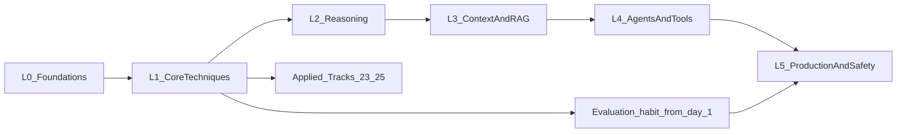

# Roadmap: L0 to L5

!!! tip "Architecture role? Filter first"
    If you are targeting Principal / Enterprise / Agentic AI Architect, start with the [Architect 20% path](architect-20.md). Use this L0–L5 roadmap as the full catalog and for the remaining ~80% depth.

Prompt engineering in 2026 is much more than clever wording. It covers four disciplines:

1. **Instructing** models clearly (prompting).
2. **Curating what they see** (context engineering).
3. **Giving them tools and loops** (agents).
4. **Proving it works** (evaluation, security, and operations).

The levels below follow that progression.

!!! tip "Evaluation is a habit, not a level"
    Module 18 is in L5, but you should measure from the first lab onward. Every lab in this repo has a tiny dataset and a scoring function for this reason.

## L0 Foundations: "I know what the model is doing"

| Module | Topic |
| --- | --- |
| [01](../modules/01-how-llms-work/index.md) | How LLMs work for prompters |
| [02](../modules/02-prompt-anatomy/index.md) | Anatomy of a prompt |

**Exit criteria:**

- [ ] Explain tokens, context windows, and sampling (and why reasoning models restrict sampling parameters)
- [ ] Explain how base, instruct, and reasoning models differ, and when to use each
- [ ] Write a system prompt and a user prompt with a clear split of responsibilities

## L1 Core techniques: "My prompts are reliable"

| Module | Topic |
| --- | --- |
| [03](../modules/03-few-shot/index.md) | Zero-shot, few-shot, and example selection |
| [04](../modules/04-clarity-and-structure/index.md) | Clarity, structure, and delimiters |
| [05](../modules/05-structured-outputs/index.md) | Structured outputs |
| [06](../modules/06-prompt-chaining/index.md) | Prompt chaining and decomposition |

**Exit criteria:**

- [ ] Measurably improve a weak prompt on a 20-item dataset
- [ ] Get schema-valid JSON at least 99% of the time using native structured outputs
- [ ] Split a complex task into a chain and explain why each step exists

## L2 Reasoning: "I can make models think well, and know when not to"

| Module | Topic |
| --- | --- |
| [07](../modules/07-chain-of-thought/index.md) | Chain-of-thought and step-back |
| [08](../modules/08-advanced-reasoning/index.md) | Self-consistency, Tree of Thoughts, self-refine, reflexion |
| [09](../modules/09-reasoning-models/index.md) | Prompting reasoning models |

**Exit criteria:**

- [ ] Show where chain-of-thought helps a non-reasoning model and where it adds nothing to a reasoning model
- [ ] Tune the effort or thinking level against cost and quality on your evals

## L3 Context engineering and retrieval: "The model sees exactly what it needs"

| Module | Topic |
| --- | --- |
| [10](../modules/10-context-engineering/index.md) | Context engineering |
| [11](../modules/11-rag-and-grounding/index.md) | RAG prompt design and hallucination control |
| [12](../modules/12-long-context-memory/index.md) | Long context and memory |
| [13](../modules/13-multimodal/index.md) | Multimodal prompting |

**Exit criteria:**

- [ ] Build a grounded Q&A prompt that cites its sources and refuses when the answer isn't there
- [ ] Explain compaction, note-taking, and just-in-time retrieval strategies

## L4 Agents and tools: "Models act, safely and effectively"

| Module | Topic |
| --- | --- |
| [14](../modules/14-tool-calling/index.md) | Tool calling and tool design |
| [15](../modules/15-agent-patterns/index.md) | Agent patterns |
| [16](../modules/16-mcp-and-skills/index.md) | MCP and agent skills |
| [17](../modules/17-multi-agent/index.md) | Multi-agent systems |

**Exit criteria:**

- [ ] Write tool descriptions that a model uses correctly without extra examples
- [ ] Pick the simplest agent pattern for a task and justify it
- [ ] Build or configure an MCP server and write a skill

## L5 Production, evaluation, and safety: "I can ship and defend it"

| Module | Topic |
| --- | --- |
| [18](../modules/18-evaluation/index.md) | Evaluation |
| [19](../modules/19-prompt-optimization/index.md) | Automatic prompt optimization |
| [20](../modules/20-prompt-security/index.md) | Prompt security |
| [21](../modules/21-promptops/index.md) | PromptOps |
| [22](../modules/22-finetune-vs-prompt-vs-rag/index.md) | Fine-tuning vs. prompting vs. RAG |

**Exit criteria:**

- [ ] Build an eval suite with an LLM-as-judge that's validated against human labels
- [ ] Run a DSPy optimization and beat your hand-written prompt
- [ ] Red-team your own app for indirect prompt injection
- [ ] Set up prompt versioning and tracing, and run a regression check in CI

## Applied tracks (any time after L1)

| Module | Topic |
| --- | --- |
| [23](../modules/23-coding-agents/index.md) | Prompting coding agents |
| [24](../modules/24-task-playbooks/index.md) | Task playbooks |
| [25](../modules/25-generative-media/index.md) | Generative media prompting |

## What "mastery" means here

You've reached mastery when you can:

1. Take an unfamiliar task and design the prompt, context, and tools for it.
2. Prove with evals that the design works, and know where it fails.
3. Defend it against misuse.
4. Explain each decision, and update it when a new model ships.
