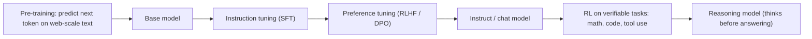
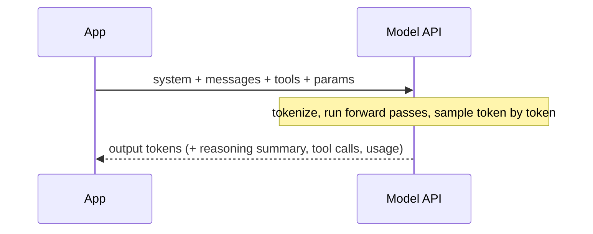

---
tags:
  - L0
  - foundations
---

# 01. How LLMs Work (for Prompters)

!!! abstract "At a glance"
    **Level:** L0 · **Status:** complete · **Last reviewed:** 2026-10-07
    **Prerequisites:** none · **Lab:** `labs/01_how_llms_work/`

## 1. Why it matters

Every prompting technique works because of *how* the model produces text. If you know the mechanics, you can predict when a technique will help instead of copying tricks:

- tokens
- next-token prediction
- the context window
- sampling
- post-training

## 2. Core concepts

### Tokens

Models read and write **tokens**, which are sub-word pieces, not characters or words.

- **Rough rule:** 1 token is about 4 characters, or about 0.75 English words. Code, non-English text, and numbers often take more tokens.
- **Consequences:**
    - Costs and limits are counted in tokens.
    - Character-level tasks are hard because the model never "sees" letters. Examples: counting the r's in "strawberry", reversing strings, exact character limits.
    - Unusual formatting splits into strange tokens.

### Next-token prediction and the "document" view

An LLM predicts the next token given everything before it. A prompt is the **start of a document** that you want the model to continue in the way you intend. Instruct and chat models are trained to continue a *conversation* document helpfully, but the principle still holds: **the model does what is most plausible given the context.**

### The context window

The context window is everything the model can see in one call: system prompt, conversation history, tool definitions, retrieved documents, and its own output. It's large but finite, and **quality degrades before you hit the limit** (see "context rot" in [module 10](../10-context-engineering/index.md)).

### Sampling

The model outputs a probability distribution, and *sampling* picks a token from it.

| Parameter | Effect | When to use |
| --- | --- | --- |
| `temperature` | Higher means a flatter distribution and more variety. Lower means more peaked and more deterministic | Low for extraction and classification. Higher for brainstorming |
| `top_p` | Samples only from the smallest set of tokens whose probabilities add up to *p* | Usually leave it at the default. Tune temperature *or* top_p, not both |
| `max_tokens` / output cap | Hard limit on output length | Leave headroom for reasoning tokens on thinking models |
| `seed` | Best-effort reproducibility (where supported) | Experiments |

!!! warning "Reasoning models restrict sampling parameters"
    Current reasoning-model APIs often **reject or ignore** `temperature`, `top_p`, or `top_k` when thinking is on. You control them through an **effort** or **thinking level** setting instead. Check the provider docs for your model, and see [module 09](../09-reasoning-models/index.md).

### Model types



| Type | Behavior | Prompting implication |
| --- | --- | --- |
| **Base** | Continues text. Doesn't follow instructions | Write the beginning of the document you want (few-shot formats) |
| **Instruct / chat** | Follows instructions and has a system prompt | Clear instructions, examples, and structure |
| **Reasoning** | Generates hidden or summarized thinking before answering | State goals, constraints, and success criteria. Don't script the steps |

### Why models hallucinate

Models are trained to produce *plausible* continuations, not *verified* ones. When the facts aren't in the context or are only weakly stored in the weights, a fluent but wrong answer can still be the most likely continuation. The mitigations covered in later modules all work by **putting the truth in the context and permitting "I don't know"**:

- grounding
- citations
- permission to abstain
- verification

## 3. Architecture / flow



## 4. Prompt patterns

=== "Bad: fighting tokenization"

    ```text
    Write a tagline that is exactly 47 characters long.
    ```

=== "Good: work with the model"

    ```text
    Write 5 taglines under 50 characters.
    ```

    Then measure the length in code and pick a valid one. Use code for exact counting.

## 5. Failure modes and mitigations

| Failure mode | Symptom | Mitigation |
| --- | --- | --- |
| Character and arithmetic errors | Wrong counts or sums | Use code or a tool; use a reasoning model |
| Truncated output | Response cut off mid-JSON | Raise the output cap; check the `finish_reason` / `stop_reason` |
| Non-determinism | Different answers per run | Lower temperature where allowed; evaluate on many samples, not one |
| Confident hallucination | Plausible fake facts | Ground in the provided context; allow "I don't know" ([module 11](../11-rag-and-grounding/index.md)) |

## 6. How to evaluate it

This module is conceptual. The lab checks your mental model empirically: run the same prompt 20 times at different settings and measure how much the output varies.

## 7. Lab and exercises

- Lab: `labs/01_how_llms_work/`
- **Exercise 1:** run one creative prompt 10 times at temperature 0, 0.7, and 1.2. Count the unique outputs.
- **Exercise 2:** compare a token count (provider tokenizer or `litellm.token_counter`) for English text, Hindi text, JSON, and Python of similar length.
- **Exercise 3:** ask a reasoning model and a non-reasoning model the same multi-step math question. Compare accuracy, latency, and token usage.

## 8. Model-specific notes

| Provider | Notes |
| --- | --- |
| Anthropic (Claude) | Thinking (adaptive or extended) plus an effort setting on current models. Sampling parameters are restricted while thinking is on |
| OpenAI (GPT) | `reasoning.effort` (Responses API). Sampling parameters like `temperature` aren't supported on reasoning settings |
| Google (Gemini) | `thinkingLevel` on Gemini 3+. Google's guidance is to keep temperature at the default |
| Open models | You control the chat template. A mismatched template quietly degrades quality |

These details change quickly, so verify them in [Official guides](../../resources/official-guides.md) and log changes in [What's new](../../reference/whats-new.md).

## 9. Must-read references

- [Karpathy: Intro to Large Language Models](https://www.youtube.com/watch?v=zjkBMFhNj_g): the best one-hour mental model
- [Karpathy: Deep Dive into LLMs like ChatGPT](https://www.youtube.com/watch?v=7xTGNNLPyMI): pre-training, post-training, and reasoning
- *Prompt Engineering for LLMs* (Berryman and Ziegler), chapters 1-4: the "document completion" view

## 10. Tutorials covering this module

- YouTube: both Karpathy videos ([YouTube page](../../tutorials/youtube.md))
- Udemy: AI Engineer Core Track, week 1 ([Udemy page](../../tutorials/udemy.md))

## 11. Key takeaways (flashcards)

??? question "Why can't LLMs reliably count letters in a word?"
    They see tokens, not characters, so the letters are never directly visible.

??? question "What's the 'document' view of prompting?"
    The model continues the most plausible document. Your prompt sets up what's plausible.

??? question "How do you control reasoning models, if not with temperature?"
    With effort or thinking-level settings and the output budget. Sampling parameters are often restricted.

??? question "Why does a model hallucinate?"
    It produces plausible continuations. Without grounding in context and permission to abstain, plausible-but-false text wins.

## 12. Mastery checklist

- [ ] I can explain tokens, the context window, and sampling without notes
- [ ] I ran the temperature experiment and logged it in the journal
- [ ] I know how my main provider exposes reasoning effort
- [ ] I can explain why a model hallucinated in a specific case
