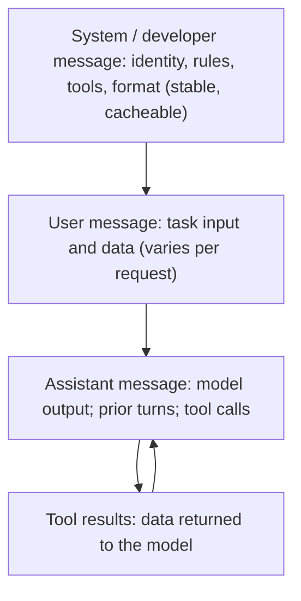
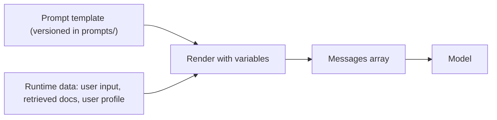

---
tags:
  - L0
  - foundations
---

# 02. Anatomy of a Prompt

!!! abstract "At a glance"
    **Level:** L0 · **Status:** complete · **Last reviewed:** 2026-10-07
    **Prerequisites:** [01](../01-how-llms-work/index.md) · **Lab:** `labs/02_prompt_anatomy/`

## 1. Why it matters

Most bad prompts are missing a component, such as context, a success criterion, or an output format. They're rarely just worded badly. A shared anatomy gives you a checklist to diagnose prompts and a consistent structure across projects.

## 2. Core concepts

### The components

| Component | Question it answers | Example |
| --- | --- | --- |
| **Role / identity** | Who is the model in this interaction? | "You are a support assistant for Acme's billing product." |
| **Goal / task** | What outcome do we want? | "Resolve the user's billing question or route it to a human." |
| **Context** | What does the model need to know that it can't guess? | Policies, user plan, retrieved documents, today's date |
| **Instructions and constraints** | What rules apply? | "Never promise refunds. Ask at most one clarifying question." |
| **Examples** | What does good look like? | Two or three input and output pairs ([module 03](../03-few-shot/index.md)) |
| **Output specification** | What shape is the answer? | "Return JSON matching this schema" or "Reply in under 120 words" |
| **Success criteria / stop conditions** | How do we know it's done? | "Done when the user confirms, or after you've escalated." |
| **Input** | The actual data or question | The user's message, in its own clearly delimited section |

Not every prompt needs every component. But when output is bad, **check which component is missing first**.

### Message roles



- **System (or developer) message:** stable instructions that apply to the whole conversation. Providers train models to give these higher priority than user messages (the *instruction hierarchy*).
- **User message:** what varies per request: the task input and any data.
- **Static first, dynamic last:** put stable content first. Prompt caching works on matching prefixes, so this saves cost and latency ([module 21](../21-promptops/index.md)).

### Role prompting: what it really does

"You are an expert X" gives the model **context about the domain, audience, and tone**. It doesn't make the model smarter. Concrete context works better than a bare title:

- *Weak:* "You are a world-class lawyer."
- *Strong:* "You review SaaS contracts for a 20-person startup. Flag clauses that create uncapped liability or auto-renewal traps, and explain each in plain English for a non-lawyer founder."

### Explain the *why*

Modern models generalize from the reasons behind a rule. "Keep responses under 3 sentences *because they're read aloud by a voice assistant*" leads to better behavior in edge cases than "keep it short."

## 3. Architecture / flow

A prompt in an application is a template plus runtime data:



## 4. Prompt patterns

=== "Bad"

    ```text
    Summarize this.

    {{ document }}
    ```

=== "Good"

    ```text
    <role>
    You write briefings for a busy engineering manager.
    </role>

    <task>
    Summarize the incident report below so the manager can decide in 1 minute
    whether to escalate to leadership.
    </task>

    <instructions>
    - Lead with impact: users affected, duration, revenue risk if stated.
    - Then root cause (or "unknown"), then current status.
    - Do not speculate beyond the report; say "not stated" where info is missing.
    </instructions>

    <output_format>
    3-5 bullet points, under 80 words total.
    </output_format>

    <incident_report>
    {{ document }}
    </incident_report>
    ```

    **What changed:** it now has an audience, a purpose, priorities, a grounding rule, a format, and delimited data.

## 5. Failure modes and mitigations

| Failure mode | Symptom | Mitigation |
| --- | --- | --- |
| Missing context | Generic or wrong assumptions | Add the facts the model can't guess, like the date, audience, and domain rules |
| Instructions mixed with data | The model follows text inside the document | Delimit the data, and say it's data ([module 20](../20-prompt-security/index.md)) |
| Conflicting rules | Inconsistent behavior. Reasoning models waste tokens reconciling the rules | Audit for contradictions, and give a priority order |
| Over-specified process | Rigid or worse output on reasoning models | Specify the outcome and constraints, not every step ([module 09](../09-reasoning-models/index.md)) |
| All-caps "MUST/NEVER" everywhere | Over-triggering, especially on newer models | Keep absolute rules for true invariants. Use calm, explained guidance for the rest |

## 6. How to evaluate it

Use an *ablation*: remove one component at a time and measure the drop on a small dataset. This shows which parts of the prompt carry the weight.

## 7. Lab and exercises

- Lab: `labs/02_prompt_anatomy/`
- **Exercise 1:** take three prompts you've used recently and label their components. Which are missing?
- **Exercise 2:** ablation. Run the "Good" prompt above with role, instructions, and format removed one at a time on five incident reports, and score each version.
- **Exercise 3:** move an instruction from the system message to the user message and back. Does adherence change?

## 8. Model-specific notes

| Provider | Notes |
| --- | --- |
| Anthropic (Claude) | Responds very well to XML-tagged sections. Newer models follow instructions literally, so ask explicitly for "above and beyond" behavior if you want it |
| OpenAI (GPT) | "Developer" messages carry system-level instructions. Recent guidance favors outcome-first prompts with clear stopping conditions |
| Google (Gemini) | System instructions are supported. Put long context first and the question last |
| Open models | System-prompt adherence varies. Test it, and repeat key rules near the end if needed |

## 9. Must-read references

- [Anthropic: Prompt engineering overview](https://platform.claude.com/docs/en/build-with-claude/prompt-engineering/overview)
- [OpenAI: Latest model guide (prompting guidance)](https://developers.openai.com/api/docs/guides/latest-model)
- [Google: Prompt design strategies](https://ai.google.dev/gemini-api/docs/prompting-strategies)
- [The Instruction Hierarchy](https://arxiv.org/abs/2404.13208): why system messages outrank user messages

## 10. Tutorials covering this module

- Anthropic Interactive Tutorial, chapters 1-3 ([notes](../../tutorials/notes/anthropic-interactive-tutorial.md))
- Udemy Bootcamp: Five Principles of Prompting ([notes](../../tutorials/notes/udemy-prompt-engineering-bootcamp.md))
- Coursera: Prompt Engineering for ChatGPT, module on prompt patterns

## 11. Key takeaways (flashcards)

??? question "Name the 8 components of a prompt."
    Role, goal, context, instructions and constraints, examples, output spec, success criteria, input.

??? question "Why put static content first?"
    Prompt caching matches on prefixes, so it lowers cost and latency. It also keeps the instructions stable.

??? question "What does role prompting really do?"
    It supplies domain, audience, and tone context. Concrete context beats a bare title.

??? question "Why explain the reason behind an instruction?"
    The model generalizes the intent to edge cases you didn't list.

## 12. Mastery checklist

- [ ] I can diagnose a bad prompt by naming its missing component
- [ ] I ran an ablation and know which components mattered most for one task
- [ ] I write system and user messages with a clear split of responsibilities
- [ ] I explain the "why" behind constraints by default
