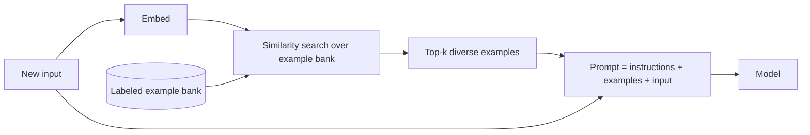

---
tags:
  - L1
  - techniques
---

# 03. Zero-Shot, Few-Shot, and Example Selection

!!! abstract "At a glance"
    **Level:** L1 · **Status:** complete · **Last reviewed:** 2026-10-07
    **Prerequisites:** [02](../02-prompt-anatomy/index.md) · **Lab:** `labs/03_few_shot/` (runnable)

## 1. Why it matters

Examples are the highest-bandwidth way to communicate what you want: format, tone, edge cases, and judgment calls. They're often faster than writing paragraphs of instructions. Examples also *anchor* the model strongly, so badly chosen ones quietly hurt quality.

## 2. Core concepts

| Approach | What it is | When to use |
| --- | --- | --- |
| **Zero-shot** | Instructions only | Simple or common tasks. Reasoning models. When examples would over-anchor |
| **One-shot / few-shot** | Instructions plus 1-10 input and output pairs | Format-sensitive output, subtle labels, a house style |
| **Many-shot** | Dozens to hundreds of examples (needs long context) | Hard classification where fine-tuning isn't an option |
| **Dynamic few-shot** | Retrieve the *most similar* examples for each input | Large example banks and varied inputs |

**What the research says:**

- **Format and label space matter a lot.** In some setups, whether the example labels are correct matters surprisingly little (Min et al., 2022). The model learns *what the task looks like*.
- **Order and balance matter.** The last example and the majority label bias the output (Zhao et al., 2021). Shuffle and balance your examples.
- **Diversity beats volume.** Cover the edge cases. Don't repeat the easy case.



## 3. Architecture / flow

**Static few-shot:** examples live in the prompt template, versioned in `prompts/`.

**Dynamic few-shot:**

- An example bank, stored in `evals/datasets/` or a vector store.
- A retriever that picks *k* similar but diverse examples for each request.
- Keep the evaluation set **separate** from the example bank, or your scores will be inflated.

## 4. Prompt patterns

=== "Zero-shot"

    ```text
    Classify the sentiment of the customer review as positive, negative, or mixed.
    Reply with only the label.

    Review: {{ review }}
    ```

=== "Few-shot (good)"

    ```text
    Classify the sentiment of the customer review as positive, negative, or mixed.
    "mixed" means clear praise AND clear complaint in the same review.
    Reply with only the label.

    <examples>
    <example>
    <review>Fast shipping, works perfectly.</review>
    <label>positive</label>
    </example>
    <example>
    <review>Love the design but the battery dies by noon.</review>
    <label>mixed</label>
    </example>
    <example>
    <review>Stopped working after two days. Support never replied.</review>
    <label>negative</label>
    </example>
    </examples>

    <review>{{ review }}</review>
    ```

    **Why it works:** it defines the tricky label ("mixed"), has one example per label, uses a consistent format, and keeps the examples clearly separated from the input.

=== "Anti-pattern"

    ```text
    Examples:
    "Great!" -> positive
    "Awesome!" -> positive
    "Amazing!" -> positive
    "Bad." -> negative
    ```

    **Problems:** the examples are imbalanced (biased toward positive), trivial, miss the "mixed" label, and are all short (biased toward short inputs).

## 5. Failure modes and mitigations

| Failure mode | Symptom | Mitigation |
| --- | --- | --- |
| Over-anchoring | Outputs copy the examples' wording, length, or topic | More diverse examples. Say "examples are illustrative, not templates" |
| Label imbalance | The model over-predicts the majority label | Balance the labels, and shuffle the order |
| Data leakage | Eval scores look great but production is poor | Never use eval items as examples |
| Examples contradict instructions | Inconsistent behavior | Examples win, so fix the examples |
| Token bloat | High cost and latency | Use dynamic selection, or move stable examples into a cached prefix |

## 6. How to evaluate it

- **Dataset:** a labeled set of 30 or more items that includes hard cases. The lab ships one.
- **Compare** zero-shot, 3-shot, and 3-shot with shuffled order. For bias testing, also try 3-shot with wrong labels.
- **Metrics:** accuracy, per-label recall (to catch bias), and tokens per call.

## 7. Lab and exercises

- **Lab:** `labs/03_few_shot/run.py` compares zero-shot and few-shot on `evals/datasets/sentiment.jsonl`, with per-label accuracy.
- **Exercise 1:** run the lab. Then add an example that's deliberately misleading. How much does accuracy drop?
- **Exercise 2:** reverse the example order. Does the last example's label become more frequent?
- **Exercise 3 (stretch):** implement dynamic few-shot with embeddings (`litellm.embedding`) and compare it against static few-shot.

## 8. Model-specific notes

| Provider | Notes |
| --- | --- |
| Anthropic (Claude) | Wrap examples in `<example>` tags. Claude pays close attention to example details, so make sure they show exactly the behavior you want |
| OpenAI (GPT) | Reasoning models often do well zero-shot. Try zero-shot first, then add examples only if evals improve |
| Google (Gemini) | Google recommends always including a few examples, and showing positive patterns rather than anti-patterns |
| Open models | Usually benefit more from few-shot than frontier models do |

## 9. Must-read references

- [Language Models are Few-Shot Learners](https://arxiv.org/abs/2005.14165)
- [Rethinking the Role of Demonstrations](https://arxiv.org/abs/2202.12837)
- [Calibrate Before Use](https://arxiv.org/abs/2102.09690)
- [Many-Shot In-Context Learning](https://arxiv.org/abs/2404.11018)
- [Anthropic: Prompting best practices - examples](https://platform.claude.com/docs/en/build-with-claude/prompt-engineering/claude-prompting-best-practices#use-examples-effectively)

## 10. Tutorials covering this module

- Anthropic Interactive Tutorial, chapter 7 ([notes](../../tutorials/notes/anthropic-interactive-tutorial.md))
- DeepLearning.AI: ChatGPT Prompt Engineering for Developers ([page](../../tutorials/deeplearning-ai.md))
- Udemy Bootcamp: the few-shot and templates sections

## 11. Key takeaways (flashcards)

??? question "What matters most in few-shot examples, per Min et al.?"
    The format and label space. Whether the labels are correct can matter surprisingly little.

??? question "Two biases that example order and choice cause?"
    Recency bias (the last example's label) and majority-label bias.

??? question "When should you try zero-shot first?"
    With reasoning models and simple tasks. Add examples only if evals show a gain.

??? question "What's dynamic few-shot?"
    Retrieving the examples most similar to the current input from a labeled bank.

## 12. Mastery checklist

- [ ] I ran the lab and logged zero-shot vs. few-shot results in the journal
- [ ] I demonstrated order or majority bias experimentally
- [ ] I know when to use dynamic few-shot instead of static
- [ ] I keep evaluation data separate from example banks
