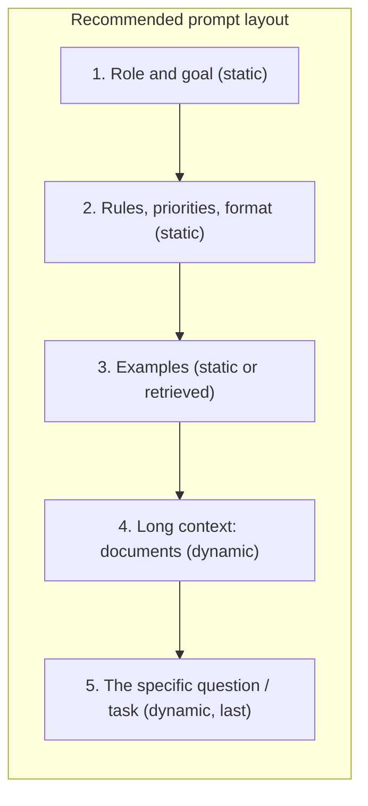

---
tags:
  - L1
  - techniques
---

# 04. Clarity, Structure, and Delimiters

!!! abstract "At a glance"
    **Level:** L1 · **Status:** complete · **Last reviewed:** 2026-10-07
    **Prerequisites:** [02](../02-prompt-anatomy/index.md) · **Lab:** `labs/04_clarity_and_structure/`

## 1. Why it matters

The single biggest lever on most prompts is **being explicit about what you actually want**. Modern models follow instructions precisely, so vagueness leads to generic output, and contradictions lead to inconsistent output. Structure also makes long prompts easier to maintain and safer against injection.

## 2. Core concepts

### The "new employee" test

Imagine giving your prompt to a smart new colleague who has **no context** about your project. Would they produce what you want? If they'd need to ask questions, the model needs those answers too.

### Clarity principles

1. **Say what to do, not only what not to do.** "Write in flowing prose paragraphs" works better than "Don't use markdown."
2. **Be specific about quality.** If you want an ambitious, polished result, say so. Newer models do what you ask, not more.
3. **Quantify.** Use "3-5 bullets, under 80 words" instead of "short".
4. **Give the purpose and the audience.** This lets the model make good judgment calls.
5. **Set a priority order** when rules might conflict: "If brevity and completeness conflict, prefer completeness."
6. **Match the prompt's style to the output you want.** A markdown-heavy prompt tends to produce markdown-heavy output.

### Delimiters and structure

Use structure to separate **instructions** from **data** and to label each part:

| Technique | Example | Best for |
| --- | --- | --- |
| XML-style tags | `<document>...</document>` | Multiple documents, nested data, referring to sections by name ("using the `<policy>`...") |
| Markdown headers | `## Instructions` | Readable system prompts |
| Triple quotes or fences | `"""..."""` | Short single inputs |

Pick one convention per prompt and use it consistently. Tag names have no magic. What matters is that they're consistent and meaningful.

### Long-context ordering

For long documents, put the **documents first** and the **instructions and question last**. Asking the model to first quote the relevant passages, then answer, also helps grounding.

### Prefill and response steering

Some APIs let you start the assistant's reply, for example with `{` to force JSON. Native **structured outputs** are now usually the better choice ([module 05](../05-structured-outputs/index.md)). Also check whether your model and settings still support prefill.

## 3. Architecture / flow



## 4. Prompt patterns

=== "Vague"

    ```text
    Write a product description for our headphones. Make it good and not too long.
    ```

=== "Clear and structured"

    ```text
    <goal>
    Write the product page description for the Aurora X2 wireless headphones.
    Readers are commuters comparing 3-4 options; the description must help them
    decide in under 30 seconds.
    </goal>

    <product_facts>
    {{ facts }}
    </product_facts>

    <requirements>
    - 90-120 words, second person, confident but not hyped.
    - Lead with the single strongest differentiator for commuters.
    - Mention battery life and noise cancelling with the exact figures from product_facts.
    - Use only facts from product_facts; if a common spec is missing, omit it.
    - End with one sentence on who it's best for.
    </requirements>

    <output_format>
    Plain prose, one paragraph, no headings or bullet points.
    </output_format>
    ```

## 5. Failure modes and mitigations

| Failure mode | Symptom | Mitigation |
| --- | --- | --- |
| Vague quality bar | Bland, generic output | State the audience and purpose, and describe what "excellent" looks like |
| Negative-only instructions | The model still does the forbidden thing | Rephrase as a positive instruction about what to do |
| Contradictory rules | Unpredictable trade-offs | Audit the prompt, and state a priority order |
| Instructions buried in data | Ignored or confused | Delimit the data, and restate the key instruction at the end |
| Over-emphasis (CAPS, "CRITICAL") | Over-triggering, rigid behavior | Use normal language, and save absolutes for real invariants |

## 6. How to evaluate it

- Score the outputs against a **rubric** built from your requirements: facts correct, length within range, differentiator first, no invented specs. Then compare the vague and clear versions on 10 products.
- Count how often each rule is violated. This tells you which requirement needs rewording.

## 7. Lab and exercises

- Lab: `labs/04_clarity_and_structure/`
- **Exercise 1:** run the new-employee test on three of your real prompts, then rewrite them.
- **Exercise 2:** turn "Don't use markdown" into a positive instruction, and measure how often markdown appears in 20 runs.
- **Exercise 3:** for a 20-page document, compare putting the question first vs. last. Measure answer accuracy.

## 8. Model-specific notes

| Provider | Notes |
| --- | --- |
| Anthropic (Claude) | Responds strongly to XML tags. Newer models follow instructions precisely, so ask explicitly for extra effort or features. Dial down aggressive emphasis that older models needed |
| OpenAI (GPT) | Guidance for GPT-5.x and later favors outcome-first prompts, few absolute rules, and explicit stopping conditions. Contradictions are especially costly |
| Google (Gemini) | Gemini's docs warn that very elaborate scaffolding can backfire. Keep prompts direct and use one structure convention |
| Open models | Smaller models benefit from more explicit structure and repeated key instructions |

## 9. Must-read references

- [Anthropic: Be clear and direct / prompting best practices](https://docs.claude.com/en/docs/build-with-claude/prompt-engineering/claude-4-best-practices)
- [OpenAI: Prompt guidance](https://developers.openai.com/api/docs/guides/prompt-guidance)
- [Sclar et al.: Sensitivity to spurious prompt features](https://arxiv.org/abs/2310.11324): why you must evaluate formatting choices

## 10. Tutorials covering this module

- Anthropic Interactive Tutorial, chapters 2 and 4 ([notes](../../tutorials/notes/anthropic-interactive-tutorial.md))
- Udemy Bootcamp: Five Principles ("Give Direction", "Specify Format")
- Coursera: Google Prompting Essentials

## 11. Key takeaways (flashcards)

??? question "What's the new-employee test?"
    Would a smart colleague with no context produce what you want from this prompt alone?

??? question "Why use positive instructions instead of negative ones?"
    Telling the model what to do gives it a target. "Don't X" still primes X.

??? question "Where should long documents go?"
    First, with the question and instructions at the end.

??? question "Why are XML tags useful?"
    They separate instructions from data, let you refer to sections by name, and help against injection.

## 12. Mastery checklist

- [ ] I rewrote three real prompts and measured the improvement
- [ ] I use one delimiter convention consistently
- [ ] I state the audience, purpose, and quality bar by default
- [ ] I can explain why over-emphasis hurts newer models
