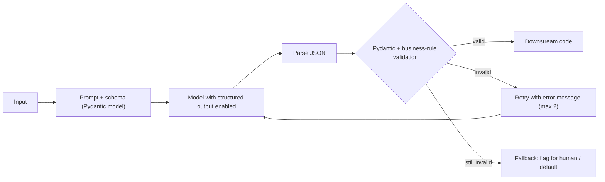

---
tags:
  - L1
  - techniques
---

# 05. Structured Outputs

!!! abstract "At a glance"
    **Level:** L1 · **Status:** complete · **Last reviewed:** 2026-10-07
    **Prerequisites:** [04](../04-clarity-and-structure/index.md) · **Lab:** `labs/05_structured_outputs/`

## 1. Why it matters

When a program reads the model's output, free text is a liability. Structured outputs make LLM calls behave like typed functions: input, validated object, next step. They're the foundation for extraction, classification, routing, tool calling, and every agent loop.

## 2. Core concepts

### Three levels of enforcement

| Level | How | Reliability |
| --- | --- | --- |
| **1. Ask nicely** | "Return JSON with keys a, b" | OK on frontier models. Breaks at scale |
| **2. JSON mode** | API flag guarantees *valid JSON* | Valid syntax, but keys and types aren't guaranteed |
| **3. Schema-constrained decoding** | Pass a JSON Schema or Pydantic model. Decoding is constrained to match it | Output matches the schema (within the provider's supported schema features) |

**Default to level 3** whenever your provider supports it. Always **validate in code**, even then, for business rules the schema can't express (such as "end_date is after start_date").

### Schema design is prompt design

The model reads field names, descriptions, and enums. They're part of the prompt.

- Use **descriptive names**: `customer_intent`, not `ci`.
- Add a **description** to each field that needs a judgment call.
- Use **enums** for closed label sets, and include an `"other"` or `"unknown"` escape hatch.
- Use **nullable or optional** fields for information that may be missing. Otherwise the model invents values.
- **Field order matters:** put `reasoning` or `evidence` fields *before* `answer` fields, so the model "thinks" before it commits.

### Format vs. reasoning trade-off

Strict formats can hurt reasoning quality (Tam et al., 2024). Mitigations:

- Let the model reason first, either in a `reasoning` field or with the provider's thinking feature, then emit the structure.
- Or use two steps: a free-form answer, then a cheap extraction into the schema.

## 3. Architecture / flow



## 4. Prompt patterns

=== "Pydantic schema"

    ```python
    from typing import Literal
    from pydantic import BaseModel, Field

    class TicketTriage(BaseModel):
        evidence: str = Field(description="Quote the sentence(s) that justify the category.")
        category: Literal["billing", "bug", "feature_request", "account", "other"]
        urgency: Literal["low", "medium", "high"] = Field(
            description="high = user blocked or data loss; medium = degraded; low = question/idea"
        )
        customer_name: str | None = Field(description="Only if explicitly stated; else null.")
    ```

=== "Prompt"

    ```text
    Triage the support ticket into the TicketTriage schema.
    Use only information in the ticket. If the customer's name is not explicitly
    written, return null rather than guessing.

    <ticket>
    {{ ticket }}
    </ticket>
    ```

=== "Anti-pattern"

    ```text
    Return JSON like {"cat": ..., "urg": ..., "name": ...}. ONLY JSON!!! NO TEXT!!!
    ```

    **Problems:** cryptic keys, no allowed values, no rule for missing data, and shouting.

## 5. Failure modes and mitigations

| Failure mode | Symptom | Mitigation |
| --- | --- | --- |
| Invented values for missing fields | Plausible fake names or dates | Nullable fields, plus an explicit "null if not stated" rule |
| Enum drift | Labels outside the set (with JSON mode only) | Schema-constrained decoding with `Literal` / `enum` |
| Truncation | Invalid JSON at the end | Raise the output cap. Check the stop reason. Keep schemas lean |
| Reasoning degraded by format | Lower accuracy than free text | Put an evidence or reasoning field first, use thinking, or use two steps |
| Unsupported schema features | API error or ignored constraint | Check the provider's supported JSON Schema subset |

## 6. How to evaluate it

- **Schema validity rate.** Aim for 100% with constrained decoding, and track retries.
- **Field-level accuracy** against a labeled set (exact match for enums, fuzzy match for strings).
- **Hallucinated-field rate:** non-null values where the gold label is null.

## 7. Lab and exercises

- Lab: `labs/05_structured_outputs/`. Use `pem.llm.complete_structured()` with a Pydantic model.
- **Exercise 1:** compare "ask nicely" with schema-constrained decoding on 30 tickets. Measure validity and accuracy.
- **Exercise 2:** remove the `evidence` field. Does category accuracy change?
- **Exercise 3:** add a business rule ("high urgency requires a quote containing a blocking word") and implement validate-and-retry.

## 8. Model-specific notes

| Provider | Notes |
| --- | --- |
| Anthropic (Claude) | Supports structured outputs (JSON schema). Tool use with a single forced tool is also a common pattern for structure |
| OpenAI (GPT) | `response_format` with `json_schema` and `strict: true`. The Pydantic integration lives in the SDK |
| Google (Gemini) | `response_schema` / `responseMimeType: application/json`. Can be combined with tools on newer models |
| Open models | Use constrained-decoding libraries in the serving layer (e.g. grammar-based decoding in vLLM or llama.cpp) |

## 9. Must-read references

- [OpenAI: Structured outputs guide](https://platform.openai.com/docs/guides/structured-outputs)
- [Instructor](https://python.useinstructor.com/): validated outputs with retries
- [Let Me Speak Freely?](https://arxiv.org/abs/2408.02442): format restrictions vs. reasoning

## 10. Tutorials covering this module

- Udemy Bootcamp: the structured output (JSON, CSV) sections ([notes](../../tutorials/notes/udemy-prompt-engineering-bootcamp.md))
- Anthropic Interactive Tutorial, chapter 5

## 11. Key takeaways (flashcards)

??? question "Three levels of output enforcement?"
    Asking in the prompt, JSON mode (valid syntax only), and schema-constrained decoding.

??? question "How do you stop the model from inventing missing fields?"
    Make the field nullable, and instruct "null if not explicitly stated".

??? question "Why put an evidence field before the answer?"
    The model generates fields in order, so it reasons from evidence before committing to an answer.

??? question "Is constrained decoding enough by itself?"
    No. Still validate business rules in code, with retry and fallback.

## 12. Mastery checklist

- [ ] I can design a schema whose names and descriptions act as instructions
- [ ] I implemented validate, retry, and fallback
- [ ] I measured the validity rate and hallucinated-field rate on a dataset
- [ ] I know my provider's supported schema subset
