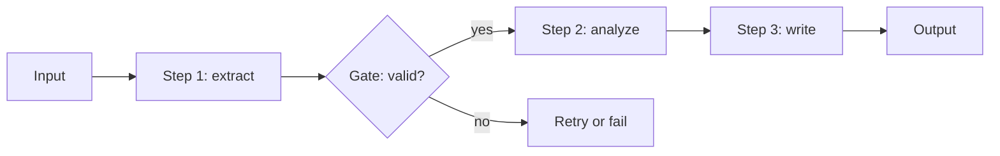

---
tags:
  - L1
  - techniques
---

# 06. Prompt Chaining and Decomposition

!!! abstract "At a glance"
    **Level:** L1 · **Status:** stub · **Last reviewed:** 2026-10-07
    **Prerequisites:** [05](../05-structured-outputs/index.md) · **Lab:** `labs/06_prompt_chaining/`

!!! note "Stub module"
    The outline, references, and checklist are ready. As you study, expand each section using the [module template](../../templates/module-design-doc.md), add good/bad prompt examples, and change the status to `draft`, then `complete`.

## 1. Why it matters

Single prompts that do five things do all five badly. Chaining splits a task into focused steps, each with its own prompt, model choice, and validation. This trades a little latency for big gains in reliability and debuggability.

## 2. Core concepts (outline)

- When to chain vs. one prompt: the task has distinct sub-skills, needs intermediate validation, or exceeds what one call does reliably
- Patterns: sequential pipeline, map-reduce (per chunk then combine), least-to-most (easy subproblems first), self-ask (generate sub-questions)
- Gates: programmatic checks between steps (schema validation, length, keyword) that stop or branch the chain
- Passing state: pass structured outputs between steps, not raw prose; keep each step's context minimal
- Per-step model selection: cheap model for extraction, strong model for synthesis

## 3. Architecture / flow

## 4. Prompt patterns

*To write: add at least one bad vs. good prompt pair from your own experiments.*

## 5. Failure modes and mitigations

| Failure mode | Symptom | Mitigation |
| --- | --- | --- |
| Error propagation | Early mistake ruins final output | Validate between steps; log intermediate outputs |
| Lost context | Later steps miss info | Explicitly pass required fields; don't assume |
| Over-chaining | Slow, costly, no quality gain | Measure: merge steps that don't improve evals |

## 6. How to evaluate it

Compare single-prompt vs. chain on the same dataset; also evaluate each step in isolation to find the weak link.

## 7. Lab and exercises

- Lab: `labs/06_prompt_chaining/`
- Build a 3-step chain: extract facts from a document -> verify against source -> write summary. Compare with a single prompt.

## 8. Model-specific notes

| Provider | Notes |
| --- | --- |
| Anthropic (Claude) | *to fill* |
| OpenAI (GPT) | *to fill* |
| Google (Gemini) | *to fill* |
| Open models | *to fill* |

## 9. Must-read references

- [Anthropic: Building effective agents (prompt chaining workflow)](https://www.anthropic.com/engineering/building-effective-agents)
- [Least-to-Most Prompting](https://arxiv.org/abs/2205.10625)
- [Self-Ask](https://arxiv.org/abs/2210.03350)

## 10. Tutorials covering this module

- Anthropic Interactive Tutorial - appendix 10.1 Chaining prompts
- Udemy Bootcamp - production Python sections

## 11. Key takeaways (flashcards)

??? question "What is a gate in a prompt chain?"
    A programmatic check between steps that validates output and decides to continue, retry, or stop.

??? question "When is chaining NOT worth it?"
    When evals show no gain - each step adds latency, cost, and failure points.

## 12. Mastery checklist

- [ ] I can explain this to someone else without notes
- [ ] I ran the lab and recorded results in the journal
- [ ] I can name two failure modes and how to detect them
- [ ] I applied it to a new task outside the lab
- [ ] I expanded this stub to `complete`
