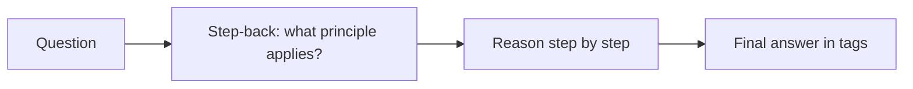

---
tags:
  - L2
  - reasoning
---

# 07. Chain-of-Thought and Step-Back Prompting

!!! abstract "At a glance"
    **Level:** L2 · **Status:** stub · **Last reviewed:** 2026-10-07
    **Prerequisites:** [04](../04-clarity-and-structure/index.md) · **Lab:** `labs/07_chain_of_thought/`

!!! note "Stub module"
    The outline, references, and checklist are ready. As you study, expand each section using the [module template](../../templates/module-design-doc.md), add good/bad prompt examples, and change the status to `draft`, then `complete`.

## 1. Why it matters

Letting a model reason before answering improves multi-step tasks (math, logic, planning) on non-reasoning models. Knowing when CoT helps - and when a reasoning model already does it internally - saves tokens and avoids degrading results.

## 2. Core concepts (outline)

- Few-shot CoT (Wei 2022): examples include worked reasoning
- Zero-shot CoT (Kojima 2022): 'Let's think step by step' - historically powerful, now mostly superseded by thinking modes
- Structured CoT: separate <thinking> and <answer> sections so code can parse the answer
- Step-back prompting: first ask for the general principle, then solve the specific problem
- Faithfulness caveat: stated reasoning is not guaranteed to be the real cause of the answer
- When NOT to: simple lookups/classification, latency-critical paths, and reasoning models (use effort settings instead)

## 3. Architecture / flow

## 4. Prompt patterns

*To write: add at least one bad vs. good prompt pair from your own experiments.*

## 5. Failure modes and mitigations

| Failure mode | Symptom | Mitigation |
| --- | --- | --- |
| Verbose reasoning leaks to users | Long rambling output | Separate thinking/answer sections; show only answer |
| Unfaithful reasoning | Correct-looking steps, wrong answer | Verify answers independently; don't trust rationale as proof |
| CoT on reasoning models | More tokens, no gain | Use effort/thinking settings, not CoT instructions |

## 6. How to evaluate it

Accuracy with vs. without CoT on a 30-item multi-step dataset, on a non-reasoning AND a reasoning model; record tokens.

## 7. Lab and exercises

- Lab: `labs/07_chain_of_thought/`
- Run GSM8K-style word problems: direct answer vs. zero-shot CoT vs. step-back, across two model types.

## 8. Model-specific notes

| Provider | Notes |
| --- | --- |
| Anthropic (Claude) | *to fill* |
| OpenAI (GPT) | *to fill* |
| Google (Gemini) | *to fill* |
| Open models | *to fill* |

## 9. Must-read references

- [Chain-of-Thought Prompting](https://arxiv.org/abs/2201.11903)
- [Large Language Models are Zero-Shot Reasoners](https://arxiv.org/abs/2205.11916)
- [Take a Step Back](https://arxiv.org/abs/2310.06117)
- [Anthropic: Prompting best practices - thinking](https://platform.claude.com/docs/en/build-with-claude/prompt-engineering/claude-prompting-best-practices#leverage-thinking-and-interleaved-thinking-capabilities)

## 10. Tutorials covering this module

- Anthropic Interactive Tutorial - chapter 6 Precognition
- promptingguide.ai - CoT pages

## 11. Key takeaways (flashcards)

??? question "Why separate thinking and answer tags?"
    So code can parse the answer and users don't see the reasoning.

??? question "Should you add 'think step by step' for reasoning models?"
    Generally no - use the provider's effort/thinking controls.

## 12. Mastery checklist

- [ ] I can explain this to someone else without notes
- [ ] I ran the lab and recorded results in the journal
- [ ] I can name two failure modes and how to detect them
- [ ] I applied it to a new task outside the lab
- [ ] I expanded this stub to `complete`
