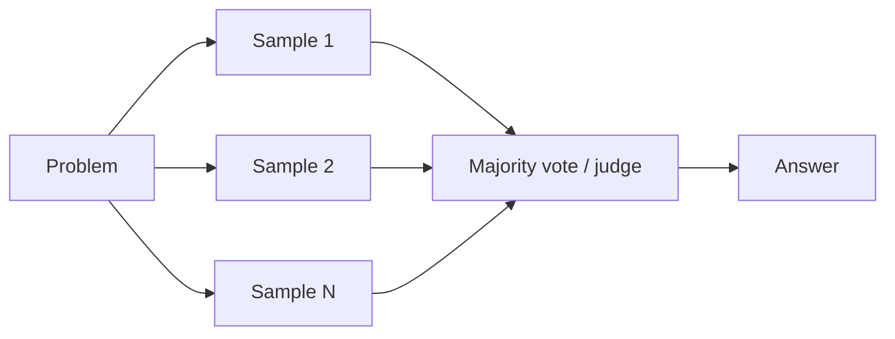

---
tags:
  - L2
  - reasoning
---

# 08. Advanced Reasoning: Self-Consistency, Tree of Thoughts, Self-Refine, Reflexion

!!! abstract "At a glance"
    **Level:** L2 · **Status:** stub · **Last reviewed:** 2026-10-07
    **Prerequisites:** [07](../07-chain-of-thought/index.md) · **Lab:** `labs/08_advanced_reasoning/`

!!! note "Stub module"
    The outline, references, and checklist are ready. As you study, expand each section using the [module template](../../templates/module-design-doc.md), add good/bad prompt examples, and change the status to `draft`, then `complete`.

## 1. Why it matters

Some problems benefit from spending more compute at inference: sampling multiple solutions, exploring branches, or critiquing and revising. These patterns underpin today's evaluator-optimizer agents.

## 2. Core concepts (outline)

- Self-consistency: sample N reasoning paths, majority-vote the answer
- Tree of Thoughts / Graph of Thoughts: explore and evaluate partial solutions (search)
- Self-refine: generate -> critique -> revise loop
- Reflexion: agent stores verbal lessons from failures and retries
- Chain-of-Verification: draft -> plan verification questions -> answer them independently -> revise
- Cost/benefit: N x cost; often superseded by reasoning models, still useful for verifiable tasks

## 3. Architecture / flow

## 4. Prompt patterns

*To write: add at least one bad vs. good prompt pair from your own experiments.*

## 5. Failure modes and mitigations

| Failure mode | Symptom | Mitigation |
| --- | --- | --- |
| Self-critique that agrees with itself | No real improvement | Use a different prompt/model as critic or an external check (tests, tools) |
| Cost explosion | N x tokens | Use only where accuracy gain justifies; cap iterations |
| No convergence | Endless revise loops | Max iterations + stop criteria |

## 6. How to evaluate it

Accuracy vs. cost curve for N = 1, 3, 5, 10 samples; for self-refine, rubric score per iteration.

## 7. Lab and exercises

- Lab: `labs/08_advanced_reasoning/`
- Self-consistency voting on a reasoning set; self-refine loop on a writing task scored by an LLM judge.

## 8. Model-specific notes

| Provider | Notes |
| --- | --- |
| Anthropic (Claude) | *to fill* |
| OpenAI (GPT) | *to fill* |
| Google (Gemini) | *to fill* |
| Open models | *to fill* |

## 9. Must-read references

- [Self-Consistency](https://arxiv.org/abs/2203.11171)
- [Tree of Thoughts](https://arxiv.org/abs/2305.10601)
- [Self-Refine](https://arxiv.org/abs/2303.17651)
- [Reflexion](https://arxiv.org/abs/2303.11366)
- [Chain-of-Verification](https://arxiv.org/abs/2309.11495)

## 10. Tutorials covering this module

- DeepLearning.AI - Agentic AI (reflection pattern)
- promptingguide.ai - ToT / self-consistency

## 11. Key takeaways (flashcards)

??? question "What does self-consistency vote over?"
    The final answers of multiple independently sampled reasoning paths.

??? question "Why use an external critic in self-refine?"
    Models often fail to find their own errors; tests, tools, or a different prompt catch more.

## 12. Mastery checklist

- [ ] I can explain this to someone else without notes
- [ ] I ran the lab and recorded results in the journal
- [ ] I can name two failure modes and how to detect them
- [ ] I applied it to a new task outside the lab
- [ ] I expanded this stub to `complete`
