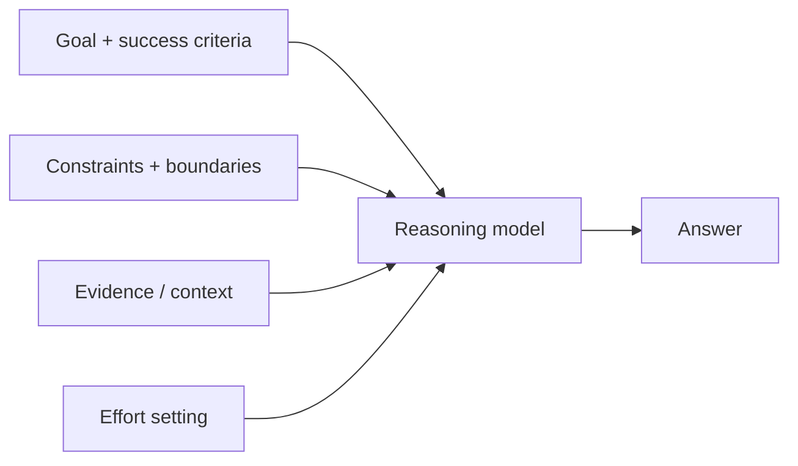

---
tags:
  - L2
  - reasoning
  - fast-changing
---

# 09. Prompting Reasoning Models

!!! abstract "At a glance"
    **Level:** L2 · **Status:** stub · **Last reviewed:** 2026-10-07
    **Prerequisites:** [07](../07-chain-of-thought/index.md), [08](../08-advanced-reasoning/index.md) · **Lab:** `labs/09_reasoning_models/`

!!! note "Stub module"
    The outline, references, and checklist are ready. As you study, expand each section using the [module template](../../templates/module-design-doc.md), add good/bad prompt examples, and change the status to `draft`, then `complete`.

## 1. Why it matters

Reasoning models (Claude with adaptive thinking, GPT-5.x/6 with reasoning effort, Gemini thinking levels) changed prompting: many old tricks are unnecessary or harmful. You now steer with goals, constraints, success criteria, and an effort dial.

## 2. Core concepts (outline)

- Outcome-first prompts: describe the destination, constraints, and evidence - not every step
- Effort / thinking controls: start at provider default, sweep lower for cheap subtasks, higher for hard ones; re-tune on every model change
- Sampling parameters are often restricted when thinking is on (temperature/top_p) - check docs
- Stopping conditions and autonomy boundaries: what the model may do without asking, when to stop
- Avoid contradictions - reasoning models spend tokens reconciling them
- Don't ask for raw chain-of-thought; use provided summaries; keep output budgets generous
- Few-shot can still help for format but may over-anchor; try zero-shot first

## 3. Architecture / flow

## 4. Prompt patterns

*To write: add at least one bad vs. good prompt pair from your own experiments.*

## 5. Failure modes and mitigations

| Failure mode | Symptom | Mitigation |
| --- | --- | --- |
| Overthinking | Slow, expensive on simple tasks | Lower effort; clear stopping criteria |
| Underthinking | Shallow answers on hard tasks | Raise effort; state that thoroughness matters |
| Legacy prompt scaffolding | Worse results than a simpler prompt | Remove step-by-step scripts and redundant rules; re-evaluate |

## 6. How to evaluate it

Effort sweep (low/medium/high) on one dataset: accuracy, latency, cost. Old prompt vs. simplified outcome-first prompt.

## 7. Lab and exercises

- Lab: `labs/09_reasoning_models/`
- Take a long legacy prompt, simplify it to outcome-first, and compare on evals across effort levels.

## 8. Model-specific notes

| Provider | Notes |
| --- | --- |
| Anthropic (Claude) | *to fill* |
| OpenAI (GPT) | *to fill* |
| Google (Gemini) | *to fill* |
| Open models | *to fill* |

## 9. Must-read references

- [OpenAI: Reasoning best practices](https://developers.openai.com/api/docs/guides/reasoning-best-practices)
- [OpenAI: Latest model guide (prompting guidance)](https://developers.openai.com/api/docs/guides/latest-model)
- [Anthropic: Extended / adaptive thinking](https://platform.claude.com/docs/en/build-with-claude/extended-thinking)
- [Google: Gemini thinking](https://ai.google.dev/gemini-api/docs/thinking)

## 10. Tutorials covering this module

- Karpathy - Deep Dive into LLMs (reasoning/RL section)
- Provider launch videos for each new model

## 11. Key takeaways (flashcards)

??? question "Main shift when prompting reasoning models?"
    Specify outcome, constraints, and success criteria; let the model choose the path.

??? question "What replaces temperature tuning?"
    Effort / thinking-level settings and output budget.

## 12. Mastery checklist

- [ ] I can explain this to someone else without notes
- [ ] I ran the lab and recorded results in the journal
- [ ] I can name two failure modes and how to detect them
- [ ] I applied it to a new task outside the lab
- [ ] I expanded this stub to `complete`
