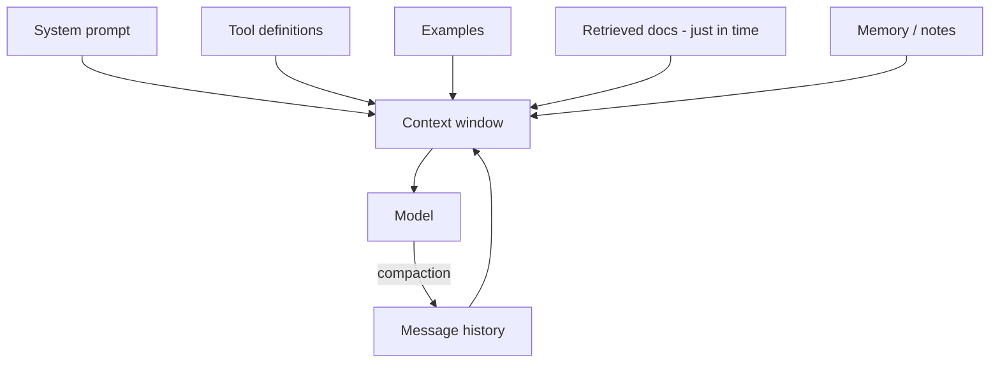

---
tags:
  - L3
  - context
  - fast-changing
---

# 10. Context Engineering

!!! abstract "At a glance"
    **Level:** L3 · **Status:** stub · **Last reviewed:** 2026-10-07
    **Prerequisites:** [02](../02-prompt-anatomy/index.md), [09](../09-reasoning-models/index.md) · **Lab:** `labs/10_context_engineering/`

!!! note "Stub module"
    The outline, references, and checklist are ready. As you study, expand each section using the [module template](../../templates/module-design-doc.md), add good/bad prompt examples, and change the status to `draft`, then `complete`.

## 1. Why it matters

As tasks get longer and agentic, the question becomes 'what is the smallest set of high-signal tokens that produces the desired behavior?' Context engineering manages everything in the window: system prompt, tools, examples, history, retrieved data, and memory.

## 2. Core concepts (outline)

- Context is a finite 'attention budget'; quality degrades with length (context rot) and position (lost in the middle)
- System prompt 'altitude': specific enough to guide, general enough to not be brittle
- Tool set hygiene: minimal, non-overlapping tools with clear descriptions
- Just-in-time retrieval: give the agent identifiers/paths and tools to load data when needed, instead of stuffing everything up front
- Long-horizon techniques: compaction (summarize history), structured note-taking / memory files, sub-agents with clean contexts
- Ordering and caching: static prefix first for prompt caching; dynamic content last

## 3. Architecture / flow

## 4. Prompt patterns

*To write: add at least one bad vs. good prompt pair from your own experiments.*

## 5. Failure modes and mitigations

| Failure mode | Symptom | Mitigation |
| --- | --- | --- |
| Context stuffing | Lower accuracy, high cost | Retrieve less but better; just-in-time loading |
| Stale/irrelevant history | Agent drifts or repeats | Compaction; clear tool results after use |
| Overlapping tools | Wrong tool choice | Consolidate tools; sharper descriptions |

## 6. How to evaluate it

Same task with full context vs. curated context vs. just-in-time retrieval: accuracy, tokens, latency.

## 7. Lab and exercises

- Lab: `labs/10_context_engineering/`
- Needle-in-haystack and distractor experiment: measure accuracy as irrelevant context grows.

## 8. Model-specific notes

| Provider | Notes |
| --- | --- |
| Anthropic (Claude) | *to fill* |
| OpenAI (GPT) | *to fill* |
| Google (Gemini) | *to fill* |
| Open models | *to fill* |

## 9. Must-read references

- [Anthropic: Effective context engineering for AI agents](https://www.anthropic.com/engineering/effective-context-engineering-for-ai-agents)
- [Lost in the Middle](https://arxiv.org/abs/2307.03172)
- [Chroma: Context Rot](https://www.trychroma.com/research/context-rot)
- [Distracted by Irrelevant Context](https://arxiv.org/abs/2302.00093)

## 10. Tutorials covering this module

- AI Engineer conference talks on context engineering (YouTube)
- Udemy Agentic Track - foundations week

## 11. Key takeaways (flashcards)

??? question "Define context engineering."
    Curating and maintaining the optimal set of tokens in the model's context across a task.

??? question "Three long-horizon techniques?"
    Compaction, structured note-taking/memory, and sub-agents with clean contexts.

## 12. Mastery checklist

- [ ] I can explain this to someone else without notes
- [ ] I ran the lab and recorded results in the journal
- [ ] I can name two failure modes and how to detect them
- [ ] I applied it to a new task outside the lab
- [ ] I expanded this stub to `complete`
