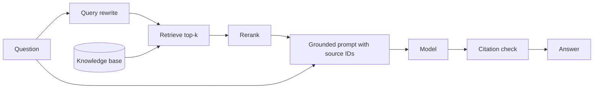

---
tags:
  - L3
  - context
  - hallucination
---

# 11. RAG Prompt Design and Hallucination Control

!!! abstract "At a glance"
    **Level:** L3 · **Status:** stub · **Last reviewed:** 2026-10-07
    **Prerequisites:** [10](../10-context-engineering/index.md) · **Lab:** `labs/11_rag_and_grounding/`

!!! note "Stub module"
    The outline, references, and checklist are ready. As you study, expand each section using the [module template](../../templates/module-design-doc.md), add good/bad prompt examples, and change the status to `draft`, then `complete`.

## 1. Why it matters

Retrieval-augmented generation is the main way to give models fresh, private, verifiable knowledge. The prompt decides whether the model actually uses the sources, cites them, and refuses when they don't contain the answer.

## 2. Core concepts (outline)

- Grounding instruction: answer only from <sources>; say 'not found in sources' otherwise
- Citations: ask for source IDs per claim; verify citations programmatically
- Quote-first: extract relevant quotes, then answer from them
- Source formatting: ID, title, date, content per chunk; most relevant first or last
- Query rewriting / HyDE / multi-query for better retrieval
- Contextual retrieval: prepend chunk context before embedding
- Hallucination taxonomy: intrinsic (contradicts sources) vs. extrinsic (unsupported); permission to say 'I don't know'

## 3. Architecture / flow

## 4. Prompt patterns

*To write: add at least one bad vs. good prompt pair from your own experiments.*

## 5. Failure modes and mitigations

| Failure mode | Symptom | Mitigation |
| --- | --- | --- |
| Answer not in sources but model answers anyway | Confident hallucination | Explicit abstain rule; test with unanswerable questions |
| Fake or wrong citations | IDs that don't support the claim | Programmatic citation verification; quote-first |
| Retrieval misses | Correct 'not found' but answer existed | Evaluate retrieval separately (recall@k) |

## 6. How to evaluate it

Separate retrieval metrics (recall@k, MRR) from generation metrics (faithfulness, answer correctness, abstention on unanswerable questions).

## 7. Lab and exercises

- Lab: `labs/11_rag_and_grounding/`
- Grounded Q&A over a small doc set with citations; include 30% unanswerable questions and measure correct abstention.

## 8. Model-specific notes

| Provider | Notes |
| --- | --- |
| Anthropic (Claude) | *to fill* |
| OpenAI (GPT) | *to fill* |
| Google (Gemini) | *to fill* |
| Open models | *to fill* |

## 9. Must-read references

- [RAG (Lewis et al.)](https://arxiv.org/abs/2005.11401)
- [Anthropic: Contextual retrieval](https://www.anthropic.com/engineering/contextual-retrieval)
- [Anthropic: Reduce hallucinations](https://platform.claude.com/docs/en/test-and-evaluate/strengthen-guardrails/reduce-hallucinations)
- [Chain-of-Verification](https://arxiv.org/abs/2309.11495)

## 10. Tutorials covering this module

- Anthropic Interactive Tutorial - ch. 8 Avoiding hallucinations, appendix 10.3
- Udemy AI Engineer Core Track - RAG week

## 11. Key takeaways (flashcards)

??? question "Why include unanswerable questions in RAG evals?"
    To measure whether the model correctly abstains instead of hallucinating.

??? question "Why evaluate retrieval separately?"
    A wrong answer may be a retrieval failure, not a prompt failure.

## 12. Mastery checklist

- [ ] I can explain this to someone else without notes
- [ ] I ran the lab and recorded results in the journal
- [ ] I can name two failure modes and how to detect them
- [ ] I applied it to a new task outside the lab
- [ ] I expanded this stub to `complete`
