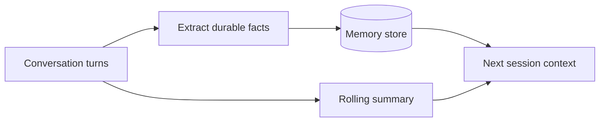

---
tags:
  - L3
  - context
---

# 12. Long Context and Memory Strategies

!!! abstract "At a glance"
    **Level:** L3 · **Status:** stub · **Last reviewed:** 2026-10-07
    **Prerequisites:** [10](../10-context-engineering/index.md) · **Lab:** `labs/12_long_context_memory/`

!!! note "Stub module"
    The outline, references, and checklist are ready. As you study, expand each section using the [module template](../../templates/module-design-doc.md), add good/bad prompt examples, and change the status to `draft`, then `complete`.

## 1. Why it matters

Million-token windows don't mean the model uses all tokens equally well. Long-document tasks and multi-session assistants need deliberate strategies for placement, summarization, and persistent memory.

## 2. Core concepts (outline)

- Long context vs. RAG: when to just paste the document, when to retrieve
- Placement: documents first, question last; quote extraction before answering
- Hierarchical summarization / map-reduce for documents beyond reliable length
- Conversation memory: rolling summaries, entity memory, memory files/tools
- Prompt caching for repeated long prefixes (cost/latency)
- Memory hygiene: what to store, staleness, privacy

## 3. Architecture / flow

## 4. Prompt patterns

*To write: add at least one bad vs. good prompt pair from your own experiments.*

## 5. Failure modes and mitigations

| Failure mode | Symptom | Mitigation |
| --- | --- | --- |
| Middle-of-document facts ignored | Misses info in long docs | Quote-first; chunk + map-reduce; reorder |
| Memory pollution | Outdated or wrong facts persist | Timestamp, confidence, and periodic pruning |
| Cost blowup | Huge input token bills | Prompt caching; summarize; retrieve |

## 6. How to evaluate it

Needle tests at various depths; multi-session consistency tests for memory.

## 7. Lab and exercises

- Lab: `labs/12_long_context_memory/`
- Q&A over a 100+ page document: full-context vs. map-reduce vs. RAG - accuracy and cost.

## 8. Model-specific notes

| Provider | Notes |
| --- | --- |
| Anthropic (Claude) | *to fill* |
| OpenAI (GPT) | *to fill* |
| Google (Gemini) | *to fill* |
| Open models | *to fill* |

## 9. Must-read references

- [Lost in the Middle](https://arxiv.org/abs/2307.03172)
- [MemGPT](https://arxiv.org/abs/2310.08560)
- [Generative Agents](https://arxiv.org/abs/2304.03442)
- [Anthropic: Prompting best practices - long context](https://platform.claude.com/docs/en/build-with-claude/prompt-engineering/claude-prompting-best-practices#long-context-prompting)

## 10. Tutorials covering this module

- Anthropic - Effective context engineering (memory section)

## 11. Key takeaways (flashcards)

??? question "Where to put the question with long documents?"
    At the end, after the documents.

??? question "Two risks of persistent memory?"
    Stale/wrong facts and privacy leakage.

## 12. Mastery checklist

- [ ] I can explain this to someone else without notes
- [ ] I ran the lab and recorded results in the journal
- [ ] I can name two failure modes and how to detect them
- [ ] I applied it to a new task outside the lab
- [ ] I expanded this stub to `complete`
