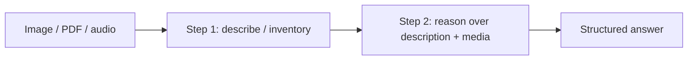

---
tags:
  - L3
  - multimodal
---

# 13. Multimodal Prompting

!!! abstract "At a glance"
    **Level:** L3 · **Status:** stub · **Last reviewed:** 2026-10-07
    **Prerequisites:** [04](../04-clarity-and-structure/index.md) · **Lab:** `labs/13_multimodal/`

!!! note "Stub module"
    The outline, references, and checklist are ready. As you study, expand each section using the [module template](../../templates/module-design-doc.md), add good/bad prompt examples, and change the status to `draft`, then `complete`.

## 1. Why it matters

Models now read images, PDFs, screenshots, charts, audio, and video. Multimodal prompts need their own patterns: placement, resolution, region references, and verification of visual claims.

## 2. Core concepts (outline)

- Image-first then instruction; one image per question when precision matters
- Ask for description/inventory before reasoning ('first list what you see')
- Documents and PDFs: page references, table extraction to structured output
- Charts and screenshots: request values with uncertainty; verify critical numbers
- Audio/video: timestamps, segment-level questions
- Limits: small text, counting, spatial precision; resolution/token cost trade-offs

## 3. Architecture / flow

## 4. Prompt patterns

*To write: add at least one bad vs. good prompt pair from your own experiments.*

## 5. Failure modes and mitigations

| Failure mode | Symptom | Mitigation |
| --- | --- | --- |
| Visual hallucination | Describes things not present | Inventory first; ask for 'not visible' option |
| Misread numbers in charts | Wrong values | Ask for confidence; cross-check with data when available |
| Token cost of high-res images | Expensive calls | Downscale or crop to region of interest |

## 6. How to evaluate it

Field-level accuracy on extracted data from 20 documents/screenshots; human spot-check for visual claims.

## 7. Lab and exercises

- Lab: `labs/13_multimodal/`
- Extract structured data (invoice fields, chart values) from images using a Pydantic schema.

## 8. Model-specific notes

| Provider | Notes |
| --- | --- |
| Anthropic (Claude) | *to fill* |
| OpenAI (GPT) | *to fill* |
| Google (Gemini) | *to fill* |
| Open models | *to fill* |

## 9. Must-read references

- [Google: Prompt design strategies (multimodal)](https://ai.google.dev/gemini-api/docs/prompting-strategies)
- [Anthropic: Vision](https://docs.claude.com/en/docs/build-with-claude/vision)
- [OpenAI: Images and vision](https://platform.openai.com/docs/guides/images-vision)

## 10. Tutorials covering this module

- DeepLearning.AI - Large Multimodal Model Prompting with Gemini
- Coursera - Google Prompting Essentials (multimodal)

## 11. Key takeaways (flashcards)

??? question "Why inventory before reasoning on images?"
    It grounds reasoning in what is actually visible and exposes misperceptions.

??? question "Common multimodal weaknesses?"
    Small text, counting, precise spatial relations.

## 12. Mastery checklist

- [ ] I can explain this to someone else without notes
- [ ] I ran the lab and recorded results in the journal
- [ ] I can name two failure modes and how to detect them
- [ ] I applied it to a new task outside the lab
- [ ] I expanded this stub to `complete`
