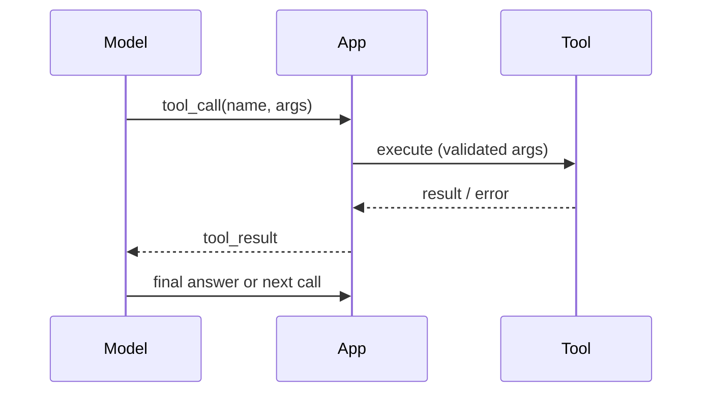

---
tags:
  - L4
  - agents
---

# 14. Tool Calling and Tool Design

!!! abstract "At a glance"
    **Level:** L4 · **Status:** stub · **Last reviewed:** 2026-10-07
    **Prerequisites:** [05](../05-structured-outputs/index.md) · **Lab:** `labs/14_tool_calling/`

!!! note "Stub module"
    The outline, references, and checklist are ready. As you study, expand each section using the [module template](../../templates/module-design-doc.md), add good/bad prompt examples, and change the status to `draft`, then `complete`.

## 1. Why it matters

Tools let models act: search, compute, call APIs. The model only knows a tool through its name, description, and schema - so tool design is prompt design, and it is often the biggest lever on agent quality.

## 2. Core concepts (outline)

- Tool definition anatomy: name, description (what, when, when NOT), parameter schema with descriptions
- Design tools for agents, not as thin API wrappers: consolidate multi-step workflows into one tool
- Return meaningful, token-efficient results; helpful error messages that guide retries
- Namespacing and avoiding overlap between tools
- Parallel tool calls, tool choice (auto/required/specific)
- Safety: confirmations for destructive actions, least-privilege credentials

## 3. Architecture / flow

## 4. Prompt patterns

*To write: add at least one bad vs. good prompt pair from your own experiments.*

## 5. Failure modes and mitigations

| Failure mode | Symptom | Mitigation |
| --- | --- | --- |
| Wrong tool chosen | Irrelevant calls | Sharper descriptions incl. when NOT to use; fewer, distinct tools |
| Malformed arguments | Validation errors | Strict schemas; enums; examples in descriptions |
| Token-heavy results | Context bloat | Paginate, filter, summarize; return IDs + key fields |

## 6. How to evaluate it

Tool-selection accuracy and argument correctness on a labeled set of requests; end-to-end task success.

## 7. Lab and exercises

- Lab: `labs/14_tool_calling/`
- Build 3 tools (search notes, calculator, calendar stub) and measure tool-choice accuracy as you refine descriptions.

## 8. Model-specific notes

| Provider | Notes |
| --- | --- |
| Anthropic (Claude) | *to fill* |
| OpenAI (GPT) | *to fill* |
| Google (Gemini) | *to fill* |
| Open models | *to fill* |

## 9. Must-read references

- [Anthropic: Writing effective tools for agents](https://www.anthropic.com/engineering/writing-tools-for-agents)
- [OpenAI: Function calling](https://platform.openai.com/docs/guides/function-calling)
- [Toolformer](https://arxiv.org/abs/2302.04761)

## 10. Tutorials covering this module

- Anthropic Interactive Tutorial - appendix 10.2 Tool use
- Hugging Face Agents course - unit 1

## 11. Key takeaways (flashcards)

??? question "Why is tool design prompt design?"
    The model only sees the tool's name, description, and schema.

??? question "What makes a good tool error message?"
    It says what went wrong and how to fix the call.

## 12. Mastery checklist

- [ ] I can explain this to someone else without notes
- [ ] I ran the lab and recorded results in the journal
- [ ] I can name two failure modes and how to detect them
- [ ] I applied it to a new task outside the lab
- [ ] I expanded this stub to `complete`
