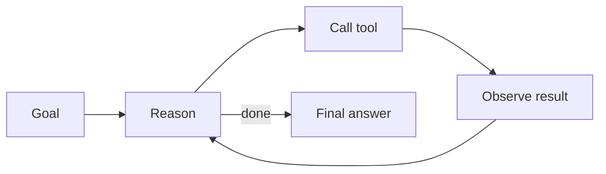

---
tags:
  - L4
  - agents
---

# 15. Agent Patterns

!!! abstract "At a glance"
    **Level:** L4 · **Status:** stub · **Last reviewed:** 2026-10-07
    **Prerequisites:** [06](../06-prompt-chaining/index.md), [14](../14-tool-calling/index.md) · **Lab:** `labs/15_agent_patterns/`

!!! note "Stub module"
    The outline, references, and checklist are ready. As you study, expand each section using the [module template](../../templates/module-design-doc.md), add good/bad prompt examples, and change the status to `draft`, then `complete`.

## 1. Why it matters

Most 'agent' problems are best solved with the simplest pattern that works. Knowing the catalog - from fixed workflows to autonomous loops - lets you trade autonomy for predictability deliberately.

## 2. Core concepts (outline)

- Workflows (predefined paths): prompt chaining, routing, parallelization (sectioning/voting), orchestrator-workers, evaluator-optimizer
- Agents (model-directed loops): ReAct (reason -> act -> observe), plan-and-execute
- Start simple; add autonomy only when evals justify it
- Agent system prompt: goal, tools, autonomy boundaries, stop conditions, progress reporting
- Human-in-the-loop checkpoints; max steps; budget limits

## 3. Architecture / flow

## 4. Prompt patterns

*To write: add at least one bad vs. good prompt pair from your own experiments.*

## 5. Failure modes and mitigations

| Failure mode | Symptom | Mitigation |
| --- | --- | --- |
| Infinite loops | Repeats actions | Max steps; detect repeated calls; progress notes |
| Premature completion | Stops before task is done | Explicit success criteria and verification step |
| Over-engineering | Agent where a chain suffices | Start with workflow; justify autonomy with evals |

## 6. How to evaluate it

Task success rate, steps/cost per success, and trajectory review (error analysis on traces).

## 7. Lab and exercises

- Lab: `labs/15_agent_patterns/`
- Implement a ReAct agent from scratch (no framework) with 2 tools; then the same task as a fixed chain - compare.

## 8. Model-specific notes

| Provider | Notes |
| --- | --- |
| Anthropic (Claude) | *to fill* |
| OpenAI (GPT) | *to fill* |
| Google (Gemini) | *to fill* |
| Open models | *to fill* |

## 9. Must-read references

- [Anthropic: Building effective agents](https://www.anthropic.com/engineering/building-effective-agents)
- [ReAct](https://arxiv.org/abs/2210.03629)
- [OpenAI: A practical guide to building agents](https://cdn.openai.com/business-guides-and-resources/a-practical-guide-to-building-agents.pdf)
- [Lilian Weng: LLM Powered Autonomous Agents](https://lilianweng.github.io/posts/2023-06-23-agent/)

## 10. Tutorials covering this module

- Udemy - AI Engineer Agentic Track (weeks 1-4)
- DeepLearning.AI - AI Agents in LangGraph
- DeepLearning.AI - Agentic AI

## 11. Key takeaways (flashcards)

??? question "Workflow vs. agent?"
    Workflow: code defines the path. Agent: the model decides the next step dynamically.

??? question "Five workflow patterns?"
    Chaining, routing, parallelization, orchestrator-workers, evaluator-optimizer.

## 12. Mastery checklist

- [ ] I can explain this to someone else without notes
- [ ] I ran the lab and recorded results in the journal
- [ ] I can name two failure modes and how to detect them
- [ ] I applied it to a new task outside the lab
- [ ] I expanded this stub to `complete`
