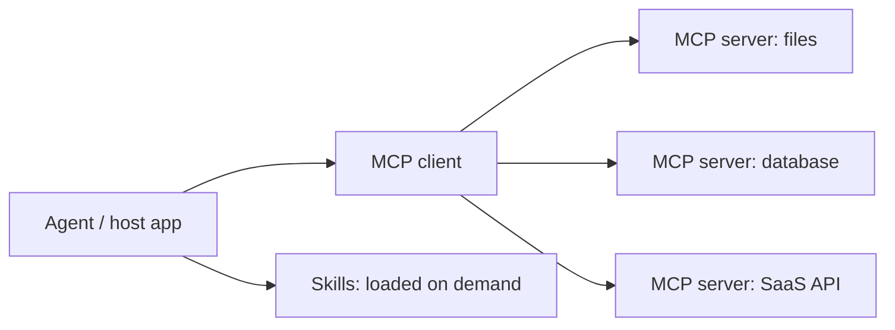

---
tags:
  - L4
  - agents
  - fast-changing
---

# 16. MCP and Agent Skills

!!! abstract "At a glance"
    **Level:** L4 · **Status:** stub · **Last reviewed:** 2026-10-07
    **Prerequisites:** [14](../14-tool-calling/index.md) · **Lab:** `labs/16_mcp_and_skills/`

!!! note "Stub module"
    The outline, references, and checklist are ready. As you study, expand each section using the [module template](../../templates/module-design-doc.md), add good/bad prompt examples, and change the status to `draft`, then `complete`.

## 1. Why it matters

The Model Context Protocol standardizes how agents connect to tools and data; skills package instructions and resources that agents load on demand. Together they are how modern agents get capabilities without bloating every prompt.

## 2. Core concepts (outline)

- MCP primitives: tools, resources, prompts; clients vs. servers; transports
- Designing MCP tool descriptions (same rules as module 14)
- Skills: a folder with SKILL.md (name + description always loaded; body loaded when relevant) - progressive disclosure
- Security: trust boundaries of third-party servers, tool poisoning, least privilege
- When to use MCP vs. direct function calling

## 3. Architecture / flow

## 4. Prompt patterns

*To write: add at least one bad vs. good prompt pair from your own experiments.*

## 5. Failure modes and mitigations

| Failure mode | Symptom | Mitigation |
| --- | --- | --- |
| Too many servers/tools loaded | Context bloat, wrong tool choice | Enable only needed servers; progressive disclosure |
| Malicious tool descriptions | Injected instructions | Vet servers; pin versions; review descriptions |
| Vague skill descriptions | Skill never triggers | Write the description as 'use when ...' trigger conditions |

## 6. How to evaluate it

Does the agent pick the right skill/tool for 20 varied requests? Measure trigger precision/recall.

## 7. Lab and exercises

- Lab: `labs/16_mcp_and_skills/`
- Build a tiny MCP server (Python SDK) exposing your prompts/ library; write one skill for 'create a prompt card'.

## 8. Model-specific notes

| Provider | Notes |
| --- | --- |
| Anthropic (Claude) | *to fill* |
| OpenAI (GPT) | *to fill* |
| Google (Gemini) | *to fill* |
| Open models | *to fill* |

## 9. Must-read references

- [Model Context Protocol](https://modelcontextprotocol.io/)
- [Anthropic: Agent Skills](https://www.anthropic.com/engineering/equipping-agents-for-the-real-world-with-agent-skills)

## 10. Tutorials covering this module

- Udemy - AI Engineer Agentic Track (MCP week)

## 11. Key takeaways (flashcards)

??? question "Three MCP server primitives?"
    Tools, resources, prompts.

??? question "What is progressive disclosure in skills?"
    Only the skill's name/description is always in context; the full body loads when relevant.

## 12. Mastery checklist

- [ ] I can explain this to someone else without notes
- [ ] I ran the lab and recorded results in the journal
- [ ] I can name two failure modes and how to detect them
- [ ] I applied it to a new task outside the lab
- [ ] I expanded this stub to `complete`
