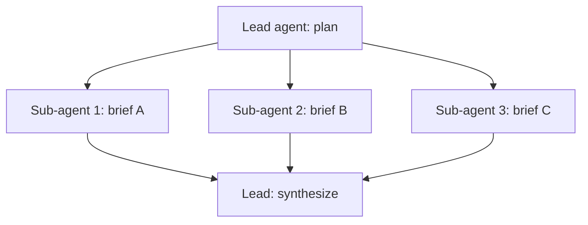

---
tags:
  - L4
  - agents
---

# 17. Multi-Agent Systems and Sub-Agent Prompts

!!! abstract "At a glance"
    **Level:** L4 · **Status:** stub · **Last reviewed:** 2026-10-07
    **Prerequisites:** [15](../15-agent-patterns/index.md) · **Lab:** `labs/17_multi_agent/`

!!! note "Stub module"
    The outline, references, and checklist are ready. As you study, expand each section using the [module template](../../templates/module-design-doc.md), add good/bad prompt examples, and change the status to `draft`, then `complete`.

## 1. Why it matters

Splitting work across agents gives parallelism and clean contexts, but multiplies cost and coordination failures. The orchestrator's delegation prompts are the critical design artifact.

## 2. Core concepts (outline)

- Orchestrator-worker: lead agent plans, spawns sub-agents with focused briefs, synthesizes
- Writing sub-agent briefs: objective, output format, boundaries, tools, effort budget
- Handoffs vs. agents-as-tools
- Clean context per sub-agent (context isolation) vs. shared memory
- Costs: token multiplication; when single-agent is better (tightly coupled tasks, e.g. most coding)

## 3. Architecture / flow

## 4. Prompt patterns

*To write: add at least one bad vs. good prompt pair from your own experiments.*

## 5. Failure modes and mitigations

| Failure mode | Symptom | Mitigation |
| --- | --- | --- |
| Vague delegation | Duplicate or off-target work | Detailed briefs with scope, format, and boundaries |
| Lost information at handoff | Synthesis misses findings | Structured sub-agent outputs; store artifacts externally |
| Cost blowup | Many x tokens | Scale sub-agent count to task complexity |

## 6. How to evaluate it

Compare single-agent vs. multi-agent on breadth-heavy research tasks: quality (rubric), cost, latency.

## 7. Lab and exercises

- Lab: `labs/17_multi_agent/`
- Orchestrator + 3 research sub-agents over local documents; compare to a single agent.

## 8. Model-specific notes

| Provider | Notes |
| --- | --- |
| Anthropic (Claude) | *to fill* |
| OpenAI (GPT) | *to fill* |
| Google (Gemini) | *to fill* |
| Open models | *to fill* |

## 9. Must-read references

- [Anthropic: How we built our multi-agent research system](https://www.anthropic.com/engineering/multi-agent-research-system)
- [OpenAI Agents SDK (handoffs)](https://openai.github.io/openai-agents-python/)

## 10. Tutorials covering this module

- Udemy - AI Engineer Agentic Track (CrewAI, AutoGen weeks)
- Hugging Face Agents course

## 11. Key takeaways (flashcards)

??? question "Key ingredient of a good sub-agent brief?"
    Clear objective, output format, tool guidance, and task boundaries.

??? question "When is multi-agent a bad fit?"
    Tightly coupled tasks needing shared context, where coordination costs dominate.

## 12. Mastery checklist

- [ ] I can explain this to someone else without notes
- [ ] I ran the lab and recorded results in the journal
- [ ] I can name two failure modes and how to detect them
- [ ] I applied it to a new task outside the lab
- [ ] I expanded this stub to `complete`
