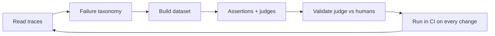

---
tags:
  - L5
  - evals
---

# 18. Evaluation

!!! abstract "At a glance"
    **Level:** L5 · **Status:** stub · **Last reviewed:** 2026-10-07
    **Prerequisites:** [03](../03-few-shot/index.md) · **Lab:** `labs/18_evaluation/`

!!! note "Stub module"
    The outline, references, and checklist are ready. As you study, expand each section using the [module template](../../templates/module-design-doc.md), add good/bad prompt examples, and change the status to `draft`, then `complete`.

## 1. Why it matters

Evals turn prompt engineering from guesswork into engineering. Without a dataset and a metric, you cannot tell if a change helped, regressed something else, or survives a model upgrade.

## 2. Core concepts (outline)

- Error analysis first: read traces, build a failure taxonomy, then write evals for real failure modes
- Datasets: golden sets, edge cases, synthetic generation along dimensions, production samples
- Metric types: code-based assertions (exact, regex, schema), reference-based, LLM-as-judge (pointwise rubric, pairwise)
- Validating judges against human labels (TPR/TNR); judge biases (position, verbosity, self-preference)
- Regression testing in CI; eval on every prompt or model change
- Online evals: monitoring, user feedback, A/B tests

## 3. Architecture / flow

## 4. Prompt patterns

*To write: add at least one bad vs. good prompt pair from your own experiments.*

## 5. Failure modes and mitigations

| Failure mode | Symptom | Mitigation |
| --- | --- | --- |
| Generic metrics | Scores don't track real quality | Derive metrics from error analysis of your app |
| Unvalidated LLM judge | Judge disagrees with humans | Measure agreement on 50+ human-labeled items |
| Overfitting to eval set | Great evals, poor production | Hold-out sets; refresh with production samples |

## 6. How to evaluate it

Meta: measure judge-human agreement; track eval suite coverage of the failure taxonomy.

## 7. Lab and exercises

- Lab: `labs/18_evaluation/`
- Use pem.evals: build a rubric judge, label 30 outputs yourself, measure judge agreement, then run as regression.

## 8. Model-specific notes

| Provider | Notes |
| --- | --- |
| Anthropic (Claude) | *to fill* |
| OpenAI (GPT) | *to fill* |
| Google (Gemini) | *to fill* |
| Open models | *to fill* |

## 9. Must-read references

- [Hamel Husain: Your AI product needs evals](https://hamel.dev/blog/posts/evals/)
- [Hamel Husain: Using LLM-as-a-judge](https://hamel.dev/blog/posts/llm-judge/)
- [Judging LLM-as-a-Judge](https://arxiv.org/abs/2306.05685)
- [Who Validates the Validators?](https://arxiv.org/abs/2404.12272)
- [promptfoo](https://www.promptfoo.dev/)

## 10. Tutorials covering this module

- Anthropic courses - Prompt evaluations
- DeepLearning.AI - Evaluating AI Agents
- Maven - AI Evals for Engineers & PMs (cohort)

## 11. Key takeaways (flashcards)

??? question "What comes before writing evals?"
    Error analysis on real traces to find actual failure modes.

??? question "How do you trust an LLM judge?"
    Measure its agreement with human labels (e.g., TPR/TNR) before relying on it.

## 12. Mastery checklist

- [ ] I can explain this to someone else without notes
- [ ] I ran the lab and recorded results in the journal
- [ ] I can name two failure modes and how to detect them
- [ ] I applied it to a new task outside the lab
- [ ] I expanded this stub to `complete`
