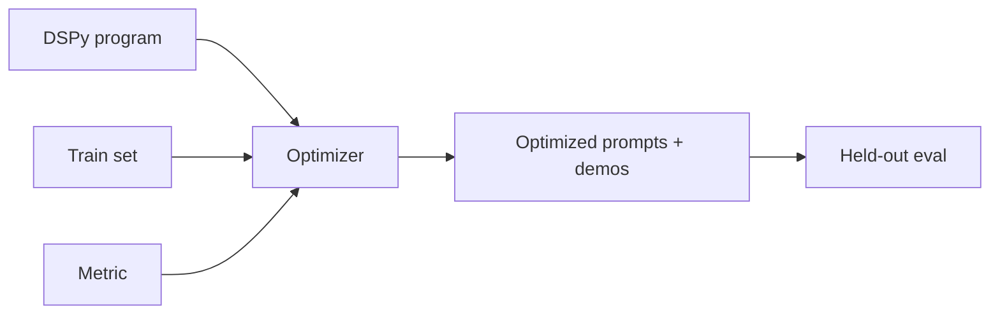

---
tags:
  - L5
  - optimization
---

# 19. Automatic Prompt Optimization

!!! abstract "At a glance"
    **Level:** L5 · **Status:** stub · **Last reviewed:** 2026-10-07
    **Prerequisites:** [18](../18-evaluation/index.md) · **Lab:** `labs/19_prompt_optimization/`

!!! note "Stub module"
    The outline, references, and checklist are ready. As you study, expand each section using the [module template](../../templates/module-design-doc.md), add good/bad prompt examples, and change the status to `draft`, then `complete`.

## 1. Why it matters

Once you have evals, prompts can be optimized by algorithms: searching instructions and examples against a metric. DSPy and similar tools turn prompts into programs you compile rather than strings you hand-tune.

## 2. Core concepts (outline)

- Meta-prompting: use a strong model to critique and rewrite prompts (with eval feedback)
- APE / OPRO: LLM-proposed instructions scored on a dataset
- DSPy: signatures, modules (Predict, ChainOfThought, ReAct), optimizers (few-shot bootstrapping, MIPROv2, GEPA)
- TextGrad: textual 'gradients' from feedback
- Requirements: a trustworthy metric and enough data; risk of overfitting
- Provider tools: OpenAI prompt optimizer, Anthropic prompt improver/console tools

## 3. Architecture / flow

## 4. Prompt patterns

*To write: add at least one bad vs. good prompt pair from your own experiments.*

## 5. Failure modes and mitigations

| Failure mode | Symptom | Mitigation |
| --- | --- | --- |
| Optimizing a bad metric | Gamed outputs | Validate metric first (module 18) |
| Overfitting small sets | Gains vanish on new data | Held-out set; more diverse data |
| Unreadable prompts | Hard to maintain | Keep human review; store versions |

## 6. How to evaluate it

Hand-written prompt vs. optimized prompt on a held-out set; cost of optimization run.

## 7. Lab and exercises

- Lab: `labs/19_prompt_optimization/`
- Optimize the lab 03 classifier with DSPy (BootstrapFewShot, then MIPROv2) and compare to your best manual prompt.

## 8. Model-specific notes

| Provider | Notes |
| --- | --- |
| Anthropic (Claude) | *to fill* |
| OpenAI (GPT) | *to fill* |
| Google (Gemini) | *to fill* |
| Open models | *to fill* |

## 9. Must-read references

- [DSPy](https://dspy.ai/)
- [DSPy paper](https://arxiv.org/abs/2310.03714)
- [OPRO](https://arxiv.org/abs/2309.03409)
- [APE](https://arxiv.org/abs/2211.01910)
- [MIPRO](https://arxiv.org/abs/2406.11695)
- [GEPA](https://arxiv.org/abs/2507.19457)
- [OpenAI: Prompt optimizer cookbook](https://developers.openai.com/cookbook/examples/gpt-5/prompt-optimization-cookbook)

## 10. Tutorials covering this module

- DeepLearning.AI - DSPy: Build and Optimize Agentic Apps

## 11. Key takeaways (flashcards)

??? question "Prerequisite for automatic prompt optimization?"
    A validated metric and a representative dataset.

??? question "What does a DSPy signature define?"
    Typed inputs and outputs of a module - the 'what', not the prompt text.

## 12. Mastery checklist

- [ ] I can explain this to someone else without notes
- [ ] I ran the lab and recorded results in the journal
- [ ] I can name two failure modes and how to detect them
- [ ] I applied it to a new task outside the lab
- [ ] I expanded this stub to `complete`
