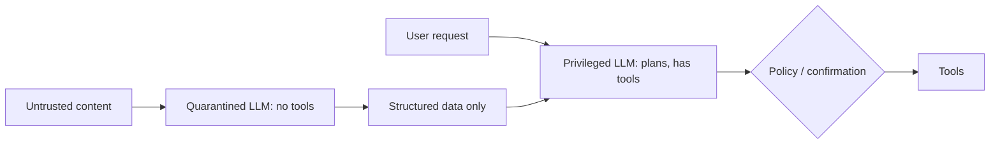

---
tags:
  - L5
  - security
---

# 20. Prompt Security

!!! abstract "At a glance"
    **Level:** L5 · **Status:** stub · **Last reviewed:** 2026-10-07
    **Prerequisites:** [14](../14-tool-calling/index.md), [15](../15-agent-patterns/index.md) · **Lab:** `labs/20_prompt_security/`

!!! note "Stub module"
    The outline, references, and checklist are ready. As you study, expand each section using the [module template](../../templates/module-design-doc.md), add good/bad prompt examples, and change the status to `draft`, then `complete`.

## 1. Why it matters

Any LLM that reads untrusted text can be instructed by it. Prompt injection is the top risk for LLM applications (OWASP LLM01), and agents with tools turn it from embarrassing into dangerous. No prompt fully prevents it - defense must be architectural.

## 2. Core concepts (outline)

- Direct injection / jailbreaks vs. indirect injection (instructions hidden in web pages, emails, documents, tool results)
- The 'lethal trifecta': private data + untrusted content + exfiltration channel
- System prompt leakage; sensitive data disclosure; excessive agency (OWASP LLM Top 10)
- Prompt-level mitigations (delimiting, instruction hierarchy, spotlighting) - helpful but not sufficient
- Architectural defenses: least privilege, human confirmation, dual-LLM / CaMeL patterns, output filtering, egress controls
- Red-teaming your own apps: promptfoo, garak, manual attack libraries

## 3. Architecture / flow

## 4. Prompt patterns

*To write: add at least one bad vs. good prompt pair from your own experiments.*

## 5. Failure modes and mitigations

| Failure mode | Symptom | Mitigation |
| --- | --- | --- |
| Relying on 'ignore malicious instructions' in prompt | Bypassed by creative attacks | Architectural controls; assume prompt defenses fail |
| Agent exfiltrates data via links/images/tools | Data leak | Break the trifecta; restrict egress; confirm sensitive actions |
| Secrets in system prompt | Leaked via extraction | Never put secrets in prompts |

## 6. How to evaluate it

Attack success rate on a red-team suite (direct + indirect) before/after each defense; false-positive rate of filters.

## 7. Lab and exercises

- Lab: `labs/20_prompt_security/`
- Build a summarizer that reads 'emails' containing injected instructions; measure attack success; add layered defenses.

## 8. Model-specific notes

| Provider | Notes |
| --- | --- |
| Anthropic (Claude) | *to fill* |
| OpenAI (GPT) | *to fill* |
| Google (Gemini) | *to fill* |
| Open models | *to fill* |

## 9. Must-read references

- [OWASP Top 10 for LLM Applications](https://genai.owasp.org/llm-top-10/)
- [Simon Willison: The lethal trifecta](https://simonwillison.net/2025/Jun/16/the-lethal-trifecta/)
- [Indirect Prompt Injection (Greshake)](https://arxiv.org/abs/2302.12173)
- [CaMeL: Defeating Prompt Injections by Design](https://arxiv.org/abs/2503.18813)
- [Design Patterns for Securing LLM Agents](https://arxiv.org/abs/2506.08837)

## 10. Tutorials covering this module

- Learn Prompting - prompt hacking section
- promptfoo red-team docs

## 11. Key takeaways (flashcards)

??? question "What is the lethal trifecta?"
    Access to private data + exposure to untrusted content + an exfiltration channel.

??? question "Can prompting alone prevent injection?"
    No - use architectural controls (least privilege, isolation, confirmation).

## 12. Mastery checklist

- [ ] I can explain this to someone else without notes
- [ ] I ran the lab and recorded results in the journal
- [ ] I can name two failure modes and how to detect them
- [ ] I applied it to a new task outside the lab
- [ ] I expanded this stub to `complete`
