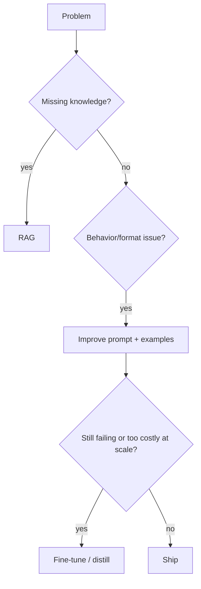

---
tags:
  - L5
  - strategy
---

# 22. Fine-Tuning vs. Prompting vs. RAG

!!! abstract "At a glance"
    **Level:** L5 · **Status:** stub · **Last reviewed:** 2026-10-07
    **Prerequisites:** [11](../11-rag-and-grounding/index.md), [18](../18-evaluation/index.md) · **Lab:** `labs/22_finetune_vs_prompt_vs_rag/`

!!! note "Stub module"
    The outline, references, and checklist are ready. As you study, expand each section using the [module template](../../templates/module-design-doc.md), add good/bad prompt examples, and change the status to `draft`, then `complete`.

## 1. Why it matters

Choosing the right tool saves months. Prompting changes behavior cheaply, RAG adds knowledge, fine-tuning bakes in style/format/skills or reduces cost at scale. Most problems should exhaust prompting + RAG before fine-tuning.

## 2. Core concepts (outline)

- Decision axes: knowledge vs. behavior, freshness, data availability, volume/cost, latency, control
- Prompting first: fastest iteration; establish eval baseline
- RAG for knowledge that changes or must be cited
- Fine-tuning (SFT, preference tuning, RL fine-tuning, LoRA/QLoRA) for consistent format/style, narrow skills, distillation to smaller models
- Hybrid: fine-tuned small model + RAG + prompt

## 3. Architecture / flow

## 4. Prompt patterns

*To write: add at least one bad vs. good prompt pair from your own experiments.*

## 5. Failure modes and mitigations

| Failure mode | Symptom | Mitigation |
| --- | --- | --- |
| Fine-tuning for knowledge | Stale, hallucinated facts | Use RAG for facts |
| Fine-tuning before prompt baseline | Wasted effort | Prompt + eval baseline first |
| No eval to compare | Can't justify choice | Same eval suite across all approaches |

## 6. How to evaluate it

Same eval suite for prompt-only, RAG, and fine-tuned variants; include cost per 1k requests.

## 7. Lab and exercises

- Lab: `labs/22_finetune_vs_prompt_vs_rag/`
- Decision memo: pick one task, estimate cost/quality of each approach, and run the prompt and RAG variants.

## 8. Model-specific notes

| Provider | Notes |
| --- | --- |
| Anthropic (Claude) | *to fill* |
| OpenAI (GPT) | *to fill* |
| Google (Gemini) | *to fill* |
| Open models | *to fill* |

## 9. Must-read references

- [Chip Huyen: AI Engineering (book)](https://huyenchip.com/)
- [OpenAI: Model optimization / fine-tuning guide](https://platform.openai.com/docs/guides/model-optimization)

## 10. Tutorials covering this module

- Udemy - AI Engineer Core Track (QLoRA weeks)
- DeepLearning.AI - Improving Accuracy of LLM Applications

## 11. Key takeaways (flashcards)

??? question "Fine-tune for knowledge or behavior?"
    Behavior/format/skill; use RAG for knowledge.

??? question "First step before any of the three?"
    Build an eval baseline with prompting.

## 12. Mastery checklist

- [ ] I can explain this to someone else without notes
- [ ] I ran the lab and recorded results in the journal
- [ ] I can name two failure modes and how to detect them
- [ ] I applied it to a new task outside the lab
- [ ] I expanded this stub to `complete`
