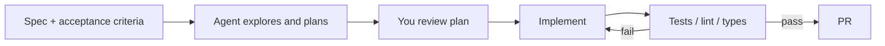

---
tags:
  - applied
  - agents
  - fast-changing
---

# 23. Prompting Coding Agents

!!! abstract "At a glance"
    **Level:** Applied · **Status:** stub · **Last reviewed:** 2026-10-07
    **Prerequisites:** [15](../15-agent-patterns/index.md) · **Lab:** `labs/23_coding_agents/`

!!! note "Stub module"
    The outline, references, and checklist are ready. As you study, expand each section using the [module template](../../templates/module-design-doc.md), add good/bad prompt examples, and change the status to `draft`, then `complete`.

## 1. Why it matters

Coding agents (Cursor, Claude Code, Codex, Copilot) are where most engineers prompt every day. Rules files, skills, and spec-driven prompts determine whether they produce maintainable code or plausible messes.

## 2. Core concepts (outline)

- Project instructions files: AGENTS.md, CLAUDE.md, Cursor rules - conventions, commands, architecture, gotchas
- Spec-first: describe outcome, constraints, acceptance criteria, files in scope
- Plan before code; ask the agent to explore and propose, then implement
- Verification loops: tests, type-checks, linters as the agent's feedback
- Context management: point to files; keep sessions focused; use sub-agents for search
- Skills for repeatable workflows (release, migration, review)

## 3. Architecture / flow

## 4. Prompt patterns

*To write: add at least one bad vs. good prompt pair from your own experiments.*

## 5. Failure modes and mitigations

| Failure mode | Symptom | Mitigation |
| --- | --- | --- |
| Vague task | Plausible but wrong change | Acceptance criteria + files in scope |
| No verification | Broken code merged | Require tests/lint pass; agent runs them |
| Bloated rules file | Ignored or conflicting rules | Short, specific, current; prune regularly |

## 6. How to evaluate it

Track task success without rework on a set of 10 representative tasks; compare with/without rules file.

## 7. Lab and exercises

- Lab: `labs/23_coding_agents/`
- Write an AGENTS.md for this repo and a skill for 'add a new module'; test them on 3 tasks.

## 8. Model-specific notes

| Provider | Notes |
| --- | --- |
| Anthropic (Claude) | *to fill* |
| OpenAI (GPT) | *to fill* |
| Google (Gemini) | *to fill* |
| Open models | *to fill* |

## 9. Must-read references

- [AGENTS.md](https://agents.md/)
- [Anthropic: Claude Code best practices](https://code.claude.com/docs/en/best-practices)
- [OpenAI: GPT-5 prompting guide (coding/Cursor section)](https://developers.openai.com/cookbook/examples/gpt-5/gpt-5_prompting_guide)

## 10. Tutorials covering this module

- Udemy - Academind ChatGPT & GenAI Complete Guide (Copilot/Cursor sections)

## 11. Key takeaways (flashcards)

??? question "What belongs in AGENTS.md?"
    Build/test commands, conventions, architecture notes, and gotchas - short and current.

??? question "Most important coding-agent habit?"
    Give it a way to verify its work (tests, lint, types).

## 12. Mastery checklist

- [ ] I can explain this to someone else without notes
- [ ] I ran the lab and recorded results in the journal
- [ ] I can name two failure modes and how to detect them
- [ ] I applied it to a new task outside the lab
- [ ] I expanded this stub to `complete`
