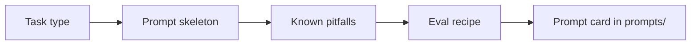

---
tags:
  - applied
---

# 24. Task Playbooks

!!! abstract "At a glance"
    **Level:** Applied · **Status:** stub · **Last reviewed:** 2026-10-07
    **Prerequisites:** [03](../03-few-shot/index.md), [04](../04-clarity-and-structure/index.md), [05](../05-structured-outputs/index.md) · **Lab:** `labs/24_task_playbooks/`

!!! note "Stub module"
    The outline, references, and checklist are ready. As you study, expand each section using the [module template](../../templates/module-design-doc.md), add good/bad prompt examples, and change the status to `draft`, then `complete`.

## 1. Why it matters

Most real work is a handful of task types. A tested playbook per task type - prompt skeleton, pitfalls, eval - makes you fast and consistent.

## 2. Core concepts (outline)

- Extraction: schema-first, nullable fields, evidence quotes
- Classification: label definitions, balanced examples, 'other' class, confidence
- Summarization: audience, purpose, length, what to prioritize, faithfulness check
- Writing/rewriting: voice, audience, constraints, examples of target style
- Translation/localization: glossary, tone, do-not-translate list
- Data analysis: give the model code execution; ask for assumptions

## 3. Architecture / flow

## 4. Prompt patterns

*To write: add at least one bad vs. good prompt pair from your own experiments.*

## 5. Failure modes and mitigations

| Failure mode | Symptom | Mitigation |
| --- | --- | --- |
| Summaries add facts | Unfaithful summary | Faithfulness check vs. source |
| Classification boundary confusion | Inconsistent labels | Explicit definitions + boundary examples |
| Style drift in rewriting | Wrong voice | Show target-style examples |

## 6. How to evaluate it

One small eval dataset per playbook in evals/datasets/; track scores in the prompt card.

## 7. Lab and exercises

- Lab: `labs/24_task_playbooks/`
- Create one prompt card + dataset for each of 3 task types you use at work.

## 8. Model-specific notes

| Provider | Notes |
| --- | --- |
| Anthropic (Claude) | *to fill* |
| OpenAI (GPT) | *to fill* |
| Google (Gemini) | *to fill* |
| Open models | *to fill* |

## 9. Must-read references

- [DeepLearning.AI: ChatGPT Prompt Engineering for Developers](https://www.deeplearning.ai/courses/chatgpt-prompt-eng)
- [Anthropic: Prompt engineering overview](https://docs.claude.com/en/docs/build-with-claude/prompt-engineering/overview)

## 10. Tutorials covering this module

- DeepLearning.AI - ChatGPT Prompt Engineering for Developers (summarize/infer/transform/expand)
- Anthropic Interactive Tutorial - ch. 9

## 11. Key takeaways (flashcards)

??? question "Key element of an extraction prompt?"
    A schema with nullable fields and a 'do not guess' rule.

??? question "Key element of a summarization prompt?"
    Audience and purpose, which decide what to prioritize.

## 12. Mastery checklist

- [ ] I can explain this to someone else without notes
- [ ] I ran the lab and recorded results in the journal
- [ ] I can name two failure modes and how to detect them
- [ ] I applied it to a new task outside the lab
- [ ] I expanded this stub to `complete`
