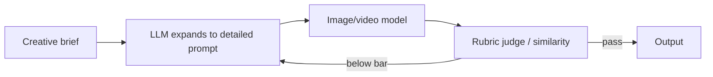

---
tags:
  - applied
  - multimodal
---

# 25. Generative Media Prompting (Image and Video)

!!! abstract "At a glance"
    **Level:** Applied · **Status:** stub · **Last reviewed:** 2026-10-07
    **Prerequisites:** [13](../13-multimodal/index.md) · **Lab:** `labs/25_generative_media/`

!!! note "Stub module"
    The outline, references, and checklist are ready. As you study, expand each section using the [module template](../../templates/module-design-doc.md), add good/bad prompt examples, and change the status to `draft`, then `complete`.

## 1. Why it matters

Image and video models respond to a different prompt grammar: subject, composition, style, lighting, camera, motion. Iteration with reference images and evaluation loops matters more than wording tricks.

## 2. Core concepts (outline)

- Prompt structure: subject, action, setting, composition/camera, style, lighting, mood, technical specs
- Reference images, style references, starting frames
- LLM-enhanced prompting: let an LLM expand a brief into a detailed media prompt
- Negative prompts (where supported) vs. positive description
- Video: shot lists, motion, temporal consistency across scenes
- Evaluation: image-text similarity, LLM-as-judge with rubrics, human review; brand/safety constraints

## 3. Architecture / flow

## 4. Prompt patterns

*To write: add at least one bad vs. good prompt pair from your own experiments.*

## 5. Failure modes and mitigations

| Failure mode | Symptom | Mitigation |
| --- | --- | --- |
| Generic outputs | Stock-photo look | Specific composition, lighting, style references |
| Inconsistent characters across scenes | Identity drift | Reference images; fixed descriptors |
| Text rendering errors | Garbled text in image | Use models strong at text; add text in post |

## 6. How to evaluate it

Rubric scoring (prompt adherence, aesthetics, brand fit) by judge + human spot-check on 20 generations.

## 7. Lab and exercises

- Lab: `labs/25_generative_media/`
- Build an LLM prompt-expander + judge loop for product images.

## 8. Model-specific notes

| Provider | Notes |
| --- | --- |
| Anthropic (Claude) | *to fill* |
| OpenAI (GPT) | *to fill* |
| Google (Gemini) | *to fill* |
| Open models | *to fill* |

## 9. Must-read references

- [DeepLearning.AI: AI Agents for Image and Video Generation](https://www.deeplearning.ai/courses/ai-agents-for-image-and-video-generation)

## 10. Tutorials covering this module

- Udemy Bootcamp - image/video generation sections
- DeepLearning.AI - AI Agents for Image and Video Generation

## 11. Key takeaways (flashcards)

??? question "Core components of an image prompt?"
    Subject, setting, composition/camera, style, lighting, mood.

??? question "How to keep a character consistent across scenes?"
    Reference images and fixed, repeated descriptors.

## 12. Mastery checklist

- [ ] I can explain this to someone else without notes
- [ ] I ran the lab and recorded results in the journal
- [ ] I can name two failure modes and how to detect them
- [ ] I applied it to a new task outside the lab
- [ ] I expanded this stub to `complete`
