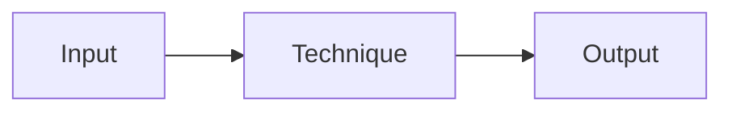

---
tags:
  - template
---

# NN. Module Title

!!! abstract "At a glance"
    **Level:** L? · **Status:** stub / draft / complete · **Last reviewed:** YYYY-MM-DD
    **Prerequisites:** modules ... · **Lab:** `labs/NN_slug/`

## 1. Why it matters

What problem does this technique solve? When would you reach for it, and when would you not?

## 2. Core concepts

Key ideas in plain language. Add a diagram when it helps:



## 3. Architecture / flow

How this fits into a real LLM system: the components, data flow, and where the prompt lives.

## 4. Prompt patterns

=== "Bad"

    ```text
    A vague or naive prompt.
    ```

=== "Good"

    ```text
    The improved prompt, with what changed and why.
    ```

## 5. Failure modes and mitigations

| Failure mode | Symptom | Mitigation |
| --- | --- | --- |
| ... | ... | ... |

## 6. How to evaluate it

- The dataset and metrics that would prove this technique helps
- What to compare against (the baseline)

## 7. Lab and exercises

- Lab: `labs/NN_slug/`
- Exercise 1: ...
- Exercise 2: ...

## 8. Model-specific notes

| Provider | Notes |
| --- | --- |
| Anthropic (Claude) | ... |
| OpenAI (GPT) | ... |
| Google (Gemini) | ... |
| Open models | ... |

## 9. Must-read references

- [Title](https://example.com): why it's worth reading

## 10. Tutorials covering this module

- Course name, section or lecture numbers: link to the notes in `docs/tutorials/notes/`

## 11. Key takeaways (flashcards)

??? question "Question 1?"
    Answer.

## 12. Mastery checklist

- [ ] I can explain this to someone else without notes
- [ ] I ran the lab and recorded results in the journal
- [ ] I can name two failure modes and how to detect them
- [ ] I applied it to a new task outside the lab
